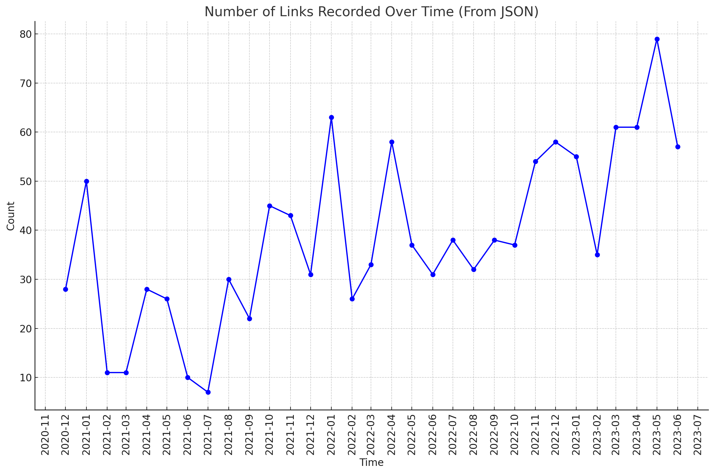

# what_i_read
Monthly snapshot of **[mainly]** technology focused content which I read. It include articles, stories, twitts and other content that I find interesting, thought-provoking, or that I may need in a future.

*.md format and tags are well supported by [Obsidian.md](https://obsidian.md/)

# 2024

## July 2024
*comming soon*

## June 2024

| Links | Tags |
|-------|------|
| [How Actors Remember Their Lines - The MIT Press Reader](https://thereader.mitpress.mit.edu/how-actors-remember-their-lines/) | #psychology #memory #acting |
| [Ask HN: What is your ChatGPT customization prompt? - Hacker News](https://news.ycombinator.com/item) | #ai #llm #prompt_engineering |
| [Thomas Dohmke: With AI, anyone can be a coder now - TED Talk](https://www.ted.com/talks/thomas_dohmke_with_ai_anyone_can_be_a_coder_now) | #ai #coding #github |
| [My 5 Swimming Rules](https://youtu.be/yWlTu3qvYBc) | #swimming #triathlon #training |
| [Emergent Mind: Computer Science Research Explorer](https://www.emergentmind.com/) | #ai #research #computer_science |
| [Text to Speech & AI Voice Generator - ElevenLabs](https://elevenlabs.io/) | #tts |
| [Microplastics Are Everywhere. Here's How to Avoid Eating Them. - Reviews by Wirecutter](https://www.nytimes.com/wirecutter/reviews/how-to-avoid-eating-microplastics/) | #health #environment #food |
| [NASA's James Webb Space Telescope Finds Most Distant Known Galaxy - James Webb Space Telescope](https://blogs.nasa.gov/webb/2024/05/30/nasas-james-webb-space-telescope-finds-most-distant-known-galaxy/) | #space #astronomy #science |
| [Better RAG results with Reciprocal Rank Fusion and Hybrid Search](https://www.assembled.com/blog/better-rag-results-with-reciprocal-rank-fusion-and-hybrid-search) | #ai #rag #search |
| [The Opaque Investment Empire Making OpenAI's Sam Altman Rich - WSJ](https://www.wsj.com/tech/ai/openai-sam-altman-investments-004fc785) | #sam_altman #openai #business |
| [Applied LLMs - What We've Learned From A Year of Building with LLMs](https://applied-llms.org/) | #ai #llm #programming |
| [An interview with the most prolific ChatGPT and LLM jailbreaker - VentureBeat](https://venturebeat.com/ai/an-interview-with-the-most-prolific-jailbreaker-of-chatgpt-and-other-leading-llms/) | #ai #security #llm |
| [A deep dive into the world's smartest email AI](https://www.shortwave.com/blog/deep-dive-into-worlds-smartest-email-ai/) | #ai #email #productivity |
| [pii-detection · GitHub Topics · GitHub](https://github.com/topics/pii-detection) | #github #privacy #security #pii |
| [LLM From the Trenches: 10 Lessons Learned Operationalizing Models at GoDaddy - GoDaddy Blog](https://www.godaddy.com/resources/news/llm-from-the-trenches-10-lessons-learned-operationalizing-models-at-godaddy#h-1-sometimes-one-prompt-isn-t-enough) | #llm #engineering #deployment |
| [Tech services and generative AI: Plotting the necessary reinvention - McKinsey](https://www.mckinsey.com/industries/technology-media-and-telecommunications/our-insights/tech-services-and-generative-ai-plotting-the-necessary-reinvention) | #ai #business #strategy |
| [Databricks' Accelerating Growth by @ttunguz](https://tomtunguz.com/databricks-growth-2024/) | #business #data #cloud |
| [Training Tips: Open Water Swimming - MyProCoach™](https://www.myprocoach.net/trainingtips/open-water-swimming/) | #swimming #ironman #my_pro_coach |
| [Training Tips: IRONMAN 70.3 Race Day - MyProCoach™](https://www.myprocoach.net/trainingtips/ironman-70-3-race-day/) | #triathlon #ironman #my_pro_coach |
| [Payments 101 for a Developer · juspay/hyperswitch Wiki · GitHub](https://github.com/juspay/hyperswitch/wiki/Payments-101-for-a-Developer) | #github #payments #programming |
| [What's Next For ASML?](https://youtu.be/ig0FCK0C76U) | #semiconductor #business #technology |
| [How I Became a Better Swimmer at an Older Age](https://youtu.be/pv7Sb7GlNMA) | #swimming #fitness #aging |
| [How Meta trains large language models at scale - Engineering at Meta](https://engineering.fb.com/2024/06/12/data-infrastructure/training-large-language-models-at-scale-meta/) | #ai #llm #engineering |
| [Microsoft's Nadella Is Building an AI Empire. OpenAI Was Just the First Step. - WSJ](https://www.wsj.com/tech/ai/microsoft-nadella-openai-inflection-9727e77a) | #microsoft #ai #business |
| [GitHub - onuratakan/gpt-computer-assistant: gpt-4o for windows, macos and linux](https://github.com/onuratakan/gpt-computer-assistant) | #github #ai #gpt_computer_assistant|
| [The Hazardous Life of an Undersea Cable](https://youtu.be/AFt9le2ytW0) | #technology #infrastructure #internet |
| [Anthropic's CEO on Being an Underdog - TIME](https://time.com/6990386/anthropic-dario-amodei-interview/) | #ai #anthropic #leadership |
| [Hi, AI: Our Thesis on AI Voice Agents - Andreessen Horowitz](https://a16z.com/ai-voice-agents/) | #ai #voice #venture_capital #a16z |
| [Pick A Side And Fight For It, Keep Your Head Down, Or Flee](https://www.linkedin.com/pulse/pick-side-fight-keep-your-head-down-flee-ray-dalio-53fpe/) | #leadership #strategy #business |
| [Roblox's Road to 4D Generative AI](https://corp.roblox.com/newsroom/2024/06/robloxs-road-to-4d-generative-ai) | #ai #gaming #roblox |
| [Generative AI in the Enterprise – O'Reilly](https://www.oreilly.com/radar/generative-ai-in-the-enterprise/) | #ai #business #enterprise |
| [GitHub - gpt-engineer-orggpt-engineer: Specify what you want it to build, the AI asks for clarification, and then builds it.](https://github.com/gpt-engineer-org/gpt-engineer) | #github #ai #gpt_engineer |

## May 2024

| Links | Tags |
|-------|------|
| [Tesla conducting more layoffs, including entire Supercharger team - Electrek](https://electrek.co/2024/04/29/tesla-conducting-more-layoffs-including-entire-supercharger-team/) | #tesla #layoffs #ev |
| [New findings point to an Earth-like environment on ancient Mars](https://discover.lanl.gov/news/0501-ancient-mars/) | #mars #space #astrobiology #science |
| [What can LLMs never do? - by Rohit Krishnan](https://www.strangeloopcanon.com/p/what-can-llms-never-do) | #ai #llm #reasoning |
| [ESA - Webb captures iconic Horsehead Nebula in unprecedented detail](https://www.esa.int/Science_Exploration/Space_Science/Webb/Webb_captures_iconic_Horsehead_Nebula_in_unprecedented_detail) | #astronomy #space #webb #nebula |
| [The world is not conspiring against you - Manas J. Saloi](https://manassaloi.com/2024/05/01/world-conspiring.html) | #career #psychology #productivity |
| [How AI apps make money - by Kyle Poyar and Palle Broe](https://www.growthunhinged.com/p/how-ai-apps-make-money) | #ai #pricing #saas |
| [GitHub - cxli233/FriendsDontLetFriends: Friends don't let friends make certain types of data visualization - What are they and why are they bad.](https://github.com/cxli233/FriendsDontLetFriends) | #data_visualization #github #r |
| [The Possibilities of AI [Entire Talk] - Sam Altman (OpenAI)](https://youtu.be/GLKoDkbS1Cg) | #ai #openai #sam_altman #agi |
| [The changes to non-compete laws in the Netherlands from 2025](https://www.iamexpat.nl/expat-info/dutch-expat-news/changes-non-compete-laws-netherlands-2025) | #netherlands #employment_law #non_compete |
| [Everything announced at Apple's Let Loose iPad event](https://www.engadget.com/everything-announced-at-apples-let-loose-ipad-event-161005007.html) | #apple #ipad #hardware #m4 |
| [The Next Big Programming Language Is English](https://every.to/chain-of-thought/i-spent-24-hours-with-github-copilot-workspaces) | #ai #github #copilot #programming |
| [Earth wraps up hottest year on record, and may break record next year](https://www.axios.com/2023/12/28/climate-change-extreme-heat-outlook) | #climate_change #global_warming #extreme_weather |
| [GitHub - phidatahq/phidata: Memory, knowledge and tools for LLMs](https://github.com/phidatahq/phidata/tree/main) | #ai #llm #agent #framework #github |
| [GitHub - huggingface/lighteval: LightEval is a lightweight LLM evaluation suite that Hugging Face has been using internally with the recently released LLM data processing library datatrove and LLM training library nanotron.](https://github.com/huggingface/lighteval) | #ai #llm #evaluation #huggingface #github |
| [9 Common Running Mistakes Even Experts Make (And How to Fix Them)](https://youtu.be/17qbZnDbbwk) | #running #fitness #training #exercise |
| [Cardiorespiratory fitness is a strong and consistent predictor of morbidity and mortality among adults: an overview of meta-analyses representing over 20.9 million observations from 199 unique cohort studies - British Journal of Sports Medicine](https://bjsm.bmj.com/content/58/10/556) | #fitness #health #cardio #longevity |
| [Deaf girl is cured in world first gene therapy trial - The Independent](https://www.independent.co.uk/news/health/deaf-cure-girl-gene-therapy-b2541735.html) | #genetics #hearing #gene_therapy |
| [How LLMs Work, Explained Without Math - miguelgrinberg.com](https://blog.miguelgrinberg.com/post/how-llms-work-explained-without-math) | #ai #llm #explanation #nlp |
| [James Shore: A Useful Productivity Measure?](https://www.jamesshore.com/v2/blog/2024/a-useful-productivity-measure) | #productivity #engineering_management #software_development #metrics |
| [GitHub - alessiodm/drl-zh: Deep Reinforcement Learning: Zero to Hero!](https://github.com/alessiodm/drl-zh) | #ai #reinforcement_learning #github #python #tutorial |
| [In conversation with Sam Altman](https://youtu.be/nSM0xd8xHUM) | #ai #openai #sam_altman #interview |
| [GitHub - ashishpatel26/500-AI-Machine-learning-Deep-learning-Computer-vision-NLP-Projects-with-code: 500 AI Machine learning Deep learning Computer vision NLP Projects with code](https://github.com/ashishpatel26/500-AI-Machine-learning-Deep-learning-Computer-vision-NLP-Projects-with-code) | #ai #github #machine_learning #nlp #computer_vision |
| [Jim Simons: A Short Story of My Life and Mathematics (2022)](https://youtu.be/CTQcLi6SpX8) | #mathematics #finance #investment #interview |
| [Conversation with Groq CEO Jonathan Ross](https://youtu.be/UneoszmxRGg) | #ai #hardware #interview #llm |
| [Sam Altman talks GPT-4o and Predicts the Future of AI](https://youtu.be/fMtbrKhXMWc) | #ai #openai #sam_altman #gpt4 |
| [AI spending grew 293% last year. Here's how companies are using AI to stay ahead.](https://ramp.com/blog/q1-2024-spending-insights) | #ai #investment |
| [Gravitational waves: We are about to hear echoes in the fabric of space for the first time - New Scientist](https://www.newscientist.com/article/mg26234911-400-we-are-about-to-hear-echoes-in-the-fabric-of-space-for-the-first-time/) | #physics #space #science #astronomy |
| [China's 'AI-in-a-box' products threaten Big Tech's cloud growth strategies](https://www.ft.com/content/02537db9-8687-48eb-94c8-383f8332b5d6) | #ai #china #cloud #business |
| [How Perplexity builds product - by Lenny Rachitsky](https://www.lennysnewsletter.com/p/how-perplexity-builds-product) | #ai #product_management #perplexity #search |
| [Microsoft Build 2024 Book of News](https://news.microsoft.com/build-2024-book-of-news/) | #microsoft #ai #developer #cloud |
| [How AI will reinvent Marketing - by Andrew Chen](https://andrewchen.substack.com/p/ai-and-marketing-what-happens-next) | #ai #marketing #business #strategy |
| [ASML adds remote kill switch to TSMC's EUV machines in case China invades Taiwan - report - DCD](https://www.datacenterdynamics.com/en/news/asml-adds-remote-kill-switch-to-tsmcs-euv-machines-in-case-china-invades-taiwan-report/) | #semiconductor #hardware #geopolitics #taiwan |
| [The beauty of concrete - Works in Progress](https://worksinprogress.co/issue/the-beauty-of-concrete/) | #architecture #engineering #materials #construction |
| [Sal Khan is pioneering innovation in education…again - Bill Gates](https://www.gatesnotes.com/Brave-New-Words) | #education #ai #khan_academy #bill_gates |
| [How to build your own Perplexity for any dataset - Jonathan Unikowski](https://jnnnthnn.com/how-to-build-your-own-perplexity-for-any-dataset) | #ai #perplexity #search #data |
| [Building an AI game studio: what we've learned so far - Braindump Incorporated](https://braindump.me/blog-posts/building-an-ai-game-studio) | #ai #gaming #game_development |
| [Beyond Self-Attention: How a Small Language Model Predicts the Next Token - Shyam's Blog](https://shyam.blog/posts/beyond-self-attention/) | #ai #llm #nlp #self_attention |
| [How do transformers work?+Design a Multi-class Sentiment Analysis for Customer Reviews](https://nintyzeros.substack.com/p/how-do-transformer-workdesign-a-multi) | #ai #nlp #transformers #sentiment_analysis |
| [GitHub - BCG-X-Official/agentkit: Starter-kit to build constrained agents with Nextjs, FastAPI and Langchain](https://github.com/BCG-X-Official/agentkit) | #ai #agent #github #langchain #nextjs |
| [Owning the Workflow in B2B AI Apps - Andreessen Horowitz](https://a16z.com/owning-the-workflow-in-b2b-ai-apps/) | #ai #b2b #workflow #saas |
| [GitHub - nucleuscloud/neosync: Open source data anonymization and synthetic data orchestration for developers. Create high fidelity synthetic data and sync it across your environments.](https://github.com/nucleuscloud/neosync) | #data #github #synthetic_data #privacy |
| [For B2B Generative AI Apps, Is Less More? - Andreessen Horowitz](https://a16z.com/for-b2b-generative-ai-apps-is-less-more/) | #ai #b2b #saas #product_management |
| [The Plastic Chemicals Hiding in Your Food - Consumer Reports](https://www.consumerreports.org/health/food-contaminants/the-plastic-chemicals-hiding-in-your-food-a7358224781) | #health #food #environment #plastic |
| ['Absolute miracle' breakthrough provides recipe for zero-carbon cement](https://newatlas.com/materials/concrete-steel-recycle-cambridge-zero-carbon-cement/) | #environment #engineering #materials #sustainability |
| [Scott and Mark learn AI - BRK255](https://youtu.be/KKWPSkYN3vw) | #ai #microsoft #learning #tutorial |
| [Full Keynote: Satya Nadella at Microsoft Build 2024](https://youtu.be/8OviTSFqucI) | #microsoft #ai #developer #keynote |
| [Announcing the AI Toolkit for Visual Studio Code](https://techcommunity.microsoft.com/t5/microsoft-developer-community/announcing-the-ai-toolkit-for-visual-studio-code/ba-p/4146473) | #ai #microsoft #vscode #developer_tools |
| [Codestral: Hello, World! - Mistral AI](https://mistral.ai/news/codestral/) | #ai #mistral #coding #llm |
| [Frontier AI in your hands](https://mistral.ai/news/codestral/) | #ai #mistral #llm #open_source |
| [AI Copilots for business and coding solutions](https://codegpt.co/) | #ai #copilot #coding #productivity |

## April 2024

| Links | Tags |
|-------|------|
| [Making AI accessible with Andrej Karpathy and Stephanie Zhan](https://youtu.be/c3b-JASoPi0) | #ai #education #andrej_karpathy #interview |
| [What's next for AI agents ft. LangChain's Harrison Chase](https://youtu.be/pBBe1pk8hf4) | #ai_agent #langchain #harrison_chase #interview #ai |
| [What's next for AI agentic workflows ft. Andrew Ng of AI Fund](https://youtu.be/sal78ACtGTc) | #ai_agent #andrew_ng #workflow #interview |
| [The Top 100 Gen AI Consumer Apps - Andreessen Horowitz](https://a16z.com/100-gen-ai-apps/) | #ai #consumer_apps #a16z #chatgpt #ai_tool |
| [AI in semiconductor manufacturing: The next S curve? - McKinsey](https://www.mckinsey.com/industries/semiconductors/our-insights/generative-ai-the-next-s-curve-for-the-semiconductor-industry) | #ai #semiconductor #mckinsey |
| [Learning to code with and without AI - Austin Z. Henley](https://austinhenley.com/blog/learningwithai.html) | #ai #education #code_generation |
| [The Top 100 Gen AI Consumer Apps - Andreessen Horowitz](https://a16z.com/100-gen-ai-apps/) | #ai #consumer_apps #a16z #chatgpt #ai_tool |
| [AI Infrastructure Explained - Salesforce Ventures](https://salesforceventures.com/perspectives/ai-infrastructure-explained/) | #ai #infrastructure #gpu #cloud #salesforce |
| [How to win at Vertical AI - by Sangeet Paul Choudary](https://platforms.substack.com/p/how-to-win-at-vertical-ai) | #ai #vertical_ai #ai_agent #b2b |
| [Introducing improvements to the fine-tuning API and expanding our custom models program](https://openai.com/blog/introducing-improvements-to-the-fine-tuning-api-and-expanding-our-custom-models-program) | #openai #fine_tuning #api #llm #model |
| [AI and the Future of Work - by Tomas Pueyo](https://unchartedterritories.tomaspueyo.com/p/ai-and-the-future-of-work) | #ai #future_of_work #automation #productivity #workforce |
| [Notes on how to use LLMs in your product. - Irrational Exuberance](https://lethain.com/mental-model-for-how-to-use-llms-in-products/) | #llm #product_management #ai #mental_model #product |
| [SWE-agent/sweagent/agent at main · princeton-nlp/SWE-agent · GitHub](https://github.com/princeton-nlp/SWE-agent/tree/main/sweagent/agent) | #sweagent #software_engineering #github #automation #ai |
| [How Do AI Software Engineers Really Compare To Humans? – StepChange](https://www.stepchange.work/blog/why-do-ai-software-engineers-like-devin-struggle-to-fix-bugs) | #ai #software_engineering #devin #automation |
| [Building reliable systems out of unreliable agents - Rainforest QA](https://www.rainforestqa.com/blog/building-reliable-systems-out-of-unreliable-agents) | #ai_agent #reliability #qa #system_design |
| [OpenTelemetry](https://opentelemetry.io/) | #observability #telemetry #open_source |
| [GitHub - traceloop/openllmetry: Open-source observability for your LLM application, based on OpenTelemetry](https://github.com/traceloop/openllmetry) | #llm #observability #open_source #github |
| [Prompt Engineering vs. Blind Prompting – Mitchell Hashimoto](https://mitchellh.com/writing/prompt-engineering-vs-blind-prompting) | #prompt_engineering #ai #llm |
| [- Your AI Product Needs Evals](https://hamel.dev/blog/posts/evals/) | #ai #evaluation #metrics |
| [The rise of the chief AI officer](https://www.ft.com/content/4c5d823e-004b-4f00-9536-9fea93330453) | #ai #cio #leadership #executive #ft |
| [AI Index Report - Stanford HAI](https://hai.stanford.edu/research/ai-index-report) | #ai #stanford #report |
| [The Shifting Dynamics & Meta-Moats of AI - Michael Dempsey: Blog](https://www.michaeldempsey.me/blog/2024/04/17/the-meta-moats-of-ai/) | #ai #analysis |
| [MLOps vs. Eng: Misaligned Incentives and Failure to Launch? - Heavybit](https://www.heavybit.com/library/article/machine-learning-engineering-ai-incentives) | #mlops #engineering #incentives #ml #ai |
| [AI Product Management - Silicon Valley Product Group : Silicon Valley Product Group](https://www.svpg.com/ai-product-management/) | #ai #product_management #svpg |
| [Preparing For The Future - Silicon Valley Product Group : Silicon Valley Product Group](https://www.svpg.com/preparing-for-the-future/) | #product_management #svpg |
| [The impact of AI tooling on engineering at ANZ Bank](https://newsletter.getdx.com/p/impact-of-copilot-at-anz-bank) | #ai #copilot #engineering #productivity |
| [Calculus Made Easy](https://calculusmadeeasy.org/) | #mathematics #calculus #learning |
| [Nutrition in Training – Support & Help Center - MyProCoach](https://support.myprocoach.net/hc/en-us/articles/360022206491-Nutrition-in-Training) | #nutrition #training #myprocoach |
| [Consulting firms step up efforts to push out their low performers](https://www.ft.com/content/8c3679c4-b34a-41d0-93c9-af96ea6f90e2) | #consulting #ft |
| [Schiphol - Case study Deep Turnaround](https://www.schiphol.nl/en/aviation-solutions/page/case-study-amsterdam-airport-schiphol/) | #aviation #operations #case_study #schiphol |
| [Ditch Your To-Do List and Do This Instead - Sam Corcos - The Tim Ferriss Show](https://youtu.be/UneF4tCVHFk) | #productivity #gtd #tim_ferriss |
| [Steve Jobs talks about managing people](https://youtu.be/f60dheI4ARg) | #leadership #steve_jobs #apple #interview |
| [Sergey Brin 3/2 (AGI House)](https://youtu.be/idOD-2D7nxs) | #ai #sergey_brin #google #interview |
| [Inside the Super Nintendo cartridges](https://fabiensanglard.net/snes_carts/index.html) | #gaming #nintendo #hardware #catridge |
| [Do You Have Enough Non-Debt Money?](https://www.linkedin.com/pulse/do-you-have-enough-non-debt-money-ray-dalio-cfffe) | #money #ray_dalio #investing |
| [Yann LeCun - Imagination In Action - Davos 2024](https://youtu.be/YdaRd_vitLw) | #ai #yann_lecun #davos |
| [Embeddings are a good starting point for the AI curious app developer](https://bawolf.substack.com/p/embeddings-are-a-good-starting-point) | #ai #embeddings #development #llm #programming |
| [GitHub - BCG-X-Officialagentkit: Starter-kit to build constrained agents with Nextjs, FastAPI and Langchain](https://github.com/BCG-X-Official/agentkit) | #ai_agent #github #nextjs #fastapi #langchain |
| [Tobi Lutke - I gave this talk to my team a few years ago and I find myself constantly referencing it](https://x.com/tobi/status/1782090994072137774) | #tobi_lutke #important |
| [⭐️ Implementing FrugalGPT: Reducing LLM Costs & Improving Performance](https://portkey.ai/blog/implementing-frugalgpt-smarter-llm-usage-for-lower-costs/) | #llm #cost_optimization #frugalgpt #ai_tool |
| [GitHub - openlit/openlit: OpenLIT is an open-source GenAI and LLM observability platform native to OpenTelemetry with traces and metrics in a single application 🔥 🖥 . 👉 Open source GenAI and LLM Application Performance Monitoring (APM) & Observability tool](https://github.com/openlit/openlit) | #llm #observability #open_source #github #ai_tool |
| [GitHub - jina-ai/reader: Convert any URL to an LLM-friendly input with a simple prefix https://r.jina.ai/](https://github.com/jina-ai/reader/tree/main) | #llm #url_conversion #github #jina #ai_tool |
| [Apple Vision Pro brings a new era of spatial computing to business - Apple](https://www.apple.com/newsroom/2024/04/apple-vision-pro-brings-a-new-era-of-spatial-computing-to-business/) | #apple #vision_pro #spatial_computing #ar |
| [Keynote by NVIDIA CEO Jensen Huang at 2024 SIEPR Economic Summit](https://youtu.be/cEg8cOx7UZk) | #nvidia #jensen_huang #ai  #keynote |

## March 2024

| Links | Tags |
|-------|------|
| [Corporate Ozempic - No Mercy / No Malice](https://www.profgalloway.com/corporate-ozempic/) | #ai #layoffs #scott_galloway |
| [OpenAI DevDay: Opening Keynote](https://www.youtube.com/live/U9mJuUkhUzk) | #open_ai |
| [Stable Diffusion 3: Research Paper — Stability AI](https://stability.ai/news/stable-diffusion-3-research-paper) | #ai #diffusion #image_generation #stability_ai |
| [Indestructible Jacket. Fleece Lined edition – Vollebak](https://vollebak.com/products/indestructible-jacket-fleece-lined-edition) | [CANNOT PROCESS] |
| [How ZOE Works](https://zoe.com/how-it-works) | #health #nutrition #personalization #microbiome |
| [Quanta Magazine](https://www.quantamagazine.org/new-breakthrough-brings-matrix-multiplication-closer-to-ideal-20240307/) | #mathematics #algorithms #research |
| [What 2026 looks like — LessWrong](https://www.lesswrong.com/posts/6Xgy6CAf2jqHhynHL/what-2026-looks-like#2024) | #ai #prediction #lesswrong #agi |
| [On the new Dutch Intelligence and Security Law - Bert Hubert's writings](https://berthub.eu/articles/posts/dutch-intelligence-and-security-law/) | #privacy #security #law #netherlands |
| [World's Fastest Camera Drone Vs F1 Car (ft. Max Verstappen)](https://youtu.be/9pEqyr_uT-k) | #f1 #max_verstappen #drone #racing |
| [Microplastics and Nanoplastics in Atheromas and Cardiovascular Events - NEJM](https://www.nejm.org/doi/full/10.1056/NEJMoa2309822) | #health #microplastics #cardiovascular #research |
| [Microsoft's Mistral deal beefs up Azure without spurning OpenAI - The Verge](https://www.theverge.com/24087008/microsoft-mistral-openai-azure-europe) | #microsoft #mistral #azure #openai |
| [Open Release of Grok-1](https://x.ai/blog/grok-os) | #ai #grok #open_source #elon_musk |
| [My rules for being a founder (after selling 3 companies)](https://www.linkedin.com/posts/gisenberg_my-rules-for-being-a-founder-after-selling-activity-7172627821444468736-TKDD/) | #founder #startup #greg_isenberg #entrepreneurship |
| [Scientists discover new mechanism for kidney cell renewal](https://www.news-medical.net/news/20230714/Scientists-Discover-New-Mechanism-for-Kidney-Cell-Renewal.aspx) | #health #kidney #research #medicine |
| [Заметки из гаража #2: печатаем домашние стикеры, футболки, винилы на машину —  Вастрик](https://vas3k.blog/notes/stickers/) | #diy #printing #vas3k #russian |
| [Sam Altman: OpenAI, GPT-5, Sora, Board Saga, Elon Musk, Ilya, Power & AGI - Lex Fridman Podcast #419](https://youtu.be/jvqFAi7vkBc) | #podcast #sam_altman #openai #lex_fridman |
| [16 Changes to the Way Enterprises Are Building and Buying Generative AI](https://a16z.com/generative-ai-enterprise-2024/) | #ai #enterprise #a16z #report |
| [Accenture, AWS, Anthropic Collaboration \ Anthropic](https://www.anthropic.com/news/accenture-aws-anthropic) | #anthropic #aws #accenture #ai |
| [Sora: First Impressions](https://openai.com/blog/sora-first-impressions) | #openai #sora #video_generation #ai |
| [In China: The 100-Year Storm on the Horizon and How the Five Big Forces Are Playing Out](https://www.linkedin.com/pulse/china-100-year-storm-horizon-how-five-big-forces-playing-ray-dalio-wysbc/) | #china #ray_dalio #economics #geopolitics |
| [AI escape velocity: A conversation with Ray Kurzweil - Bessemer Venture Partners](https://www.bvp.com/atlas/ai-escape-velocity-a-conversation-with-ray-kurzweil) | #ai #ray_kurzweil #singularity #venture_capital |
| [2024 Barkley Marathon Results: Jasmin Paris Rewrites History](https://run.outsideonline.com/news/barkley-marathons-2024-results/) | #running #marathon #barkley #ultramarathon |
| [Amazon Q Code Transformation](https://aws.amazon.com/q/aws/code-transformation/) | #aws #amazon_q #ai #code_transformation |
| [[How Assistants work](https://platform.openai.com/docs/assistants/how-it-works/agents)](https://platform.openai.com/docs/assistants/how-it-works/runs-and-run-steps) | #openai #assistants #api #ai |

## February 2024

| Links | Tags |
| ----- | ---- |
| [23andMe's Fall From $6 Billion to Nearly $0](https://www.wsj.com/health/healthcare/23andme-anne-wojcicki-healthcare-stock-913468f4) | #23andme #anne_wojcicki #biotech |
| [How hard is it to cheat with ChatGPT in technical interviews? We ran an experiment.](https://interviewing.io/blog/how-hard-is-it-to-cheat-with-chatgpt-in-technical-interviews) | #chatgpt #interview #hiring #ai |
| [V12 First Impressions - Biggest FSD Update EVER](https://youtu.be/aEhr6M9Orx0) | #tesla #fsd |
| [How to Do Great Work](http://paulgraham.com/greatwork.html) | #paul_graham #career #productivity |
| [AI Logo Generator - neural.love](https://neural.love/ai-logo-generator) | #ai_tool #design #logo |
| [Here's How To Actually Lose Weight](https://youtu.be/mTTLAVnChrw) | #health #fitness #weight_loss |
| [How Billionaire Toto Wolff Built Mercedes' F1 Team Into An Auto Racing Dynasty](https://youtu.be/_XlouPG9UFQ) | #f1 #toto_wolff #leadership |
| [7 things I learned after doing my first Ironman 70.3](https://youtu.be/szpMNE8MJCc) | #ironman #triathlon |
| [GitHub - andkret/Cookbook: The Data Engineering Cookbook](https://github.com/andkret/Cookbook) | #book #data_engineering #github |
| [Selling](https://docs.google.com/document/d/1T6fnyDDqdzAFdzJzZkiAnaKvZzjzkX5HSwAjuedvlQQ/edit) | #meetings #care #matt_mochary |
| [You Just Lost Your Job Now What - Google Docs](https://docs.google.com/document/d/1yY-M3SB9cvB7tS3QVvCSJkQELgbvp0WNtj9OvKKv8Zg/edit) | #matt_mochary #layoff |
| [Robert Cialdini explains the six ways to influence people - Interview: - Barking Up The Wrong Tree](https://bakadesuyo.com/2013/06/robert-cialdini-influence/) | #influence #psychology #interview |
| [Picnic's review of 2023: the year of AI - Join Picnic](https://picnic.app/careers/picnics-review-of-2023-the-year-of-ai) | #ai #picnic #year_review |
| [Billionaire Peter Thiel Backs Doping-Friendly Olympics Rival — What To Know About The 'Enhanced Games'](https://www.forbes.com/sites/roberthart/2024/01/31/billionaire-peter-thiel-backs-doping-friendly-olympics-rival---what-to-know-about-the-enhanced-games/) | #peter_thiel #olympics #enhanced_games |
| [Linkedin Optimization Chrome Extension Tool - Careerflow](https://www.careerflow.ai/linkedin-review) | #linkedin #career #chrome_extension |
| [Dr. Robert Lustig: How Sugar & Processed Foods Impact Your Health](https://youtu.be/n28W4AmvMDE) | #health #nutrition #sugar #podcast |
| [Edsger W. Dijkstra's Interview on Dutch TV](https://pncnmnp.github.io/blogs/translating-dijakstra.html) | #dijkstra #computer_science #interview |
| [AI Design Patterns by @ttunguz](https://tomtunguz.com/ai-design-patterns/) | #ai #design_patterns #product |
| [Provocative Predictions for the Future of Tech with NYU Marketing Professor Scott Galloway](https://youtu.be/otyoPiVAicI) | #scott_galloway #tech #podcast |
| [Scott Galloway: The Algebra of Happiness](https://youtu.be/Brp9DpJsEi4) | #scott_galloway #happiness #life |
| [LLM Visualization](https://bbycroft.net/llm) | #llm #visualization #ai |
| [Toto + Susie Wolff - The Thoroughbred and the Donkey - Performance People](https://youtu.be/24UvmBqAkIA) | #toto_wolff #susie_wolff #f1 #interview |
| [Jeff Bezos: Amazon and Blue Origin - Lex Fridman Podcast #405](https://youtu.be/DcWqzZ3I2cY) | #jeff_bezos #amazon #podcast #lex_fridman |
| [Sam Altman on Choosing Projects, Creating Value, and Finding Purpose](https://youtu.be/uEl2KUZ3JWA) | #sam_altman #openai #career |
| [Andrej Karpathy on X: "# on shortification of "learning"](https://twitter.com/karpathy/status/1756380066580455557) | #andrej_karpathy #learning #ai |
| [Continuous Integration](https://martinfowler.com/articles/continuousIntegration.html) | #martin_fowler #ci #software_engineering |
| [Continue](https://continue.dev/) | #copilot #opensource #ide |
| [Ollama](https://ollama.com/) | #local_model #ai |
| [The Future of AI Compute: A Conversation With Jonathan Ross](https://chamath.substack.com/p/the-future-of-ai-compute-a-conversation) | #ai #compute #chamath #interview |
| [7 Real-Life Todoist Setups to Steal](https://todoist.com/inspiration/todoist-setup) | #productivity #todoist #gtd |
| [My Sixth Year as a Bootstrapped Founder mtlynch.io](https://mtlynch.io/solo-developer-year-6/) | #bootstrapping #entrepreneurship #indie_hacker |
| [Data Industry Primer - by Eric Flaningam - Generative Value](https://www.generativevalue.com/p/data-industry-primer) | #data #industry_primer #analytics |
| [Video generation models as world simulators](https://openai.com/research/video-generation-models-as-world-simulators) | #openai #sora #video_generation #ai |
| [Scott's Personal Finance - Prof G Markets](https://youtu.be/cxQ4agvOvTI) | #scott_galloway #personal_finance #podcast |
| [SDXL Lightning - by fal.ai](https://fastsdxl.ai/) | #ai_tool #image_generation #sdxl |
| [tinygrad: A simple and powerful neural network framework](https://tinygrad.org/) | #tinygrad #deep_learning #opensource |
| [Introducing the Enterprise Scenarios Leaderboard: a Leaderboard for Real World Use Cases](https://huggingface.co/blog/leaderboards-on-the-hub-patronus) | #huggingface #llm #benchmarks |
| [Why Gödel, Escher, Bach is the most influential book in my life. - by Mark Johnson Medium](https://philosophygeek.medium.com/why-g%C3%B6del-escher-bach-is-the-most-influential-book-in-my-life-49d785a4e428) | #book #gödel_escher_bach #philosophy |
| [[2402.09171] Automated Unit Test Improvement using Large Language Models at Meta](https://arxiv.org/abs/2402.09171) | #meta #llm #testing #software_engineering |
| [[2308.11432] A Survey on Large Language Model based Autonomous Agents](https://arxiv.org/abs/2308.11432) | #llm #ai_agent #survey |
| [As Much As You Ever Wanted To Know About 155mm Artillery Shell Production and More](https://roblh.substack.com/p/as-much-as-you-ever-wanted-to-know) | #military #manufacturing #ukraine |
| [Air Canada must honor refund policy invented by airline's chatbot - Ars Technica](https://arstechnica.com/tech-policy/2024/02/air-canada-must-honor-refund-policy-invented-by-airlines-chatbot/) | #ai #chatbot #legal #air_canada |
| [Engineering Data and Analytics Platform - DX Data Cloud](https://getdx.com/products/datacloud/) | #devops #analytics #engineering_metrics |
| [Starter Story: Learn How People Are Starting Successful Businesses](https://www.starterstory.com/) | #entrepreneurship #startup #case_study |
| [The Build Board](https://www.indiehackers.com/products) | [CANNOT PROCESS] |
| [Are We in a Stock Market Bubble?](https://www.linkedin.com/pulse/we-stock-market-bubble-ray-dalio-zpdre/) | #ray_dalio #investing #markets |

## January 2024

| Links | Tags |
|-------|------|
| [Ask HN: What are good books/blogs to read for a first time CTO? - Hacker News](https://news.ycombinator.com/item) | #cto #leadership #books #hacker_news |
| [If only someone told me this before my first startup - Hacker News](https://news.ycombinator.com/item) | #startup #entrepreneurship #lessons_learned #hacker_news |
| [Little Wonder: a Bluesound Node INSIDE a loudspeaker - PSB Alpha iQ review](https://youtu.be/PQtEpIiVrbE) | #psb_alpha_iq #bluesound_node #hifi |
| [WOW. Just WOW. KEF R3 Meta review.](https://youtu.be/tjTVOOoQDS4) | #kef #meta #audio_review #hifi |
| [Кто побеждает в борьбе за технологии и что изменилось в AI с приходом опенсорса [Тех] — Вастрик.Клуб 🤘✖️👩‍💻‍](https://vas3k.club/post/22008/) | #ai #opensource #llama |
| [Leica celebrates most successful business year to date, sells 10 times as many analogue Leica M models as in 2015 - NotebookCheck.net News](https://www.notebookcheck.net/Leica-celebrates-most-successful-business-year-to-date-sells-10-times-as-many-analogue-Leica-M-models-as-in-2015.761764.0.html) | #leica #camera #photo |
| [GitHub - openai/openai-cookbook: Examples and guides for using the OpenAI API](https://github.com/openai/openai-cookbook) | #openai #api #python #gpt #chatgpt #github |
| [After 34 Years, Someone Finally Beat Tetris](https://youtu.be/GuJ5UuknsHU) | #tetris #gaming #nes |
| [AMA #12: Thoughts on Longevity Supplements (Resveratrol, NR, NMN, Etc.) & How to Improve Memory](https://youtu.be/qJ3uV7coZbA) | #longevity #supplements #resveratrol #nr #nmn |
| [Reshaping the tree: rebuilding organizations for AI](https://www.oneusefulthing.org/p/reshaping-the-tree-rebuilding-organizations) | #ai #organizational_change #llm #management #ethan_mollick |
| [Almost an Agent: What GPTs can do - by Ethan Mollick](https://www.oneusefulthing.org/p/almost-an-agent-what-gpts-can-do) | #ai #gpt #ai_agent #openai #structured_prompting #ethan_mollick |
| [Performance Nutritionist Breaks Down Athletic Greens](https://youtu.be/IrFJ4DCdYaQ) | #athletic_greens #nutrition #supplements #health #science_explained |
| [When big tech buys small tech — Benedict Evans](https://www.ben-evans.com/benedictevans/2021/11/12/when-big-tech-buys-small-tech) | #big_tech #acquisitions #startups #innovation #benedict_evans |
| [hackerllama - The Random Transformer](https://osanseviero.github.io/hackerllama/blog/posts/random_transformer/) | #ai #transformer #llm #machine_learning |
| [How to Detect Hallucinations in LLMs - by Iulia Brezeanu Towards Data Science](https://towardsdatascience.com/real-time-llm-hallucination-detection-9a68bb292698) | #ai #llm #hallucination #data_science |
| [Freestyle: How to Breathe Smoother](https://youtu.be/GszNr1vGGfk) | #swimming #freestyle #breathing #technique |
| [Why the Swiss Love Their Guns (more than Americans)](https://youtu.be/wnBDK-QNZkM) | #switzerland #guns #culture #politics |
| [How To Swim For Triathlon - From Non Swimmer To Ironman Distance, Using These Tools and Training](https://youtu.be/GgBi7EwEbDQ) | #triathlon #swimming #ironman #training |
| [How I'd Learn to Swim for Triathlon (If I Could Start Over)](https://youtu.be/FncinCRbkAE) | #triathlon #swimming #training #technique |
| [Swiss Railways Network](https://maps.vasile.ch/transit-sbb/) | #switzerland #railway #transport #map |
| [The future for Miro and Freehand - MiroBlog](https://miro.com/blog/future-miro-freehand/) | #miro #freehand #collaboration #design |
| [а!](https://youtu.be/ydH3oSObnLg) | #music #video #entertainment |
| [Jeff Bezos: Amazon and Blue Origin - Lex Fridman Podcast #405](https://youtu.be/DcWqzZ3I2cY) | #jeff_bezos #amazon #blue_origin #lex_fridman #podcast |
| [A comprehensive list of 2023 & 2024 tech layoffs - TechCrunch](https://techcrunch.com/2024/01/11/tech-layoffs-2023-list/) | #tech_layoffs #employment #tech_industry #2024 |
| [How To Train For Your First Half Ironman](https://youtu.be/bjLY7Y9vFv0) | #triathlon #half_ironman #training #endurance |
| [Feynman's Nobel Ambition](https://www.asc.ohio-state.edu/kilcup.1/262/feynman.html) | #feynman #nobel_prize #physics #science |
| [Is It Dangerous to Keep Getting COVID-19? - TIME](https://time.com/6553340/covid-19-reinfection-risk/) | #covid #health #reinfection #medical |
| [Episode 6: Sam Altman](https://youtu.be/PkXELH6Y2lM) | #sam_altman #openai #ai #podcast |
| [A woman bought a vintage dress at an antique store. It had a secret pocket with a mysterious note - CNN](https://edition.cnn.com/2024/01/15/us/antique-dress-maine-encrypted-message-cec/index.html) | #mystery #vintage #encryption #story |
| [What is the prediabetes range, and what should I do if I'm borderline? - Levels](https://www.levelshealth.com/blog/what-is-the-prediabetes-range-and-what-should-i-do-if-im-borderline) | #prediabetes #health #diabetes #nutrition |
| [CEOs say generative AI will result in job cuts in 2024 - Ars Technica](https://arstechnica.com/ai/2024/01/ceos-say-generative-ai-will-result-in-job-cuts-in-2024/) | #ai #job_cuts #employment #ceo #automation |
| [A new way to measure developer productivity – from the creators of DORA and SPACE](https://newsletter.pragmaticengineer.com/p/developer-productivity-a-new-framework) | #developer_productivity #dora #space #engineering_management #metrics |
| [A Crash Course in Networking - ByteByteGo Newsletter](https://open.substack.com/pub/bytebytego/p/a-crash-course-in-networking) | #networking #system_design #computer_science #bytebytego |
| [Djokovic/Sabalenka v Tsitsipas/Sakkari Full Match - Australian Open 2024 Exhibition](https://youtu.be/-Nh6XgGTN4U) | #tennis #australian_open #djokovic #exhibition |
| [Yuval Noah Harari: An Urgent Warning They Hope You Ignore. More War Is Coming!](https://youtu.be/UzOJiqN_DpM) | #yuval_harari #war #politics #future |
| [10 Hour Ironman Training Week - The Ironman Work-Life Balance](https://youtu.be/AkGRzHgTj94) | #ironman #training #work_life_balance #triathlon |
| [The Hacker News Top 40 books of 2023 -](https://hnreads.com/post/top40_2023/) | #books #hacker_news #reading #2023 |
| [Why The World Relies On ASML For Machines That Print Chips](https://youtu.be/iSVHp6CAyQ8) | #asml #semiconductors #chip_manufacturing #technology |
| [Google DeepMind's new AI system can solve complex geometry problems - MIT Technology Review](https://www.technologyreview.com/2024/01/17/1086722/google-deepmind-alphageometry/) | #google #deepmind #ai #geometry #mathematics |
| [Presenting to Executives - blog.danielna.com](https://blog.danielna.com/presenting-to-executives/) | #presentation #executives #communication #leadership |
| [Dutch government presents vision on generative AI - News item Government.nl](https://www.government.nl/latest/news/2024/01/18/dutch-government-dutch-government-presents-vision-on-generative-ai) | #netherlands #ai #government #policy |
| [2024: A Pivotal Year on the Brink](https://www.linkedin.com/pulse/2024-pivotal-year-brink-ray-dalio-fwgie/) | #ray_dalio #2024 #economics #predictions |
| [6 Triathlon Swim Technique Killers (and drills to fix them)](https://youtu.be/oammxp8u6uY) | #triathlon #swimming #technique #drills |
| [How I'm (re)learning math as an adult - Gabriel Mays](https://gmays.com/how-im-relearning-math-as-an-adult/) | #mathematics #learning #adult_education #self_improvement |
| [Fermented Foods Recipes: 50+ to Get You Started](https://www.attainable-sustainable.net/ferment-vegetables/) | #fermented_foods #recipes #nutrition #health |
| [The Acceleration of Addictiveness](https://www.paulgraham.com/addiction.html) | #paul_graham #addiction #technology #society |
| [There's never going to be time - Bryan Braun - Frontend Developer](https://www.bryanbraun.com/2024/01/27/theres-never-going-to-be-time/) | #time_management #productivity #development #philosophy |
| [Blackrock Neurotech - Empowered by Thought](https://blackrockneurotech.com/) | #neurotech #brain_computer_interface #medical_technology #blackrock |
| [[2401.12945] Lumiere: A Space-Time Diffusion Model for Video Generation](https://arxiv.org/abs/2401.12945) | #ai #video_generation #diffusion_model #research |
| [Mars in 4K: The Ultimate Edition](https://youtu.be/Vy_RPd0rblI) | #mars #space #4k #documentary |
| [Quick Essay: Large Language Models, How to Train Them, and xAI's Grok](https://chamath.substack.com/p/large-language-models-how-to-train) | #llm #grok #xai #chamath #ai_training |
| [Netflix: What Happens When You Press Play?](https://blog.bytebytego.com/p/netflix-what-happens-when-you-press) | #netflix #system_design #streaming #architecture |
| [Watch Accenture's 2024 Generative AI Outlook - Bloomberg](https://www.bloomberg.com/news/videos/2024-01-08/accenture-s-2024-generative-ai-outlook-video) | #accenture #ai #outlook |
| [The AI Hype Wall of Shame](https://www.linkedin.com/pulse/ai-hype-wall-shame-gary-marcus-g9q2c/) | #ai #hype #gary_marcus |
| [How We Built Picture-in-Picture - WebKit](https://webkit.org/blog/14782/how-we-built-picture-in-picture-on-iphone/) | #webkit #pip |
| [Poe co-founder Adam D'Angelo on what's next for AI (Aarthi and Sriram event)](https://www.youtube.com/watch?v=Tw0HaY3y0II) | #poe #adam_d_angelo #ai #llm |
| [Generative AI Has a Visual Plagiarism Problem - IEEE Spectrum](https://spectrum.ieee.org/generative-ai-visual-plagiarism) | #ai #copyright #midjourney #dall_e |
| [Building a visual search engine for 100 million images · PostHog](https://posthog.com/blog/building-visual-search) | #visual_search #openai_clip #pinecone #rust #posthog #image_search |
| [Data & AI Summit 2023: Day 1 Highlights - Databricks](https://www.databricks.com/blog/data-ai-summit-2023-day-1-highlights) | #databricks #data_summit #ai #streaming #delta_lake #spark |
| [We need to talk about your data team's new AI overlords - The Register](https://www.theregister.com/2024/01/05/data_team_ai_overlords/) | [CANNOT PROCESS] |
| [Amazon Mocks Return to Office Mandates in New Ad Campaign - Slashdot](https://slashdot.org/story/24/01/14/021224/amazon-mocks-return-to-office-mandates-in-new-ad-campaign) | #amazon #remote_work #office_mandates #advertising |

# 2023

## December 2023

| Links | Tags |
|-------|------|
| [Write Like a Billionaire - Chamath Palihapitiya - How I Write Podcast](https://youtu.be/-3ZRKK-hNfA) | #chamath_palihapitiya #writing #communication #podcast |
| [Low-code moet ASML greep geven op applicaties - Computable.nl](https://www.computable.nl/artikel/achtergrond/infrastructuur/7580153/1444691/low-code-moet-asml-greep-geven-op-applicaties.html) | #asml |
| [How Google takes the pain out of code reviews, with 97% dev satisfaction](https://engineercodex.substack.com/p/how-google-takes-the-pain-out-of) | #google #code_review #developer_productivity #ai_tool #engineering_culture |
| [Perplexity AI unveils online LLMs with up-to-date knowledge - VentureBeat](https://venturebeat.com/ai/perplexity-ai-unveils-online-llms-that-could-dethrone-google-search/) | #perplexity_ai #llm #ai_search #ai_news |
| [[2311.16989] ChatGPT's One-year Anniversary: Are Open-Source Large Language Models Catching up?](https://arxiv.org/abs/2311.16989) | #important |
| [✨ If I had to pick one AI tool... this would be it.](https://www.exponentialview.co/p/perplexity-aravind-srinivas) | #perplexity |
| [The Global Energy Transition - Chamath Palihapitiya](https://chamath.substack.com/p/the-global-energy-transition) | #chamath_palihapitiya #energy #green_energy |
| [Elon Musk: War, AI, Aliens, Politics, Physics, Video Games, and Humanity - Lex Fridman Podcast #400 - YouTube](https://www.youtube.com/watch?v=JN3KPFbWCy8&t=5298s) | #elon_musk #lex_fridman #grok |
| [The 6 Types of Conversations with Generative AI](https://www.nngroup.com/articles/AI-conversation-types/) | #generative_ai #ai_interaction #ux_research #nielsen_norman_group #chatbot_design |
| [CEO of the Year 2023: Sam Altman](https://time.com/6342827/ceo-of-the-year-2023-sam-altman/) | #sam_altman #openai #time_magazine |
| [On How People Are Seeing Things Differently](https://www.linkedin.com/pulse/how-people-seeing-things-differently-ray-dalio-55lgc/) | #ray_dalio |
| [Music map - Similar Bands and Artists](https://www.music-map.com/r) | #music #search |
| [Kandinsky 3.0](https://ai-forever.github.io/Kandinsky-3/) | #image_generation |
| [How to ship fast](https://wraptext.equals.com/how-to-ship-fast/) | #startup #product_management #agile #shipping_fast |
| [Your output depends on your input](https://austinkleon.com/2019/12/19/your-output-depends-on-your-input/) | #input_output #austin_kleon |
| [The Inside Story of Microsoft's Partnership with OpenAI - The New Yorker](https://www.newyorker.com/magazine/2023/12/11/the-inside-story-of-microsofts-partnership-with-openai) | #sam_altman #open_ai #microsoft |
| [Sam Altman explains being fired and rehired by OpenAI - The Verge](https://www.theverge.com/2023/11/29/23982046/sam-altman-interview-openai-ceo-rehired) | #sam_altman #openai |
| [Big Ideas in Tech for 2024 - Andreessen Horowitz](https://a16z.com/big-ideas-in-tech-2024/) | #a16z #ai #tech_trends  #innovation |
| [The future of AI in software development - Inbal Shani (CPO of GitHub)](https://www.lennysnewsletter.com/p/the-future-of-ai-in-software-development) | #ai #software_development #github #github_copilot #podcast #inbal_shani |
| [What developers need to know about generative AI - The GitHub Blog](https://github.blog/2023-04-07-what-developers-need-to-know-about-generative-ai/) | #ai  #github #github_copilot #llm #ai_applications |
| [Why the AI revolution will be more like the tractor than the internet](https://www.ft.com/content/f308c81d-2703-4f0b-bf87-bf0187379ffa) | #ai #ft #history |
| [How to work with large language models - OpenAI Cookbook](https://platform.openai.com/docs/guides/prompt-engineering/strategy-write-clear-instructions) | #openai #llm #prompt_engineering #ai_guide |
| [Millions of new materials discovered with deep learning - Google DeepMind](https://deepmind.google/discover/blog/millions-of-new-materials-discovered-with-deep-learning/) | #ai #deep_learning #materials_science #google #deepmind |
| [Google DeepMind's new AI model can forecast weather with 'unprecedented accuracy' - The Verge](https://www.theverge.com/2023/11/14/23959558/google-deepmind-graphcast-ai-weather-forecast-model) | #google #deepmind |
| [Accenture chief says most companies not ready for AI rollout](https://www.ft.com/content/5d280f04-4aac-4295-8fb1-8571fab71046) | #ai #business #accenture #ft #ai_adoption |
| [Exclusive: OpenAI investors in talks to buy shares at $86bn valuation](https://www.reuters.com/technology/openai-investors-talks-buy-shares-86-billion-valuation-sources-2023-10-06/) | #openai #valuation #ai_business #reuters |
| [The Fourth Big Force: Climate Change](https://www.linkedin.com/pulse/fourth-big-force-climate-change-ray-dalio-vmt5e/) | #climate_change #ray_dalio #economy #global_trends |
| [The road ahead reaches a turning point in 2024 - Bill Gates](https://www.gatesnotes.com/The-Year-Ahead-2024) | #bill_gates |
| [What I Wish Someone Had Told Me - Sam Altman](https://blog.samaltman.com/what-i-wish-someone-had-told-me) | #sam_altman |
| [How Not to Be Stupid About AI, With Yann LeCun - WIRED](https://www.wired.com/story/artificial-intelligence-meta-yann-lecun-interview/) | #ai #yann_lecun #meta #open_source #ai_ethics #interview |
| [How I Use ChatGPT (As a Reasonable Person)](https://every.to/napkin-math/how-i-a-reasonable-person-use-chatgpt) | #chatgpt #ai #productivity #prompt_engineering |
| [Startup School - The Best Resource for Founders](https://www.startupschool.org/) | #startup #startup_school #y_combinator |
| [One CEO's Approach to Managing His Calendar](https://hbr.org/2018/07/one-ceos-approach-to-managing-his-calendar) | #ceo #time_management #productivity #hbr |
| [GitHub - Fileforma/AntiPython-AI-Club: AI for people who don't like Python](https://github.com/Fileforma/AntiPython-AI-Club) | #github #ai #compiler #google_colab #python #java #rust #javascript |
| [firmware_basics_procedures [FreshTomato Wiki]](https://wiki.freshtomato.org/doku.php/firmware_basics_procedures) | #freshtomato #firmware #router #flashing #asus #linksys #netgear #nvram #tftp #documentation |
| [Picking a purpose](https://world.hey.com/dhh/picking-a-purpose-bd8ff341) | #dhh #purpose #meaning #work #life_philosophy #psychology |
| [NVIDIA CEO Jensen Huang on the Future of AI and Robotics at MWC 2024 - YouTube](https://www.youtube.com/watch?v=PVAb03nBH3Q) | #nvidia #jensen_huang #mwc |
| [How To Learn Chess As An Adult (or, how I went from 300 to 1500 ELO in 9 months) &mdash; Alex Crompton](https://www.alexcrompton.com/blog/how-to-learn-chess) | #chess  #tactics #spaced_repetition #alex_crompton |
| [Bicycle – Bartosz Ciechanowski](https://ciechanow.ski/bicycle/) | #physics #bicycle #mechanics #bartosz_ciechanowski |
| [2023: The Year of AI. The most remarkable releases, partnerships, and legal debates](https://journal.everypixel.com/2023-the-year-of-ai) | #ai #important |
| [No last-minute reprieve, US ban on some Apple Watch sales now in effect - Ars Technica](https://arstechnica.com/apple/2023/12/no-last-minute-reprieve-us-ban-on-some-apple-watch-sales-now-in-effect/) | #apple #apple_watch #patent_dispute #itc #legal |
| [Moderna's mRNA cancer vaccine works even better than thought](https://www.freethink.com/health/cancer-vaccine) | #moderna #mrna #cancer_vaccine #melanoma #merck |
| [Shop Artworks](https://robertaboffo.com/shop-artworks/) | #art #fine_art_prints #roberta_boffo |
| [66 Good News Stories You Didn't Hear About in 2023](https://futurecrunch.com/goodnews2023/) | #progress #optimism |
| [Big Tech is spending more than VC firms on AI startups - Ars Technica](https://arstechnica.com/ai/2023/12/big-tech-is-spending-more-than-vc-firms-on-ai-startups/) | #ai #vc #openai #microsoft #google #amazon |
| [MY FIRST IRONMAN 70.3 Triathlon / HOW I TRAINED + GEAR as a beginner with no swimming background](https://youtu.be/kSWVpXbtBYU) | #ironman #triathlon #gear |
| [Six Tips for Staying Technical as a CTO (2023)](https://shopify.engineering/six-tips-staying-technical-cto) | #cto #technical_leadership #engineering_management #career |
| [Early Stage Startup Handbook](https://shamun.dev/posts/startup-handbook) | #startup #entrepreneurship #remote_work #agile #product_development #team_management |
| [Chip Manufacturing - How are Microchips made? - Infineon](https://youtu.be/bor0qLifjz4) | #microchips #semiconductors #infineon #engineering |
| [Amazon Announces 'AI Ready,' a New Initiative Designed to Provide Free AI Skills Training to 2 Million People by 2025](https://www.businesswire.com/news/home/20231119572231/en/Amazon-Announces-%E2%80%98AI-Ready%E2%80%99-a-New-Initiative-Designed-to-Provide-Free-AI-Skills-Training-to-2-Million-People-by-2025) | #ai_education #workforce_development #amazon #ai_accessibility #skill_upgrading |
| [Accenture to Launch Network of Generative AI Studios to Help Clients Accelerate Use of Data and AI Technologies](https://newsroom.accenture.com/news/2023/accenture-to-launch-network-of-generative-ai-studios-to-help-clients-accelerate-use-of-data-and-ai-technologies) | #generative_ai #business_innovation #accenture #ai_adoption #client_engagement |
| [Listening - Resnik Consulting](https://resnikconsulting.com/listening/) | #leadership_skills #effective_communication #personal_development #listening_techniques #interpersonal_skills |
| [GitHub - guardrails-ai/guardrails: Adding guardrails to large language models.](https://github.com/guardrails-ai/guardrails) | #ai_ethics #open_source #software_development #language_models #github_projects |
| [Seamless Communication](https://ai.meta.com/research/seamless-communication) | #ai #meta #translation #speech_recognition #multilingual_model |
| [Google's Gemini: An In-depth Analysis of Capabilities and Safety - YouTube](https://www.youtube.com/watch?v=2h2l5ULMdkc) | #google #gemini |
| [Artificial intelligence: can the world's most powerful technology be controlled? - Financial Times](https://www.ft.com/content/f308c81d-2703-4f0b-bf87-bf0187379ffa) | #ai #ai_safety #regulation #ft #madhumita_murgia |
| [Demis Hassabis: The Future of AI (Full Keynote) - DLD Munich 22 - YouTube](https://www.youtube.com/watch?v=S3B3R2n0v7Q) | #ai #progress |
| [Big Tech's $10 Trillion AI Race Has a Problem: Not Enough Power - WSJ - YouTube](https://www.youtube.com/watch?v=yS3u9wB0C5c) | #ai #energy |
| [GitHub Copilot – Q&A with Ryan J. Salva, VP of Product - YouTube](https://www.youtube.com/watch?v=6PS0k3zHnvs) | #copilot #github |

## November 2023

| Links | Tags |
|-------|------|
| [macOS Sonoma Boot Failures · AsahiLinux/docs Wiki · GitHub](https://github.com/AsahiLinux/docs/wiki/macOS-Sonoma-Boot-Failures) | #macos #sonoma #boot_failures |
| [Brian Cox on how black holes could unlock the mysteries of our universe](https://youtu.be/pGsbEd6w7PI) | #brian_cox #black_holes |
| [Zone 2 & Beyond: Training Secrets From Dr Iñigo San Millán (Tadej Pogačar's Coach)](https://youtu.be/dBbK-0vh-d8) | #zone_2 |
| [The Ukraine War and MedShare Donation Match - Peter Zeihan](https://youtu.be/M6tsp4mFix8) | #peter_zeihan #ukraine |
| [Life Trends 2024: Emerging Trends in Business - Accenture](https://www.accenture.com/us-en/insights/song/accenture-life-trends) | #business_trends #generative_ai #customer_experience #technology_impact #future_predictions |
| [Amazon rolls out AI-powered image generation to help advertisers deliver a better ad experience for customers](https://www.aboutamazon.com/news/innovation-at-amazon/amazon-ads-ai-powered-image-generator) | #amazon_ads #ai_image_generation #digital_marketing #advertising_technology #creative_advertising |
| [New AR beauty tools for shoppers and brands](https://blog.google/products/shopping/ar-beauty-shopping-ads/) | #ar_beauty_tools #google_shopping #virtual_try_on #beauty_products #digital_advertising |
| [Magnus Carlsen Arrives With Only 30 Seconds To Play](https://youtu.be/4Phj-z8-AI4) | #magnus_carlsen #chess |
| [Morgan Stanley uses ChatGPT to help financial advisors](https://www.cnbc.com/2023/09/18/morgan-stanley-chatgpt-financial-advisors.html) | #morgan_stanley #chatgpt #financial_advising #generative_ai #wall_street |
| [Where We Go From Here with OpenAI's Mira Murati](https://youtu.be/KpWNCQnHg20) | #mira_murati #open_ai #ai_future |
| [Introduction to Generative AI](https://youtu.be/G2fqAlgmoPo) | #gen_ai #intro #google |
| [A Leader's Guide to Generative AI Skills in the Workplace](https://20797751.fs1.hubspotusercontent-na1.net/hubfs/20797751/LeadersGuidetoGenAIskillsWorkplace.pdf) | #genAi #effectiveness #workplace_dynamics |
| [Framework guides · Cloudflare Pages docs](https://developers.cloudflare.com/pages/framework-guides/) | #cloudflare #pages |
| [GitHub - kdeldycke/awesome-engineering-team-management](https://github.com/kdeldycke/awesome-engineering-team-management) | #awesome #important #engineering_management |
| [GitHub - LappleApple/awesome-leading-and-managing](https://github.com/LappleApple/awesome-leading-and-managing) | #awesome #leadership #engineering_management |
| [Feedback - Google Docs](https://docs.google.com/document/d/1wi714sobuQP72sKXw6J_gkwkhtVh1t6--op_Pk0YPxA/edit) | #feedback #leadership #matt_mochary |
| [The Tech Promotion Algorithm: A Structured Guide to Moving Up](https://blog.bytebytego.com/p/the-tech-promotion-algorithm-a-structured) | #career_development #software_engineering #promotion_strategy #technical_interviews #mentorship |
| [Life Lessons from the Death Bed – Isonomia Quarterly](https://isonomiaquarterly.com/archive/volume-1-issue-2/life-lessons-from-the-death-bed/) | #life_lessons #hospice_care #personal_growth #compassion #volunteering |
| [AI and Open Source in 2023 - by Sebastian Raschka, PhD](https://magazine.sebastianraschka.com/p/ai-and-open-source-in-2023) | #ai_development #open_source #technology_trends #machine_learning #future_predictions |
| [Introducing GPTs](https://openai.com/blog/introducing-gpts) | #chatgpt #customization #ai_technology #user_experience #innovation |
| [New models and developer products announced at DevDay](https://openai.com/blog/new-models-and-developer-products-announced-at-devday) | #ai_development #gpt4 #technology_announcements #developer_tools #innovation |
| [OpenAI Platform](https://platform.openai.com/docs/guides/text-to-speech) | |
| [The End of Europe - Peter Zeihan](https://youtu.be/Z6bi3D7GRqo) | #peter_zeihan |
| [Rishi Sunak & Elon Musk: Talk AI, Tech & the Future](https://youtu.be/R2meHtrO1n8) | #elon_musk #rishi_sunak #open_ai |
| [OpenAI set to launch store as ChatGPT reaches 100mn users](https://www.ft.com/content/4d7ca40a-41b5-42c1-8388-84e0fd1eea0e) | #openai #chatgpt #store |
| [FULL Leadership Series: Leaders of the Present and Recent Past](https://youtu.be/ymwXDbAB0l4) | #peter_zeihan #leaders |
| [Figma's future is about far more than design—or getting acquired](https://www.fastcompany.com/90939386/figma-dylan-field-dev-mode-future-ai-adobe) | #figma |
| [OpenAI's chief scientist thinks humans could one day merge with machines - MIT Technology Review](https://www.technologyreview.com/2023/10/26/1082398/exclusive-ilya-sutskever-openais-chief-scientist-on-his-hopes-and-fears-for-the-future-of-ai/) | #ai_future #ilya_sutskever #interview |
| [4 Unimaginable Ways AI Will Change Your Life Within the Next 5 Years, according to Bill Gates - Inc.com](https://www.inc.com/minda-zetlin/4-unimaginable-ways-ai-will-change-your-life-within-next-5-years-according-to-bill-gates.html) | #ai_impact #future_trends #bill_gates |
| [We're sorry we created the Torment Nexus - Charlie's Diary](http://www.antipope.org/charlie/blog-static/2023/11/dont-create-the-torment-nexus.html) | #science_fiction #technology_ethics #elon_musk |
| [AI is about to completely change how you use computers - Bill Gates](https://www.gatesnotes.com/AI-agents) | #ai_development #personal_assistants #future_technologies |
| [Superlinear Returns](http://paulgraham.com/superlinear.html) | #business_strategy #exponential_growth #performance_analysis |
| [Universe 2023: Copilot transforms GitHub into the AI-powered developer platform - The GitHub Blog](https://github.blog/2023-11-08-universe-2023-copilot-transforms-github-into-the-ai-powered-developer-platform/) | #github_copilot #ai_integration #software_development |
| [Introducing AI-powered application security testing with GitHub Advanced Security - The GitHub Blog](https://github.blog/2023-11-08-ai-powered-appsec/) | #cybersecurity #ai_security #github_features |
| [GitHub Next](https://githubnext.com/) | #software_research #github_innovations #future_technologies |
| [Octoverse: The state of open source and rise of AI in 2023 - The GitHub Blog](https://github.blog/2023-11-08-the-state-of-open-source-and-ai/) | #open_source #ai_development #software_trends #developer_experience #github |
| [Bulletpapers - Understand complex papers in seconds](https://www.bulletpapers.ai/) | #ai_summarization #research_papers #academic_tools #ai_chatbot #knowledge_accessibility |
| [What I learned getting acquired by Google](https://shreyans.org/google) | #startup_acquisition #google #business_strategy #corporate_culture #tech_industry_insights |
| [Mark Zuckerberg: First Interview in the Metaverse - Lex Fridman Podcast #398](https://youtu.be/MVYrJJNdrEg) | #lex_fridman #mark_zuckerberg |
| [Introducing AI to FigJam - Figma Blog](https://www.figma.com/blog/introducing-ai-to-figjam/) | #ai_integration #figjam #design_tools #visual_collaboration #product_development |
| [The 6 Most Impactful Ways Redis is Used in Production Systems](https://blog.bytebytego.com/p/the-6-most-impactful-ways-redis-is) | #redis #database_technology #in_memory_database #data_management #system_performance |
| [Free AI Text to Speech Online](https://elevenlabs.io/speech-synthesis) | #tts |
| [GitHub - porsche-design-system/porsche-design-system](https://github.com/porsche-design-system/porsche-design-system) | #ux_design #design_systems #porsche |
| [Announcing Microsoft Copilot Studio - Microsoft 365 Blog](https://www.microsoft.com/en-us/microsoft-365/blog/2023/11/15/announcing-microsoft-copilot-studio-customize-copilot-for-microsoft-365-and-build-your-own-standalone-copilots/) | #microsoft #copilot_studio #low_code_tools #ai_integration #enterprise_solutions |
| [Top 20 ChatGPT prompts that every prompt engineers should know - by Vishnu Sivan Coinmonks - Medium](https://medium.com/coinmonks/top-20-chatgpt-prompts-that-every-prompt-engineers-should-know-937b0ea5472) | #chatgpt #ai_prompts #language_models #prompt_engineering #ai_communication |
| [OpenAI announces leadership transition](https://openai.com/blog/openai-announces-leadership-transition) | #openai #leadership_change #ai_research #technology_management #corporate_governance |
| [The Ultimate AeroPress Technique (Episode #3)](https://youtu.be/j6VlT_jUVPc) | #coffee #aeropress |
| [What is Retrieval-Augmented Generation (RAG)?](https://youtu.be/T-D1OfcDW1M) | #rag #ai |
| [Reflections on the Biden-Xi Meeting and the Dinner](https://www.linkedin.com/pulse/reflections-biden-xi-meeting-dinner-ray-dalio-kroje/) | #peter_zeihan |
| [Electric vehicle battery prices are falling faster than expected](https://www.goldmansachs.com/intelligence/pages/electric-vehicle-battery-prices-falling.html) | #electric_vehicles #battery_technology #green_energy #market_trends #sustainable_transportation |
| [Manage Your Capacity, Not Your Time - The Engineering Manager](https://www.theengineeringmanager.com/management-101/manage-your-capacity-not-your-time/) | #time_management #productivity #work_capacity #professional_development #leadership_skills |
| [Ilya: the AI scientist shaping the world](https://youtu.be/9iqn1HhFJ6c) | #ilya_sutskever |
| [4 Indispensable Rules For Better English Pronunciation](https://youtu.be/UF4lWPgrNbg) | #english #pronunciation |
| [A Short History of OpenAI - Chamath Palihapitiya](https://open.substack.com/pub/chamath/p/a-short-history-of-openai) | #openai_history #sam_altman #ai_development #corporate_structure #technology_innovation |
| [Introducing Claude 2.1](https://www.anthropic.com/index/claude-2-1) | #ai_development #language_models #anthropic #claude_2 #technology_advancements |
| [Peter Zeihan Q and A 2023](https://youtu.be/9pbgljYM74g) | #peter_zeihan |
| [[1hr Talk] Intro to Large Language Models](https://youtu.be/zjkBMFhNj_g) | #important #andrej_karpathy #llm |
| [Codegen raises new cash to automate software engineering tasks - TechCrunch](https://techcrunch.com/2023/11/16/codegen-raises-new-capital-llm-automation-for-software-dev/) | #software_development #automation #codegen #venture_capital #technology_innovation |
| [OpenAI rival Anthropic makes its Claude chatbot even more useful - The Verge](https://www.theverge.com/2023/11/21/23971070/anthropic-claude-2-1-openai-ai-chatbot-update-beta-tools) | #ai_competition #chatbots #anthropic #technology_trends #claude_update |
| [How to Conduct a Job Interview: A Complete Guide](https://www.homerun.co/guides/how-to-conduct-a-job-interview) | #human_resources #job_interviews #recruitment_strategies #hiring_practices #interview_techniques |
| [Operations and Internal Communication Strategies For Effective CEOs - Pulse](https://pulseasync.com/operators/operations-and-internal-communication-strategies-for-effective-ceos/) | #leadership #internal_communication #ceo_strategies #organizational_management #business_operations |
| [US Political Conflict: The Odds of Smart Bipartisan Leadership Are Rising](https://www.linkedin.com/pulse/us-political-conflict-odds-smart-bipartisan-leadership-ray-dalio-tal5e/) | #us #ray_dalio |
| [The Q* hypothesis: Tree-of-thoughts reasoning, process reward models, and supercharging synthetic data](https://www.interconnects.ai/p/q-star) | #artificial_intelligence #machine_learning #synthetic_data #ai_research #technology_innovation |
| [AWS re:Invent: Everything Amazon's announced, from new AI tools to LLM updates and more TechCrunch](https://techcrunch.com/2023/11/28/heres-everything-aws-reinvent-2023-so-far/) | #cloud_computing #ai_tools #llm_updates #aws_reinvent #amazon_web_services |
| [How Much Does it Cost to Use an LLM? by @ttunguz](https://tomtunguz.com/gm-saas/) | #llm_cost_analysis #ai_model_pricing #gpt_models #saas_economics #cloud_services |
| [ChatGPT's training data can be exposed via a "divergence attack"](https://stackdiary.com/chatgpts-training-data-can-be-exposed-via-a-divergence-attack/) | #chatgpt #data_security #ai_privacy_concerns #divergence_attack #training_data_exposure |
| [Generative AI Journey at TomTom](https://engineering.tomtom.com/GenAI-journey/) | #generative_ai #tomtom #ai_innovation #important |
| [Tesla's CyberTruck Delivery Event](https://www.youtube.com/live/ddzZMUoXzDM) | #tesla #cyber_truck |
| [HAX Design Library - Microsoft HAX Toolkit](https://www.microsoft.com/en-us/haxtoolkit/library/) | #human_ai_interaction #design_guidelines #user_experience #ai_integration #microsoft |
| [Open LLM Leaderboard - a Hugging Face Space by HuggingFaceH4](https://huggingface.co/spaces/HuggingFaceH4/open_llm_leaderboard) | #ai_leaderboard #machine_learning #open_source #community_engagement #huggingface |
| [GitHub - continuedev/continue](https://github.com/continuedev/continue) | #open_source #software_development #coding_tools #vs_code #jetbrains |

## October 2023

| Links | Tags |
| ----- | ---- |
| [The Thinking Behind Why Cash Is Now Good (and not Trash)](https://www.linkedin.com/pulse/thinking-behind-why-cash-now-good-trash-ray-dalio/) | #ray_dalio #investing #cash #bonds #inflation |
| [Sam Altman - How to Succeed with a Startup](https://youtu.be/0lJKucu6HJc) | #sam_altman #startup #entrepreneurship #y_combinator |
| [Bain helps Carrefour bring OpenAI's ChatGPT to its shoppers](https://www.consultancy.eu/news/8854/bain-helps-carrefour-bring-openais-chatgpt-to-its-shoppers) | #chatgpt #retail #carrefour #ai #customer_experience |
| [New data shows that without intervention, generative AI jobs will continue to cluster in the same big tech hubs - Brookings](https://www.brookings.edu/articles/new-data-shows-that-without-intervention-generative-ai-jobs-will-continue-to-cluster-in-the-same-big-tech-hubs/) | #ai #generative_ai #jobs #tech_hubs |
| [Extracting Hacker News Book Recommendations with the ChatGPT API](https://reyem.dev/posts/extracting-hacker-news-book-recommendations-with-the-chatgpt-api/) | #chatgpt #api #book_recommendations #hacker_news #data_extraction |
| [A developer's guide to open source LLMs and generative AI](https://github.blog/ai-and-ml/llms/a-developers-guide-to-open-source-llms-and-generative-ai/) | #llm #open_source #github #ai #generative_ai |
| ["How to Build a Meaningful Career" by Taylor Poindexter and Scott Hanselman (Strange Loop 2023)](https://youtu.be/_egQrM13qyM) | #career_development #engineering_management #professional_growth #leadership #strange_loop |
| [How To Never Run Out Of Things To Say In Conversation](https://youtu.be/VTOO_9_ECA8) | #communication #social_skills #conversation #personal_development #charisma |
| [The Mobile Revolution vs. The AI Revolution](https://www.digitalnative.tech/p/the-mobile-revolution-vs-the-ai-revolution) | #ai #technology_revolution #mobile #innovation #tech_trends |
| [What are embeddings?](https://vickiboykis.com/what_are_embeddings/index.html) | #embeddings #nlp #machine_learning #vector_space |
| [GitHub - veekaybeewhat_are_embeddings: A deep dive into embeddings starting from fundamentals](https://github.com/veekaybee/what_are_embeddings) | #github #embeddings #machine_learning #nlp #vector_space |
| [How ChatGPT works: a deep dive - Dan Hollick](https://typefully.com/DanHollick/how-chatgpt-works-a-deep-dive-yA3ppZC) | #chatgpt #llm #ai #neural_networks #deep_learning |
| [Be Useful — Arnold Schwarzenegger on 7 Tools for Life, Thinking Big, Building Resilience, Processing Grief, and More (#696) - The Blog of Author Tim Ferriss](https://tim.blog/2023/10/02/arnold-schwarzenegger-be-useful/) | #arnold_schwarzenegger #leadership #personal_development |
| [Brain Drain and Capital Issues Plague India's Tech Industry - Peter Zeihan](https://youtu.be/ZuF4YLJ3Gpw) | #india #tech_industry #brain_drain #semiconductors #geopolitics |
| [GitHub - chase-seibertengineering-manager-blogs: Collection of Engineering Manager Blog RSS Feeds](https://github.com/chase-seibert/engineering-manager-blogs) | #engineering_management #github #rss #blogs #leadership |
| [Home - Newo](https://newo.ai/) | #ai #digital_employee #automation #conversational_ai #customer_service |
| [Phind - AI Search Engine and Pair Programmer](https://www.phind.com/) | #ai #search_engine #programming #developer_tools #pair_programming |
| [Building an Observability Startup: Chronosphere](https://newsletter.pragmaticengineer.com/p/chronosphere) | #startup #observability #engineering_leadership #developer_experience #career_journey |
| [Another Step Toward International War](https://www.linkedin.com/pulse/another-step-toward-international-war-ray-dalio/) | #geopolitics #war #israel_hamas #russia_ukraine |
| [Building Products With Generative AI - Andreessen Horowitz](https://a16z.com/building-products-with-generative-ai/) | #ai #product_development #llm |
| [Mark Twain at Stormfield, 1909 (Edison film)](https://youtu.be/leYj--P4CgQ) | #mark_twain #thomas_edison #historical_footage #american_literature #silent_film |
| [Multimodality and Large Multimodal Models (LMMs)](https://huyenchip.com//2023/10/10/multimodal.html) | #multimodal #ai #llm #machine_learning |
| [The Techno-Optimist Manifesto - Marc Andreessen Substack](https://open.substack.com/pub/pmarca/p/the-techno-optimist-manifesto) | #technology #capitalism #innovation #future #marc_andreessen |
| [ChatGPT Goes Multimodal, Dating Apps Embrace AI, and more](https://www.deeplearning.ai/the-batch/issue-216/) | #chatgpt #multimodal #ai #dating_apps #voice_interface |
| [Как горы учат восхождению в бизнесе - Андрей Волков](https://youtu.be/ygBbtX6CRIg) | #leadership #mountaineering #personal_development |
| [Peter Zeihan: What's Really Going on in Israel - Danger Close with Jack Carr](https://youtu.be/Cr4zxfUCX-w) | #geopolitics #israel #middle_east #conflict_analysis #peter_zeihan |
| [Crossover](https://www.crossover.com/perspective/productivity-monitoring) | #remote_work #productivity #employee_tracking #worksmart #digital_workplace |
| [What people ask me most. Also, some answers.](https://www.oneusefulthing.org/p/what-people-ask-me-most-also-some) | #ai #education #generative_ai #ai_detection #learning |
| [The Compact Calendar 2023-2024 &#8211; DSri Seah](https://davidseah.com/node/compact-calendar/) | #productivity #calendar #planning #time_management #excel |
| [Unbundling AI &mdash; Benedict Evans](https://www.ben-evans.com/benedictevans/2023/10/5/unbundling-ai) | #ai #llm #product_design #user_interface #chatgpt |
| [Part 2: The World Falling Apart - Peter Zeihan](https://youtu.be/7IFXIfFgl2E) | #geopolitics #demographics #globalization #peter_zeihan |
| [GitHub - ByteByteGoHq/system-design-101: Explain complex systems using visuals and simple terms. Help you prepare for system design interviews.](https://github.com/ByteByteGoHq/system-design-101) | #system_design #software_architecture #interview #engineering |
| [Bill Gates demonstrates Visual Basic (1991)](https://youtu.be/Fh_UDQnboRw) | #visual_basic #microsoft #bill_gates |
| [ACT test scores fall to lowest levels in 32 years](https://www.axios.com/2023/10/11/act-test-scores-lowest-2023) | #college_admissions |
| [LLMs for Dummies - by Rex Woodbury - Digital Native](https://www.digitalnative.tech/p/llms-for-dummies) | #llm #ai |
| [OpenAI CEO Sam Altman and CTO Mira Murati on the Future of AI and ChatGPT - WSJ Tech Live 2023](https://youtu.be/byYlC2cagLw) | #openai #sam_altman #mira_murati #interview |
| [Kevin Scott: Microsoft CTO - Lex Fridman Podcast #30](https://youtu.be/QDN6xvhAw94) | #kevin_scott #microsoft #lex_fridman #podcast |
| [GitHub - SkalskiP/SoM: Unofficial implementation and experiments related to Set-of-Mark (SoM) 👁️](https://github.com/SkalskiP/SoM) | #computer_vision #gpt4v #multimodal #visual_grounding #github |
| [Embeddings: What they are and why they matter](https://simonwillison.net/2023/Oct/23/embeddings/) | #embeddings #llm #semantic_search #tutorial |
| [GitHub - seanapPlex-Audiobook-Guide: A walkthrough for optimal Audiobook experience using Plex](https://github.com/seanap/Plex-Audiobook-Guide) | #audiobook #plex #github |
| [GitHub - yermakAudioBookConverter: Improved AudioBookConverter based on freeipodsoftware release (mp3 to m4b converter)](https://github.com/yermak/AudioBookConverter/tree/development) | #audiobook #converter #mp3 #m4b #github |
| [Making Chat (ro)Bots](https://youtu.be/djzOBZUFzTw) | #chatbot #nlp #ai #tutorial |
| [Evidently AI - ML system design: 200 case studies](https://www.evidentlyai.com/ml-system-design) | #ml #llm #system_design #case_study #evidently_ai |
| [Text Embeddings Visually Explained](https://txt.cohere.com/text-embeddings/) | #embeddings #nlp #semantic_search #cohere #llm |
| [Mastering the Art of API Design - by Alex Xu](https://blog.bytebytego.com/p/api-design) | #api_design #api_first #software_architecture #alex_xu #bytebytego |
| [35 Vital Chess Principles - Opening, Middlegame, and Endgame Principles - Chess Strategy and Ideas](https://youtu.be/nXyJdetptXg) | #chess #strategy #tutorial |
| [Peter Attia's Supplement List](https://youtu.be/TFr3Dmq3uEw) | #peter_attia #supplements #health #longevity #nutrition |
| [The era of the AI Copilot - KEY02H](https://youtu.be/FyY0fEO5jVY) | #ai #copilot #microsoft |
| [LLM Basics: Embedding Spaces - Transformer Token Vectors Are Not Points in Space — LessWrong](https://www.lesswrong.com/posts/pHPmMGEMYefk9jLeh/llm-basics-embedding-spaces-transformer-token-vectors-are) | #llm #embeddings #transformer  #machine_learning |
| [ReAct (Reason+Act) prompting in OpenAI GPT and LangChain – tsmatz](https://tsmatz.wordpress.com/2023/03/07/react-with-openai-gpt-and-langchain/) | #llm #react_prompting #openai #gpt #langchain |
| [ChatGPT-AutoExpertstandard-edition at main · spdustinChatGPT-AutoExpert · GitHub](https://github.com/spdustin/ChatGPT-AutoExpert/tree/main/standard-edition) | #chatgpt #gpt4 #custom_instructions #prompt_engineering #github |
| [Zone 2 training for RUNNERS - Hype or Important?](https://youtu.be/T5M5NHPt3wY) | #running #zone2 #endurance #cardio |

## September 2023

| Links | Tags |
| ----- | ---- |
| [BarbAIrians at the Gate: The Financial Opportunity of AI - Andreessen Horowitz](https://a16z.com/2023/08/30/financial-opportunity-of-ai/) | #ai #finance #private_equity |
| [Mushroom pickers urged to avoid foraging books on Amazon that appear to be written by AI - Fungi - The Guardian](https://www.theguardian.com/technology/2023/sep/01/mushroom-pickers-urged-to-avoid-foraging-books-on-amazon-that-appear-to-be-written-by-ai) | #ai_ethics #consumer_safety #misinformation #foraging |
| [Nothing Phone - Nothing Netherlands](https://nl.nothing.tech/pages/phone-1) | #smartphone_technology #consumer_electronics #innovative_design #mobile_communication #tech_gadgets |
| [The 100 Most Influential People in AI 2023 - TIME](https://time.com/collection/time100-ai/) | #ai #leaders |
| [How artificial intelligence could help us talk to animals](https://www.snexplores.org/article/artificial-intelligence-animal-language-technology) | #ai_research #animals |
| [What It's Like To Have ADHD - Yashar Ali - The Reset](https://www.thereset.news/p/what-its-like-to-have-adhd) | #mental_health #adhd #health #psychology |
| [No other investor has a life story quite as unbelievable as Li Lu - Financial Times](https://www.ft.com/content/5308cd9f-037e-4524-a6d8-7388b3514199) | #investment #li_lu #ft |
| [What OpenAI Really Wants - WIRED](https://www.wired.com/story/what-openai-really-wants/) | #openai #ai #tech_innovation #future_of_ai |
| [Earth had hottest three-month period on record, with unprecedented sea surface temperatures and much extreme weather - World Meteorological Organization](https://public.wmo.int/en/media/press-release/earth-had-hottest-three-month-period-record-unprecedented-sea-surface) | #climate_change #global_warming #wmo |
| [Generative AI exists because of the transformer - Financial Times](https://ig.ft.com/generative-ai/) | #ai #transformer |
| [The way that Jensen Huang runs Nvidia](https://twitter.com/danhockenmaier/status/1701608618087571787) | #nvidia #jensen_huang #leadership |
| [Industry Pulse: AWS shuts down EC2 classic after 17 years](https://open.substack.com/pub/pragmaticengineer/p/industry-pulse-aws-shuts-down-ec2) | #aws #ec2_classic #cloud |
| [When MFA isn't actually MFA](https://retool.com/blog/mfa-isnt-mfa/) | #cybersecurity #phishing |
| [The Engineer's Guide to Career Growth — Advice from My Time at Stripe and Facebook - First Round Review](https://review.firstround.com/the-engineers-guide-to-career-growth-advice-from-my-time-at-stripe-and-facebook) | #career_development #engineering_management #leadership |
| [This EV smashed the world record for distance on a single charge - Ars Technica](https://arstechnica.com/cars/2023/09/1600-miles-on-a-single-charge-student-built-ev-sets-new-world-record/) | #ev #automotive |
| [How Are Consumers Using Generative AI? - Andreessen Horowitz](https://a16z.com/how-are-consumers-using-generative-ai/) | #ai #consumer_trends #a16z |
| [Phil's Beginner IRONMAN® 140.6 (5-13 hrswk) + Email Access to Coach: 32 Weeks - triathlon Training Plan - TrainingPeaks](https://www.trainingpeaks.com/training-plans/triathlon/ironman/tp-130675/phils-beginner-ironman-140-6-5-13-hrs-wk-email-access-to-coach-32-weeks) | #triathlon #training #ironman |
| [One Year of Generative AI: What Has Happened and What's Next? (Ludwig Ensthaler) - DLD AI Summit - YouTube](https://www.youtube.com/watch?v=a9OQSn2iwRk&list=WL&index=1&t=83s) | #ai #generative_ai #dld_conference #future_of_ai #ludwig_ensthaler |
| ['He is driven by demons': biographer Walter Isaacson on Elon Musk](https://on.ft.com/3Zeq8KJ) | #walter_isaacson #elon_musk |
| [Introducing PlayHT2.0: The state-of-the-art Generative Voice AI Model for Conversational Speech](https://news.play.ht/post/introducing-playht2-0-the-state-of-the-art-generative-voice-ai-model-for-conversational-speech) | #tts #playht |
| [7 simple habits of the top 1% of engineers](https://engineercodex.substack.com/p/7-simple-habits-of-the-top-1-of-engineers) | #coding #engineering_management |
| [Andrew Ng: Opportunities in AI - 2023](https://youtu.be/5p248yoa3oE) | #ai #andrew_ng #machine_learning #future_tech |
| [One Year of Generative AI: What Has Happened and What's Next? (Ludwig Ensthaler) - DLD AI Summit](https://youtu.be/a9OQSn2iwRk) | #ai #generative_ai #dld_conference #future_of_ai #ludwig_ensthaler |
| [Centaurs and Cyborgs on the Jagged Frontier](https://www.oneusefulthing.org/p/centaurs-and-cyborgs-on-the-jagged) | #ai_impact #workplace_transformation #consulting #gpt4 #productivity |
| [The World's Most Pioneering Company Of Our Times - Corporate Rebels](https://www.corporate-rebels.com/blog/haier) | #haier #management #organizational_change #corporate_culture |
| [How Are Consumers Using Generative AI? - Andreessen Horowitz](https://a16z.com/how-are-consumers-using-generative-ai/) | #ai #consumer_trends #technology_adoption #ai #market_analysis |
| [How to GIVE Feedback like a big obnoxious, aggressive jerk - Google Docs](https://docs.google.com/document/d/1lA4Bigmee4b_P7GjiXJzN0oZ4pzz536LHNqaqNZaYcU/edit) | #feedback #communication #leadership |
| [Everyday Data Science](https://everyday-data-science.tigyog.app/) | #data_science #education #online_course #machine_learning #statistics |
| [Llama Hub](https://llamahub.ai/) | #ai_integration #data_tools #technology_frameworks #knowledge_management #language_models |
| [A Gentle Intro to Chaining LLMs, Agents, and Utils via LangChain](https://towardsdatascience.com/a-gentle-intro-to-chaining-llms-agents-and-utils-via-langchain-16cd385fca81) | #langchain #llm #ai_development |
| [Using Chains and Agents for LLM application development](https://ai.plainenglish.io/using-langchain-chains-and-agents-for-llm-application-development-d538f6c70bc6) | #langchain #llm_application #software_development #ai_agents |
| [Generative Voice AI Model built for Conversational AI - PlayHT](https://play.ht/conversational/) | #voice_ai #conversational_ai #tts #playht |
| [How does Stable Diffusion work?](https://stable-diffusion-art.com/how-stable-diffusion-work/) | #stable_diffusion #ai_art #text_to_image #deep_learning #image_generation |
| [Semantic Kernel Memories: Vector DB](https://learn.microsoft.com/en-us/semantic-kernel/memories/vector-db) | #vector_database #data_storage #semantic_search #microsoft_technologies #database_management |
| [Leveraging LLMs on Your Domain-Specific Knowledge Base](https://blog.ml6.eu/leveraging-llms-on-your-domain-specific-knowledge-base-4441c8837b47) | #llms #kb #rag #ai #domain_specific_data |
| [LLM Basics: Embedding Spaces - Transformer Token Vectors Are Not Points in Space — LessWrong](https://www.lesswrong.com/posts/pHPmMGEMYefk9jLeh/llm-basics-embedding-spaces-transformer-token-vectors-are) | #llm #embedding #transformer #ai_concepts #data_representation |
| [GitHub's AI-powered coding chatbot is now available for individuals - The Verge](https://www.theverge.com/2023/9/20/23882605/github-copilot-chat-ai-chatbot-individuals) | #github_copilot #ai_coding #software_development #chatbot_technology |
| [Kevin Kelly — Excellent Advice for Living (#669) - The Blog of Author Tim Ferriss](https://tim.blog/2023/04/26/kevin-kelly-excellent-advice-for-living/) | #life_advice #kevin_kelly #technology_impact |
| [The Random Show, Rare Drinking Edition — Affordable Luxuries, Brain Stimulation, Sampling the Future (and Some Previews), Recharging with Creative Experiments, Tokenizing Humans with a Bonding Curve, Poetry for People Who Hate Poetry, and Much More (#690) - The Blog of Author Tim Ferriss](https://tim.blog/2023/09/01/the-random-show-drinking-edition/) |  #brain_stimulation #personal_growth |
| [The Brothers Who Live One Life — The Incredible Adventures of David and Daniil Liberman (#689) - The Blog of Author Tim Ferriss](https://tim.blog/2023/08/24/david-and-daniil-liberman/) | #entrepreneurship #innovation #teamwork #startup_culture #libermans |
| [FoundMyFitness Topic - Hydrolyzed collagen](https://www.foundmyfitness.com/topics/collagen) | #collagen |
| [How to hire - Sam Altman](https://blog.samaltman.com/how-to-hire) | #hiring #startup #leadership #team_building #business_growth |
| [NASA's Webb Finds Carbon Source on Surface of Jupiter's Moon Europa](https://webbtelescope.org/contents/news-releases/2023/news-2023-113) | #jupiter #nasa |
| [Timeline of World History - Major Time Periods & Ages](https://youtu.be/__BaaMfiD0Q) | #history |
| [Triathlete's Complete Guide to Training for a Half-Iron/70.3 Triathlon – Triathlete](https://www.triathlete.com/training/triathletes-complete-guide-to-training-for-a-half-iron-70-3-triathlon/) | #triathlon #ironman |
| [Pi, your personal AI](https://pi.ai/talk) | #ai #personal_assistant #chatbot |
| [10 Pro Tips Every Climber Should Know](https://youtu.be/nyszFWb5dn8) | #climbing #rock_climbing #climbing_tips |
| [25 surprising Google facts to celebrate our 25th birthday](https://blog.google/inside-google/company-announcements/google-fun-facts-25th-birthday/) | #google_history #technology_evolution #digital_innovation #google_milestones #internet_impact |
| [Anthropic \ Anthropic partners with BCG](https://www.anthropic.com/index/anthropic-bcg) | #ai  #bcg #anthropic |
| [Claude's Constitution - Anthropic](https://www.anthropic.com/index/claudes-constitution) | #ai_ethics #constitutional_ai #anthropic |
| [ChatGPT can now see, hear, and speak - OpenAI](https://openai.com/blog/chatgpt-can-now-see-hear-and-speak) | #ai_technology #chatgpt_expansion #multimodal_ai #voice_recognition #image_processing |
| [Paisa](https://paisa.fyi/) | #financial_management #accounting_tools #data_privacy #budgeting #investment_tracking |
| [Generative AI's Act Two - Sequoia Capital](https://www.sequoiacap.com/article/generative-ai-act-two/) | #generative_ai #technology_trends #ai_market_analysis #innovation #ai_applications |
| [Navigating the Jagged Technological Frontier - Digital Data Design Institute at Harvard](https://d3.harvard.edu/navigating-the-jagged-technological-frontier/) | #ai_impact #knowledge_worker_productivity #ai_research #technology_adoption #workforce_analysis |

## August 2023

| Links | Tags |
| ----- | ---- |
| [Pay dirt for ice core scientists in East Greenland as they reach bedrock – University of Copenhagen](https://news.ku.dk/all_news/2023/07/pay-dirt-for-ice-core-scientists-in-east-greenland-as-they-reach-bedrock/) | #climate_change #ice_core_research #greenland #sea_level |
| [Enterprise privacy at OpenAI](https://openai.com/api-data-privacy) | #data_privacy #api_security #openai #chatgpt |
| [A Room-Temperature Superconductor? New Developments - Science - AAAS](https://www.science.org/content/blog-post/room-temperature-superconductor-new-developments) | #superconductor #lk_99 |
| [Bill Gurley Interviews Tim Ferriss — Reflecting on 20+ Years of Life and Business Experiments (#682) – The Blog of Author Tim Ferriss](https://tim.blog/2023/07/19/bill-gurley-interviews-tim-ferriss/amp/) | #life_lessons #interview #tim_ferriss |
| [Inflection AI, Year-Old Startup Behind Chatbot Pi, Raises $1.3 Billion](https://www.forbes.com/sites/alexkonrad/2023/06/29/inflection-ai-raises-1-billion-for-chatbot-pi/) | #ai #startup #inflection_ai #chatbot |
| [Stripe Press — Ideas for progress](https://press.stripe.com/) | #technology_progress #economic_growth #stripe_press #innovation |
| [Ocean heat record broken, with grim implications for the planet - BBC News](https://www.bbc.com/news/science-environment-66387537) | #climate_change #ocean_warming #global_warming |
| [Palantir (PLTR) Stock Falls After Revenue Forecast Falls Short of AI Hopes - Bloomberg](https://www.bloomberg.com/news/articles/2023-08-07/palantir-falls-after-revenue-forecast-falls-short-of-ai-hopes) | #palantir #financial_forecast #stock_market |
| [How the most successful B2B startups came up with their original idea](https://www.lennysnewsletter.com/p/how-the-most-successful-b2b-startups) | #startup #b2b_strategy |
| [GitHub - extesy/hoverzoom: Google Chrome extension for zooming images on mouse hover](https://github.com/extesy/hoverzoom) | #chrome_extension #hoverzoom |
| [LK-99 Superconductor: Maybe a Breakthrough, Maybe Just New Hope - CNET](https://www.cnet.com/tech/computing/lk-99-superconductor-maybe-a-breakthrough-maybe-just-new-hope/) | #superconductor #lk_99 |
| [AI supercharges drug discoveries, potentially changing medicine - Semafor](https://www.semafor.com/article/08/09/2023/ai-supercharges-drug-discoveries-potentially-changing-medicine) | #ai_drug_discovery #biotech #recursion #fda_regulation #pharmaceuticals |
| [MIT Press's Direct to Open (D2O) achieves second year goal, opens access to eighty-two new books in 2023 - MIT Press](https://mitpress.mit.edu/mit-presss-direct-to-open-d2o-achieves-second-year-goal-opens-access-to-eighty-two-new-books-in-2023/) | #open_access #academic_publishing #mit_press #scholarly_monographs #library_collaboration |
| [Fantastic Learning Resources](https://matklad.github.io/2023/08/06/fantastic-learning-resources.html) | #programming_education #learning_resources #coding_projects #software_development #personal_development |
| [CSES - CSES Problem Set - Tasks](https://cses.fi/problemset/) | #algorithm_practice #programming_challenges #cses_problem_set #coding_skills #computer_science_education |
| [Catching up on the weird world of LLMs](https://simonwillison.net/2023/Aug/3/weird-world-of-llms/) | #llms #ai_technology #language_models #chatgpt #ai_ethics |
| [How I make annotated presentations](https://simonwillison.net/2023/Aug/6/annotated-presentations/) | #presentation_skills #public_speaking #educational_resources #communication_techniques #content_creation |
| [Using Transformers to Cut Waste and Put Smiles on Our Customers' Faces! - by Maarten Sukel - Jul, 2023 - Picnic Engineering](https://blog.picnic.nl/using-transformers-to-cut-waste-and-put-smiles-on-our-customers-faces-1ed2b638578f) | #transformer_models #demand_forecasting #sustainability #supply_chain_management #ai_in_retail |
| [Multinationals turn to generative AI to manage supply chains - Financial Times](https://www.ft.com/content/b7fafed2-9d00-49b0-a281-c1002b139865) | #gen_ai |
| [Apache Kafka in 6 minutes](https://youtu.be/Ch5VhJzaoaI) | #kafka #bytebytego |
| [GitHub - microsoft/azurechatgpt: 🤖 Azure ChatGPT: Private & secure ChatGPT for internal enterprise use 💼](https://github.com/microsoft/azurechatgpt/) | #enterprise_chatgpt #azure_open_ai #microsoft_azure #internal_communication #ai_integration |
| [My $0->$100m->$0 in 5 years story : startups](https://old.reddit.com/r/startups/comments/15p8qrx/my_0100m0_in_5_years_story/) | #startup |
| [Cars are now computers on wheels. No wonder car theft went high-tech](https://www.fastcompany.com/90938354/how-car-theft-went-high-tech) | #cars #hacking |
| [The Best Espresso Machine Under £500](https://youtu.be/7HIGdYy5of4) | #coffee |
| [Obsidian-Copilot: An Assistant for Writing & Reflecting](https://eugeneyan.com/writing/obsidian-copilot/) | #writing_assistant #obsidian |
| [AI comes for YouTube's thumbnail industry - Rest of World](https://restofworld.org/2023/youtube-thumbnail-ai/) | #youtube #thumbnail #ai |
| [Prototyping XGen-Image-1](https://blog.salesforceairesearch.com/prototyping-xgen-image-1/) | #image_generation #ai_research #salesforce |
| [Jukebox Diffusion. An AI tool for conditional music… - by Jeff Sontag - Better Programming](https://betterprogramming.pub/jukebox-diffusion-cbe22ff3cd47) | #music_generation #ai #audio |
| [GitHub - danswer-ai/danswer: Ask Questions in natural language and get Answers backed by private sources. Connects to tools like Slack, GitHub, Confluence, etc.](https://github.com/danswer-ai/danswer) | #nlp #semantic_search #danswer |
| [London Then And Now: Aerial Shots Show City Grow Over Past Two Decades - Londonist](https://londonist.com/london/art-and-photography/aerial-london-then-and-now) | #london #urban_development #photography |
| [How To Be Successful - Sam Altman](https://blog.samaltman.com/how-to-be-successful) | #sam_altman #personal_growth #leadership |
| [Researchers and Founders - Sam Altman](https://blog.samaltman.com/researchers-and-founders) | #founders #researchers #innovation #startup #sam_altman |
| [Idea Generation - Sam Altman](https://blog.samaltman.com/idea-generation) | #creative_thinking #innovation_process #sam_altman |
| [Open challenges in LLM research](https://huyenchip.com/2023/08/16/llm-research-open-challenges.html) | #llm #challenges #hallucinations #context #important |
| [GitHub - AntonOsika/gpt-engineer: Specify what you want it to build, the AI asks for clarification, and then builds it.](https://github.com/AntonOsika/gpt-engineer) | #ai #code_generation #coding_tools |
| [Understand Cancer & Reduce Cancer Risk - Dr. Peter Attia & Dr. Andrew Huberman](https://youtu.be/7KCQ2A7NPpY) | #andrew_huberman #peter_attia #cancer |
| [Amsterdam to use "noise cameras" against too loud cars - NL Times](https://nltimes.nl/2023/08/11/amsterdam-use-noise-cameras-loud-cars) | #amsterdam #noise_pollution #traffic |
| [How Mars, Colgate-Palmolive, Nestle & Coca-Cola are Exploring Generative AI - Consumer Goods Technology](https://consumergoods.com/how-mars-colgate-palmolive-nestle-coca-cola-are-exploring-generative-ai) | #ge_ai #ai_use_cases #mars #coca_cola |
| [The ChatGPT list of lists: A collection of 3000+ prompts, examples, use-cases, tools, APIs, extensions, fails and other resources. - by Maximilian Vogel - MLearning.ai - Medium](https://medium.com/mlearning-ai/the-chatgpt-list-of-lists-a-collection-of-1500-useful-mind-blowing-and-strange-use-cases-8b14c35eb) | #gen_ai #ai_resources #ai_use_cases |
| [Physics — Susan Rigetti](https://www.susanrigetti.com/physics) | #physics #self_learning |
| [June - The Rise of Engineering-Driven Development (EDD)](https://www.june.so/blog/the-rise-of-engineering-driven-development-edd) | #engineering_management #software_development #tech_trends |
| [Modernity Has Made Us Allergic](https://www.noemamag.com/modernity-has-made-us-allergic/) | #allergy #microbiome |
| [Stephen Bungay and the Art of Leadership - Crisp's Blog](https://blog.crisp.se/2023/08/16/michaelgothe/stephen-bungay-and-the-art-of-leadership) | #leadership #management_strategies |
| [How I use AI when blogging and writing - andrewchen](https://andrewchen-com.cdn.ampproject.org/c/s/andrewchen.com/ai-blogging/amp/) | #ai #blogging #content_creation #chatgpt #andrew_chen |
| [VR sport arena ](https://www.eva.gg/fr/ou-jouer) | #esports #gaming_arenas #vr |
| [LEICA Q2 Tutorial & Tips by Ken Rockwell](https://youtu.be/2sXyTpffxVg) | #leica |
| [Building the initial team for seed stage startups at andrewchen](https://andrewchen.com/building-the-initial-team-for-seed-stage-startups/) | #andrew_chen #startup #team |
| [Consumer startups are awesome, and here's what I'm looking for at a16z at andrewchen](https://andrewchen.com/consumer-startups-at-a16z/) | #andrew_chen #startup |
| [The red flags and magic numbers that investors look for in your startup's metrics - 80 slide deck included! at andrewchen](https://andrewchen.com/investor-metrics-deck/) | #andrew_chen #startup #metrics |
| [Game Development Basics - by Gergely Orosz](https://newsletter.pragmaticengineer.com/p/game-development-basics) | #game_development #gergely_orosz |
| [How to validate your B2B startup idea - by Lenny Rachitsky](https://www.lennysnewsletter.com/p/how-to-validate-your-b2b-startup) | #startup_ideas #b2b |
| [Text splitter app](https://langchain-text-splitter.streamlit.app/) | #langchain #streamlit |
| [Cent Cols Challenge 2012](https://youtu.be/eLL_t4Y80nw) | #cycling #europe |
| [GitHub - innovatorvedwhisper.api: This project provides an API with user level access support to transcribe speech to text using a finetuned and processed Whisper ASR model.](https://github.com/innovatorved/whisper.api) | #whisper_api #speach_to_text #open_ai |
| [Meta's "massively multilingual" AI model translates up to 100 languages, speech or text - Ars Technica](https://arstechnica.com/information-technology/2023/08/metas-massively-multilingual-ai-model-translates-up-to-100-languages-speech-or-text/) | #meta #text_to_speach #speach_to_text #ai_model #translation |
| [The key to unlocking developer productivity - Atlassian Engineering](https://www.atlassian.com/engineering/the-key-to-unlocking-developer-productivity) | #atlassian #dev_experience #hiring_marketing |
| [The State of Russia's Wartime Economy - by Joseph Politano](https://www.apricitas.io/p/the-state-of-russias-wartime-economy) | #war #state_of_economy #russia #china |
| [Buffett's 44% CAGR and Various Types of High Quality Investments](https://basehitinvesting.substack.com/p/buffetts-44-cagr-and-various-types) | #buffet #stock #investment #roic |
| [How Alexandr Wang Turned An Army Of Clickworkers Into A $7.3 Billion AI Unicorn](https://www.forbes.com/sites/kenrickcai/2023/04/11/how-alexandr-wang-turned-an-army-of-clickworkers-into-a-73-billion-ai-unicorn/) | #wang #scale_ai |
| [Scrum is a cancer](https://twitter.com/svpino/status/1695806027256475777) | #scrum #fun |
| [Airtable - Microsite](https://airtable.com/shrH4REIgddv8SzUo/tbl5dsXdD1P859QLO) | #ai #startup #important |
| [GitHub - steven2358awesome-generative-ai: A curated list of modern Generative Artificial Intelligence projects and services](https://github.com/steven2358/awesome-generative-ai) | #generative_ai #awesome |
| [Introducing ChatGPT Enterprise](https://openai.com/blog/introducing-chatgpt-enterprise) | #chatgpt #open_ai |
| [TextFX](https://textfx.withgoogle.com/) | #ai_tools #creative_writing #ai_use_cases |
| [GitHub - eschluntz/compress: Text compression for generating keyboard expansions](https://github.com/eschluntz/compress) | #text_compression #keyboard_shortcuts #productivity_tools |
| [Large sequence models for software development activities – Google Research Blog](https://ai.googleblog.com/2023/05/large-sequence-models-for-software.html) | #software_development #ai_research #ai_productivity |
| [Meta launches own AI code-writing tool: Code Llama - The Verge](https://www.theverge.com/2023/8/24/23843487/meta-llama-code-generation-generative-ai-llm) | #code_generation #meta #llama |
| [Patterns for Building LLM-based Systems & Products](https://eugeneyan.com/writing/llm-patterns/) | #llm_integration #system_design #ai_patterns #important |
| [Microsoft CEO Likens AI to a Tidal Wave, Says 'It's As Big' As the Internet](https://www.webpronews.com/microsoft-ceo-likens-ai-to-a-tidal-wave-says-its-as-big-as-the-internet/) | #ai_impact #microsoft |
| [The Real Danger of LLMs. This time, AI might _actually_ make us… - by Hywel Carver - Skiller Whale - Medium](https://medium.com/skiller-whale/the-real-danger-of-llms-e38b72530e7a) | #ai_ethics |
| [Brewing a Domain-Specific LLM Potion](https://www.kdnuggets.com/2023/08/brewing-domainspecific-llm-potion.html) | #domain_specific_ai #embeddings #ai_kb |

## July 2023

| Links | Tags |
| ----- | ---- |
| [GPT-4's Secret Has Been Revealed - by Alberto Romero](https://thealgorithmicbridge.substack.com/p/gpt-4s-secret-has-been-revealed) | #gpt4 #architecture #parameters |
| [Apple forced to make major cuts to Vision Pro headset production plans - Financial Times](https://www.ft.com/content/b6f06bde-17b0-4886-b465-b561212c96a9) | #applevision #vision_pro |
| [World's 1st 'tooth regrowth' medicine moves toward clinical trials in Japan - The Mainichi](https://mainichi.jp/english/articles/20230609/p2a/00m/0sc/026000c) | #tooth #medicine |
| [GitHub - gibboktypescript-book: The Concise TypeScript Book: A Concise Guide to Effective Development in TypeScript. Free and Open Source.](https://github.com/gibbok/typescript-book) | #typescript #book |
| [GitHub Next - Copilot Voice](https://githubnext.com/projects/copilot-voice/) | #ai #voice_assistant #github #innovation |
| [15 правил Дмитрия и Екатерины Митяевых. Как подготовиться к соревнованиям по трейлраннингу.](https://youtu.be/3Kr_KeaqEJE) | #trail_running #fitness #training_tips |
| [Zone 2 Training For Beginners & Advanced Athletes](https://youtu.be/taO8kKsx448) | #endurance_training #zone_2 #exercise |
| [Introducing OpenAI London](https://openai.com/blog/introducing-openai-london) | #openai #ai_research #technology #london |
| [Meta developer tools: Working at scale - Engineering at Meta](https://engineering.fb.com/2023/06/27/developer-tools/meta-developer-tools-open-source/) | #meta #software_development #engineering #open_source |
| [GPT-4 API general availability and deprecation of older models in the Completions API](https://openai.com/blog/gpt-4-api-general-availability) | #gpt_4 #openai #ai_technology #api #software_development |
| [How you can ~1.5x your salary through negotiation](https://careercutler.substack.com/p/how-you-can-15x-your-salary-through) | #career_development #salary_negotiation #professional_growth #personal_finance |
| [State of GPT - BRK216HFS - YouTube](https://www.youtube.com/watch?v=bZQun8Y4L2A&t=1138s) | #andrej_karpathy #gpt #build |
| [Apple's headset headache: the tiny and costly displays inside the Vision Pro - Financial Times](https://www.ft.com/content/632b4ffa-3637-4972-a525-0ddbcd50b463) | #applevision #vision_pro |
| [AI and the automation of work — Benedict Evans](https://www.ben-evans.com/benedictevans/2023/7/2/working-with-ai) | #ai_impact #work_automation #future_of_work #technology_trends #benedict_evans |
| [How to build a website without frameworks and tons of libraries - Koding Kitty](https://www.kodingkitty.com/blog/how-to-build-a-website/) | #web_development #frontend_development #javascript |
| [The New 1970s - by Noah Smith - Noahpinion](https://www.noahpinion.blog/p/the-new-1970s) | #economic_analysis #1970s_comparison #inflation_trends #global_economy |
| [Founder & Friends: Making It Work with Scott Hanselman](https://www.youtube.com/live/6oAHZYO9CAA) | #scott_hanselman #tech_industry |
| [Building a Private ChatGPT Interface With Azure OpenAI](https://techcommunity.microsoft.com/t5/azure-architecture-blog/building-a-private-chatgpt-interface-with-azure-openai/ba-p/3869522) | #chatgpt #azure_openai #data #security #ai_deployment |
| [GitHub - React95/React95: A React components library with Win95 UI](https://github.com/React95/React95) | #react #win95style |
| [The Rise of the AI Engineer - by swyx - Latent Space](https://www.latent.space/p/ai-engineer) | #ai #engineering #essay |
| [The risks of AI are real but manageable - Bill Gates](https://www.gatesnotes.com/The-risks-of-AI-are-real-but-manageable) | #bill_gates #ai #ai_risks |
| [The Pulse: VanMoof files for bankruptcy protection](https://newsletter.pragmaticengineer.com/p/the-pulse-vanmoof-files-for-bankruptcy) | #vanmoof #pragmaticengineer |
| [What AI can do with a toolbox... Getting started with Code Interpreter](https://www.oneusefulthing.org/p/what-ai-can-do-with-a-toolbox-getting) | #openai #code_interpreter #chatGPT |
| [GitHub - a16z-infra/companion-app: AI companions with memory: a lightweight stack to create and host your own AI companions](https://github.com/a16z-infra/companion-app) | #a16z #ai_companion #langchain |
| [DORA Metrics: We've Been Using Them Wrong](https://devinterrupted.substack.com/p/dora-metrics-weve-been-using-them-00c) | #metrics #dora #important #business_to_delivery |
| [GitLab's AI-assisted Code Suggestions - GitLab](https://about.gitlab.com/solutions/code-suggestions/) | #gitlab #copilot #code_suggestions |
| [Advanced macOS Commands - saurabhs.org](https://saurabhs.org/advanced-macos-commands) | #macos #terminal |
| [Prompt engineering startup Vellum.ai raises $5M as demand for generative AI services scales - TechCrunch](https://techcrunch.com/2023/07/11/prompt-engineering-startup-vellum-ai/) | #ai #startup #venture_capital #generative_ai |
| [A Beginner's Guide To Buying Great Coffee](https://youtu.be/O9YnLFrM7Fs) | #coffee |
| [Day by Day - Rory Flint](https://days.rory.codes/) | #personal_blog #life_visualization #life_calendar |
| [544. Ari Emanuel Is Never Indifferent - Freakonomics Radio - Podcast on Spotify](https://open.spotify.com/episode/73Hq5mwnwUhsAh9F9bNa5Z) | #podcast #ari_emanuel #leadership #career_insights |
| [Silicon Valley elites are reportedly taking ketamine and attending psychedelic parties to bolster their focus and creativity. Here's what the drugs do to your brain - Fortune Well](https://fortune.com/well/2023/06/27/silicon-valley-elites-ketamine-psychedelics-effects-on-brain/) | #ketamine #microdosing |
| [8 IMPORTANT Composition Tips for Better Photos](https://youtu.be/VArISvUuyr0) | #photography #composition |
| [Cookbook for solving common problems in building GPT/LLM apps](https://bootcamp.uxdesign.cc/cookbook-for-solving-common-problems-in-building-gpt-llm-apps-93fcdbe3f44a) | #gpt #llm #ai_applications #programming_challenges |
| [Proof You Can Do Hard Things](https://blog.nateliason.com/p/proof-you-can-do-hard-things) | #personal_growth #education |
| [On Becoming a VP of Engineering, Part 1: The Path to VP](https://www.honeycomb.io/blog/becoming-vp-of-engineering-pt1) | #leadership #engineering_management #executive_role |
| [On Becoming a VP of Engineering, Part 2: Doing the Job](https://www.honeycomb.io/blog/becoming-vp-of-engineering-pt2) | #leadership #engineering_management #executive_role |
| [How Does The LinkedIn Algorithm Work in 2023?](https://buffer.com/resources/linkedin-algorithm/) | #linkedin #algorithm #content_strategy |
| [Ari Emanuel Takes on the World - The New Yorker](https://www.newyorker.com/magazine/2021/04/26/ari-emanuel-takes-on-the-world) | #ari_emanuel #new_yorker #leadership #media |
| ['Millions' of sensitive US military emails were reportedly sent to Mali due to a typo - The Verge](https://www.theverge.com/2023/7/17/23797379/mali-ml-typo-us-military-emails-leak) | #cybersecurity #data_leak #us_military #security |
| [EP67: Top 9 Microservice Best Practices](https://blog.bytebytego.com/p/ep67-top-9-microservice-best-practices) | #microservices #netflix_design #kubernetes #code_review #payment_systems |
| [Code Review Best Practices](https://roadmap.sh/best-practices/code-review) | #code_review #engx #software_development |
| [Benjamin Zander - Work (How to give an A)](https://www.youtube.com/watch?v=qTKEBygQic0) | #education #motivation #leadership #teaching_methods #publc_speach |
| [Prompt Engineering Roadmap - roadmap.sh](https://roadmap.sh/prompt-engineering) | #prompt_engineering #gen_ai |
| [Stability AI CEO: Most outsourced coders in India will go in 2 years](https://www.cnbc.com/2023/07/18/stability-ai-ceo-most-outsourced-coders-in-india-will-go-in-2-years.html) | #outsourcing #job_market #india #tech_trends #software_development |
| [Doom Legend John Romero — The Path to Prolific Innovation and Making 130+ Games, How to Find the Soul of the Work, Audacious Ambition, and Building in Monk Mode (#681) - The Blog of Author Tim Ferriss](https://tim.blog/2023/07/12/john-romero/) | #game_dev #john_romero #tim_ferris |
| [Microsoft and Meta expand their AI partnership with Llama 2 on Azure and Windows - The Official Microsoft Blog](https://blogs.microsoft.com/blog/2023/07/18/microsoft-and-meta-expand-their-ai-partnership-with-llama-2-on-azure-and-windows/) | #ai_technology #microsoft #meta #llama_2 |
| [Lessons from 5 Bosses - Khosla](https://www.khoslaventures.com/lessons-from-5-bosses/) | #leadership #entrepreneurship #management_tips #career_advice |
| [We have left the cloud](https://world.hey.com/dhh/we-have-left-the-cloud-251760fb) | #dhh #no_cloud #cloud_cost |
| [How to Write a Great README](https://www.appsmith.com/blog/write-a-great-readme) | #software_development #documentation #coding_best_practices #readme |
| [The past is not true - Derek Sivers](https://sive.rs/pnt) | #philosophy #past #derek_sivers |
| [The 50 Best Places to Travel in 2023](https://www.travelandleisure.com/best-places-to-go-2023-6827750) | #travel #place_to_visit |
| [OpenAI's ChatGPT chatbot now has 'custom instructions' to store your preferences - The Verge](https://www.theverge.com/2023/7/20/23801520/chatgpt-openai-custom-instructions-chatbot) | #chat_gpt #openai #custom_instructions |
| [GitHub - steven2358/awesome-generative-ai: A curated list of modern Generative Artificial Intelligence projects and services](https://github.com/steven2358/awesome-generative-ai) | #generative_ai #awesome |
| [Being Vulnerable Is the Boldest Act of Business Leadership - Entrepreneur](https://www.entrepreneur.com/leadership/being-vulnerable-is-the-boldest-act-of-business-leadership/309784) | #leadership #vulnerability #emotional_intelligence |
| [What we don't talk about when we talk about building AI apps - ★❤✰ Vicki Boykis ★❤✰](https://vickiboykis.com/2023/07/18/what-we-dont-talk-about-when-we-talk-about-building-ai-apps/) | #ai_development #deep_learning #llms #ai_challenges |
| [Migrating to Hugo - ★❤✰ Vicki Boykis ★❤✰](https://vickiboykis.com/2022/01/08/migrating-to-hugo/) | #web_development #hugo #blog |
| [GitHub - janraasch/hugo-bearblog: 🧸 A Hugo theme based on »Bear Blog«. Free, no-nonsense, super-fast blogging. This theme now includes a dark color scheme to support dark mode 🦉 ⬛️!](https://github.com/janraasch/hugo-bearblog/) | #hugo #blog |
| [Commonly Whitelisted Domains - FAQs - Pi-hole Userspace](https://discourse.pi-hole.net/t/commonly-whitelisted-domains/212) | #pi-hole #whitelisting_domains |
| [Anthony Casalena, the founder and CEO of Squarespace talks about acquiring Google Domains, why its new AI tools won't ruin the internet and the zen of power washing content. - The Verge](https://www.theverge.com/23795154/squarespace-ai-seo-web-social-algorithms-anthony-casalena) | #squarespace #ai_tools |
| [What We Know About LLMs (Primer)](https://willthompson.name/what-we-know-about-llms-primer) | #language_learning_models #machine_learning #technology_trends |
| [[2307.12008] The First Room-Temperature Ambient-Pressure Superconductor](https://arxiv.org/abs/2307.12008) | #superconductor |
| [How does a CTO know when they need a coach?](https://blog.mocoso.co.uk/2023/06/26/how-does-a-cto-know-when-they-need-a-coach/) | #cto #coaching #leadership |
| [Money on Autopilot: The Future of AI x Personal Finance - Andreessen Horowitz](https://a16z.com/2023/07/27/money-on-autopilot-ai-personal-finance/) | #ai #personal_finance #a16z |
| [Choosing the Right Bike Frame Size & Why It's So Difficult - BikeFitTuesdays](https://youtu.be/Vg8MlmIdeGo) | #bike #frame #bike_fit |
| [Cloudflare - Postgre storage](https://twitter.com/BdKozlovski/status/1684098236426878976) | #cloudflare #storage #postgresql |
| [Why Oppenheimer Deserves His Own Movie](https://youtu.be/Xzv84ZdtlE0) | #openheimer #movie |
| [Play Deprivation Is A Major Cause of the Teen Mental Health Crisis](https://jonathanhaidt.substack.com/p/the-play-deficit) | #child_development #mental_health #play_deprivation #psychology |
| [AI's Human Factor - Stanford's Dr. Fei-Fei Li and OpenAI CTO Mira Murati](https://youtu.be/9B02MzWwkSo) | #mira_murati #openai |
| [Exploring Generative AI](https://martinfowler.com/articles/exploring-gen-ai.html) | #generative_ai #machine_learning #software_development #ai_research |
| [An epilogue to my time working at Twitter - by Esther Crawford - Jul, 2023 - Medium](https://esthercrawford.medium.com/an-epilogue-to-my-time-working-at-twitter-24a126098246) | #twitter #corporate_culture #leadership #organizational_change |

## June 2023

| Links | Tags |
| ----- | ---- |
| [Great books, songs, and shows for the summer - Bill Gates](https://www.gatesnotes.com/Summer-List-2023) | #books #bill_gates #spotify|
| [OpenAI's plans according to Sam Altman](https://humanloop.com/blog/openai-plans) | #openAI #sam_altman  |
| [The death of self-driving cars is greatly exaggerated](https://www.understandingai.org/p/the-death-of-self-driving-cars-is) | #self_driving_cars #ai #gm_cruise |
| [Thread by @sterlingcrispin on Thread Reader App – Thread Reader App](https://threadreaderapp.com/thread/1665792422914453506.html) | #visionpro #technology |
| [Why AI Will Save the World - Andreessen Horowitz](https://a16z.com/2023/06/06/ai-will-save-the-world/) | #ai_will_save_the_world #a16z  |
| [The Man Who Knows What the World’s Richest People Want (and How To Get It)](https://www.vice.com/en/article/bvjm9z/the-man-who-knows-what-the-worlds-richest-people-want-and-how-to-get-it) | |
| [Microsoft CTO Kevin Scott thinks Sydney might make a comeback - The Verge](https://www.theverge.com/23733388/microsoft-kevin-scott-open-ai-chat-gpt-bing-github-word-excel-outlook-copilots-sydney) | #microsoft #ai #cto #sydney  |
| [10 Ideas From the Best Book on Engineering Management - by Syed Mohsin - Better Programming](https://betterprogramming.pub/10-ideas-from-the-best-book-on-engineering-management-c3caa706f77c) | #engineering_management #leadership #team_management |
| [Twitter CEO Linda Yaccarino says company should be ‘global town square’ - The Verge](https://www.theverge.com/2023/6/12/23758258/twitter-ceo-linda-yaccarino-first-employee-memo) | #twitter #linda_yaccarino |
| [A Developer's View of Vision Pro - David Smith, Independent iOS Developer](https://www.david-smith.org/blog/2023/06/12/new-post/) | #vision_pro #apple|
| [What will GPT-2030 look like?](https://bounded-regret.ghost.io/what-will-gpt-2030-look-like/) |  #gpt_2030 #chat_gpt #tech_vision |
| [David Perell on Twitter: "How do you build a high-performing company?"  Twitter](https://twitter.com/david_perell/status/1669093033390792706) | #frank_slootman #leadership #ceo #focus #tempo|
| [Apple Vision - another podcast](https://another-podcast.simplecast.com/episodes/apples-vision-pro) | #applevision #benedict_evans  |
| [State of GPT - BRK216HFS](https://youtu.be/bZQun8Y4L2A) | #build #gpt #state #andrej_karpathy  |
| [Function calling and other API updates](https://openai.com/blog/function-calling-and-other-api-updates) | #openai #api_updates #function_calling #openai_api |
| [All the Hard Stuff Nobody Talks About when Building Products with LLMs - Honeycomb](https://www.honeycomb.io/blog/hard-stuff-nobody-talks-about-llm) | #llm #product_development #ai #hard_things  |
| [GitHub](https://www.promptingguide.ai/techniques/fewshot) | #prompt_engineering #few_shot_prompting |
| [AI + a16z - Andreessen Horowitz](https://a16z.com/ai/) | #ai #a16z #ai_future #founders |
| [OpenAI plans app store for AI software, The Information reports - Reuters](https://www.reuters.com/technology/openai-plans-app-store-ai-software-information-2023-06-20/) | #openai #ai_app_store #ai_marketplace |
| [Stanford CRFM](https://crfm.stanford.edu/2023/06/15/eu-ai-act.html) | #ai_regulation #eu_ai_act #foundation_models #stanford |
| [OpenAI Platform - GPT best practices](https://platform.openai.com/docs/guides/gpt-best-practices/gpt-best-practices) | #openai #gpt #best_practices |
| [Amir’s 10 Laws of Tech. Observations collected over 20 years in… - by Amir Shevat - The Startup](https://medium.com/swlh/amirs-10-laws-of-tech-64536bf8eeff) | #technology #leadership #laws_of_tech |
| [How to get ready for Microsoft 365 Copilot](https://youtu.be/oeX0lsMA69U) | #microsoft_365 #copilot  |
| [Super App Evolution Platform Based Ecosystem  - Flo Health UK](https://medium.com/flo-health/super-app-evolution-building-a-platform-based-ecosystem-for-holistic-user-experience-fff9f9886a76) | #app_development #platform_ecosystem #flo |
| [Vector Database for Vector Search - Pinecone](https://www.pinecone.io/) | #vector_db #embeddings |
| [Mastering the Art of API Design - by Alex Xu](https://blog.bytebytego.com/p/api-design) | #bytebytego #api_first #architcture |
| [GitHub - brexhqprompt-engineering: Tips and tricks for working with Large Language Models like OpenAI's GPT-4.](https://github.com/brexhq/prompt-engineering) | #prompt_engineering #llm_history #tokens|
| [Key Steps in the Database Selection Process - by Alex Xu](https://blog.bytebytego.com/p/key-steps-in-the-database-selection) | #bytebytego #db_selection |
| [EP59: 90% Cost Slash: From Serverless to Monolith](https://blog.bytebytego.com/p/ep59-90-cost-slash-from-serverless) | #bytebytego #ptime_serverless #rpc #cloud_storage #tesla|
| [Installation - Streamlit Docs](https://docs.streamlit.io/library/get-started/installation) | #python #web_apps |
| [Just Calm Down About GPT-4 Already - IEEE Spectrum](https://spectrum.ieee.org/gpt-4-calm-down) | #ai_future #robotics |
| [GitHub - fawesome-chatgpt-prompts: This repo includes ChatGPT prompt curation to use ChatGPT better.](https://github.com/f/awesome-chatgpt-prompts) | #awesome #prompt_engineering #gpt_prompt |
| [EP61: The journey of a Slack message - by Alex Xu](https://blog.bytebytego.com/p/ep61-the-journey-of-a-slack-message) | #bytebytego #graphQL #slack #architecture |
| [The art of the elevator pitch](https://hbp.myhbp.org/leadingedge/public/distributions/c785eb09-c0d4-4591-a14b-0689ac92db47/assets/af010750-99bc-4a04-8fa4-4104b04ac2b6) | #elevator_pitch|
| [The Elevator Pitch - Resnik Consulting](https://resnikconsulting.com/the-elevator-pitch/) | #elevator_pitch #communication |
| [Few-Shot Prompting - Prompt Engineering Guide](https://www.promptingguide.ai/techniques/fewshot) | #gpt_prompt #promptingguide|
| [How to use GitHub Copilot: Prompts, tips, and use cases - The GitHub Blog](https://github.blog/2023-06-20-how-to-write-better-prompts-for-github-copilot/) | #github #copilot #prompting|
| [Some blogging myths](https://jvns.ca/blog/2023/06/05/some-blogging-myths/) | #blogging #julia_evans |
| [TIME100 Most Influential Companies 2023 - TIME](https://time.com/collection/time100-companies-2023/) | #time #companies #innovators #disrupters |
| [Emerging Architectures for LLM Applications - Andreessen Horowitz](https://a16z.com/2023/06/20/emerging-architectures-for-llm-applications/) | #llm #architecture #vector_db #embeddings #a16z |
| [Prompt injection explained, with video, slides, and a transcript](https://simonwillison.net/2023/May/2/prompt-injection-explained/) | #prompt #injection |
| [XB100 - Bessemer Venture Partners](https://www.bvp.com/xb100) | #deep_tech #companies|
| [LMQL: Programming Large Language Models](https://lmql.ai) | #programming #lmql #python #dynamic_prompts |
| [Meet LMQL: An Open Source Query Language for LLMs](https://jrodthoughts.medium.com/meet-lmql-an-open-source-query-language-for-llms-85b7bb5217f2) | #query_language #lmql |
| [Data Explorer: Electric car sales, stocks, and charging points 🚗 – Hannah Ritchie](https://hannahritchie.com/ev-data-explorer/) | #ev_cars #statistic #ev_chargers|
| [Maker's Schedule, Manager's Schedule](http://www.paulgraham.com/makersschedule.html) | #marc_andreesen #scheduled #manager_vs_maker |
| [EP65: What Is A Webhook](https://blog.bytebytego.com/p/ep65-what-is-a-webhook) | #stackoverflow #architecture #monolith #bytebytego  #webhook | 
| [Roadmap.sh](https://roadmap.sh/) | #programming #learning #roadmap | 
| [Password, Session, Cookie, Token, JWT, SSO, OAuth - Authentication Explained - Part 2](https://blog.bytebytego.com/p/password-session-cookie-token-jwt-ec1) | #authentication #security #jwt #oauth #sso #bytebytego| 
| [Products - Vellum - Dev platform for LLM apps](https://www.vellum.ai/products) | #ai #llm #development_platform | 
| [Everything You Always Wanted to Know About TCP But Too Afraid to Ask](https://blog.bytebytego.com/p/everything-you-always-wanted-to-know) | #networking #tcp #protocols #bytebytego |
| [The New Language Model Stack - Sequoia Capital](https://www.sequoiacap.com/article/llm-stack-perspective/) | #ai #llm #sequoia_capital |
| [What CEOs talked about in Q2/2023](https://iot-analytics.com/what-ceos-talked-about-q2-2023/) | #ceo #insights #q2_2023 #generative_ai |
| [The Deep Sea](https://neal.fun/deep-sea/) | #deep_sea #marine_life #educational |
| [We Raised A Bunch Of Money · Fly](https://fly.io/blog/we-raised-a-bunch-of-money/) |  #startup #business_growth #investment #fly_io |
| [The Damaging Results of The Mandated Return to Office is Worse Than We Thought - Entrepreneur](https://www.entrepreneur.com/growing-a-business/the-damaging-results-of-the-mandated-return-to-office-is/454043) | #work_from_home #office_return #retention |
| [Large sequence models for software development activities - Google Research Blog](https://ai.googleblog.com/2023/05/large-sequence-models-for-software.html) | #ai  #machine_learning #google_research #large_sequence_models |

## May 2023

| Links | Tags |
| ----- | ---- |
| [Key takeaways from O'Reilly's 2023 Tech Trends Report - CTO Craft](https://ctocraft.com/blog/key-takeaways-from-oreillys-2023-tech-trends-report/) | #tech_trends #go #rust #security  |
| [‘Godfather of AI’ quits Google with regrets and fears about his life’s work - The Verge](https://www.theverge.com/2023/5/1/23706311/hinton-godfather-of-ai-threats-fears-warnings) | #ai  #risk #geoffrey_hinton #google|
| [Why You Should Send a Weekly Summary Email - by Jens-Fabian Goetzmann - Medium](https://jefago.medium.com/why-you-should-send-a-weekly-summary-email-1c556149ed42) | #weekly_summary_email #leadership #engineering_management  |
| [GitHub - vpavlenkostudy-music: An "awesome music theory" kinda wiki with books, resources and courses](https://github.com/vpavlenko/study-music) | #music_theory #awesome |
| [GitHub - DopplerHQawesome-interview-questions: A curated awesome list of lists of interview questions. Feel free to contribute!](https://github.com/DopplerHQ/awesome-interview-questions) | #interview #awesome |
| [Salesforce is working on a pair of new generative AI-driven workflow tools - TechCrunch](https://techcrunch.com/2023/04/19/salesforce-is-working-on-a-pair-of-new-generative-ai-driven-workflow-tools/) | #salesforce #ai #einsteinGPT|
| [Zalando: Zalando to launch a fashion assistant powered by ChatGPT - Zalando Corporate](https://corporate.zalando.com/en/technology/zalando-launch-fashion-assistant-powered-chatgpt) | #zalando #chatGPT |
| [Prompt engineering techniques with Azure OpenAI - Azure OpenAI Service - Microsoft Learn](https://learn.microsoft.com/en-us/azure/cognitive-services/openai/concepts/advanced-prompt-engineering) | #chatGPT #microsoft #prompt_engineering|
| [GitHub - gventuripandas-ai: Pandas AI is a Python library that integrates generative artificial intelligence capabilities into Pandas, making dataframes conversational](https://github.com/gventuri/pandas-ai) | #python #pandas #generative_ai |
| [Who builds it and who runs it? SRE team topologies - Stack Overflow Blog](https://stackoverflow.blog/2023/03/20/who-builds-it-and-who-runs-it-sre-team-topologies/) | #sre #team_topologies |
| [EP57: How ChatGPT works technically - by Alex Xu](https://blog.bytebytego.com/p/ep57-how-chatgpt-works-technically) | #chatGPT #design_patterns #netflix_ci_cd |
| [How ChatGPT Works Technically - ChatGPT Architecture - YouTube](https://www.youtube.com/watch?v=bSvTVREwSNw) | #chatGPT|
| [Atlassian Intelligence - your virtual teammate - Atlassian](https://www.atlassian.com/software/artificial-intelligence) | #atlassian #AI |
| [AI 50 2023 - Sequoia Capital USEurope](https://www.sequoiacap.com/article/ai-50-2023/) | #sequoia_capital #ai_trends #companies |
| [GitHub - matteofigusawesome-speaking: Resources about public speaking](https://github.com/matteofigus/awesome-speaking) | #public_speaking #awesome |
| [GitHub - domenicosolazzoawesome-okr: A curated list about OKR (Objective - Key Results)](https://github.com/domenicosolazzo/awesome-okr) | #okr #awesome |
| [you-tldr](https://www.you-tldr.com/) | #youtube #tldr #chatGPT |
| [Organizational Design - Chase Seibert Blog](https://chase-seibert.github.io/blog/2023/01/30/organizational-design.html) | #orgstructure |
| [GitHub - chase-seibertremote-work: Remote Work Learnings & Best Practices (from companies who have done it)](https://github.com/chase-seibert/remote-work) | #remote_work |
| [blog_posts at master · chase-seibertblog · GitHub](https://github.com/chase-seibert/blog/tree/master/_posts) | #blog #jekyll|
| [Mathematics for Machine Learning and Data Science - Coursera](https://www.coursera.org/specializations/mathematics-for-machine-learning-and-data-science) | #coursera #data_science #math |
| [Practical Deep Learning for Coders - Practical Deep Learning](https://course.fast.ai/) | #data_science #deep_learning #course #fast_ai|
| [Obsidian Raycast extension · GitHub](https://github.com/raycast/extensions/tree/e2c19dd992e84f89ce5ef011a7ed2b323b47bff0/extensions/obsidian) | #obsidian #raycast #extension |
| [Even Amazon can't make sense of serverless or microservices](https://world.hey.com/dhh/even-amazon-can-t-make-sense-of-serverless-or-microservices-59625580) | #microservices #prime #serverless #dhh |
| [Scaling up the Prime Video audiovideo monitoring service and reducing costs by 90% - Prime Video Tech](https://www.primevideotech.com/video-streaming/scaling-up-the-prime-video-audio-video-monitoring-service-and-reducing-costs-by-90) | #amazon #prime #serverless #microservices |
| [This company adopted AI. Here's what happened to its human workers : Planet Money : NPR](https://www.npr.org/sections/money/2023/05/02/1172791281/this-company-adopted-ai-heres-what-happened-to-its-human-workers) | #ai #impact|
| [fast.ai - Mojo may be the biggest programming language advance in decades](https://www.fast.ai/posts/2023-05-03-mojo-launch.html) | #moji #fast_ai |
| [Mojo 🔥: Programming language for all of AI](https://www.modular.com/mojo) | #mojo |
| [Landing Zones on Google Cloud. What is a Landing Zone? - by Dazbo (aka Derailed) - Medium](https://medium.com/@derailed.dash/landing-zones-on-google-cloud-b42b08e1abaa) | #gcp #landing_zone |
| [Sam Altman says remote work ‘experiment’ was a mistake - Fortune](https://archive.ph/YtEsQ) | #sam_altman #remote_work |
| [Replacing my best friends with an LLM trained on 500,000 group chat messages](https://www.izzy.co/blogs/robo-boys.html) | #chatbot #friends #alpaca #modal #important  |
| [Modal](https://modal.com/) | #cloud #ai #cloud_compute|
| [Behind The Billions: Bernard Arnault](https://www.forbes.com/sites/forbeswealthteam/article/behind-the-billions-bernard-arnault/) | #arnault #forbes |
| [Can ChatGPT work with your enterprise data? - YouTube](https://www.youtube.com/watch?v=tW2EA4aZ_YQ) | #microsoft #gpt #enterprise #demo|
| [From 0 to Millions: A Guide to Scaling Your App - Part 3](https://blog.bytebytego.com/p/from-0-to-millions-a-guide-to-scaling-b53) | #bytebytego #scaling #onprem #cloud #serverless  |
| [Mr.-Ranedeer-AI-Tutordocs.md at main · JushBJJMr.-Ranedeer-AI-Tutor · GitHub](https://github.com/JushBJJ/Mr.-Ranedeer-AI-Tutor/blob/main/docs.md) | #ai #tutor #gpt_prompt|
| [GitHub - JushBJJMr.-Ranedeer-AI-Tutor: A GPT-4 AI Tutor Prompt for customizable personalized learning experiences.](https://github.com/JushBJJ/Mr.-Ranedeer-AI-Tutor) | #chatGPT #tutor|
| [Geoffrey Hinton tells us why he’s now scared of the tech he helped build - MIT Technology Review](https://archive.ph/Kstex) | #ai #geoffrey_hinton #interview|
| [Mindfulness vs Meditation: How Both Can Benefit You](https://www.betterup.com/blog/mindfulness-vs-meditation) | #mindfulness #meditation |
| [OKRs are hard. But I still love them - by Camille Fournier - Medium](https://skamille.medium.com/okrs-are-hard-b4a6a8491af0) | #OKRs|
| [Avoiding the Rewrite Trap. A common challenge for engineering… - by Camille Fournier - Apr, 2023 - Medium](https://skamille.medium.com/avoiding-the-rewrite-trap-b1283b8dd39e) | #rewrite #legacy|
| [Which Meetings Should You Kill?. Your company’s most pointless meetings… - by Camille Fournier - Medium](https://skamille.medium.com/which-meetings-should-you-kill-7430467c005b) | #meetings #engineering_management |
| [World's largest battery maker announces major breakthrough in energy density](https://thedriven.io/2023/04/21/worlds-largest-battery-maker-announces-major-breakthrough-in-battery-density/) | #battery #energy_density #CATL #green_energy |
| [Take Back Your Mind &mdash; Lodro Rinzler](https://www.lodrorinzler.com/anxiety) | #meditation #shamatha |
| [How Does an FPGA Work? - SparkFun Learn](https://learn.sparkfun.com/tutorials/how-does-an-fpga-work/all) | #FPGA #embeded #hardware_design #digital_logic |
| [ChatGPT Prompt Engineering for Developers - DeepLearning.AI](https://www.deeplearning.ai/short-courses/chatgpt-prompt-engineering-for-developers/) | #deep_learning #gpt_prompt #training  |
| [Bringing Your Full Voice to Life - Barbara McAfee - TEDxGustavusAdolphusCollege - YouTube](https://www.youtube.com/watch?v=Ze763kgrWGg) | #public_speaking #voice #ted|
| [How Managers Become Leaders](https://myhbp.org/leadingedge/public/distributions/e88167f4-cd25-40d1-a438-02322e543e81/assets/9fd22178-9b32-4585-ba3a-2225297e0d08) | #leadership #hbr #executive | 
| [Slack](https://martinfowler.com/bliki/Slack.html) | #martin_fowler #planning #slack |
| [Will AIs Take All Our Jobs and End Human History—or Not? Well, It’s Complicated…—Stephen Wolfram Writings](https://writings.stephenwolfram.com/2023/03/will-ais-take-all-our-jobs-and-end-human-history-or-not-well-its-complicated/) | #stephen_wolfram #ai #chatGPT  |
| [Relentlessly Resourceful](http://www.paulgraham.com/relres.html) | #paul_graham #startup #relentlessly_resourceful|
| [Map of GitHub](https://anvaka.github.io/map-of-github/) | #map #github |
| [Real-time Messaging - Slack Engineering](https://slack.engineering/real-time-messaging/) | #slack #infra #real_time_messaging|
| [An example of LLM prompting for programming](https://martinfowler.com/articles/2023-chatgpt-xu-hao.html) | #chatGPT #testing #thoughtworks #prompt_engineering |
| [Growing an Engineering Manager - Chase Seibert Blog](https://chase-seibert.github.io/blog/2020/10/12/growing-an-engineering-manager.html) | #leadership #growth #management |
| [Manager Tools® “Basics” - Manager Tools](https://www.manager-tools.com/manager-tools-basics) | #manager_tools #podcast |
| [The Feynman Lectures on Physics](https://www.feynmanlectures.caltech.edu/) | #richard_feynman #lectures #physics|
| [How to write a great extended leave document - Ben Balter](https://ben.balter.com/2023/01/13/great-extended-leave-documents/) | #leave #chacklist #management|
| [Spotify Backstage - How Spotify measures the value of Backstage](https://backstage.spotify.com/blog/how-spotify-measures-backstage-roi/) | #backstage #spotify #engx |
| [Technology Radar - An opinionated guide to technology frontiers - Thoughtworks](https://www.thoughtworks.com/en-gb/radar) | #technology_radar #thoughtworks |
| [CMS as code - Contentful Help Center](https://www.contentful.com/help/cms-as-code/) | #contenful #cms_as_a_code #cicd|
| [Work Trend Index - Will AI Fix Work?](https://www.microsoft.com/en-us/worklab/work-trend-index/will-ai-fix-work) | #ai #impact #work |
| [Librarian AI](https://www.librarian-ai.com/) | #books #recommendation #ai |
| [Stack Overflow is ChatGPT Casualty: Traffic Down 14% in March - Similarweb](https://www.similarweb.com/blog/insights/ai-news/stack-overflow-chatgpt/) | #stakoverflow #chatgpt |
| [GitHub - imartinez/privateGPT: Interact privately with your documents using the power of GPT, 100% privately, no data leaks](https://github.com/imartinez/privateGPT) | #privateGPT #llm |
| [GitHub Copilot Chat leaked prompt](https://simonwillison.net/2023/May/12/github-copilot-chat-leaked-prompt/) | #copilot #gpt #gpt_prompt |
| [How I used GitHub Copilot to build a browser extension - The GitHub Blog](https://github.blog/2023-05-12-how-i-used-github-copilot-to-build-a-browser-extension/) | #copilot #chrome_extension |
| [Top 250 Rated Beers - BeerAdvocate](https://www.beeradvocate.com/beer/top-rated/) | #beer  |
| [F.A.Q. - The Escape Revolution - Los Angeles](https://theescaperevolution.com/faq/) | #escape_room #exploding_kittens  |
| [How to Feel Better After Drinking - The Science Behind ZBiotics](https://zbiotics.com/pages/how-it-works-1) | #zbiotic #drinking #acetaldehyde |
| [Microsoft Build 2023 Book of News](https://news.microsoft.com/build-2023-book-of-news/) | #build #microsoft #build_2023 |
| [Generated Adventure — postmortem of a game made with chatGPT and Midjourney (prompts included) - Luden.io](https://blog.luden.io/generated-adventure-the-postmortem-of-a-game-made-with-chatgpt-and-midjourney-prompts-included-f87e7e615204) | #gpt #game #midjourney  |
| [How Nvidia created the chip powering the generative AI boom - Financial Times](https://www.ft.com/content/315d804a-6ce1-4fb7-a86a-1fa222b77266) | #ft #nvidia #ai |
| [WATCH: Satya Nadella's Opening Keynote at Microsoft Build 2023 - LIVE](https://www.youtube.com/live/wkKPDBe30f0) | #microsoft #satya_nadella #build_2023 #openai  |
| [Sam Altman shares his optimistic view of our AI future - TechCrunch](https://techcrunch.com/2023/05/26/sam-altman-shares-his-optimistic-view-of-our-ai-future/) | #sam_altman #ai_future  |
| [Nvidia chief Jensen Huang says AI is creating a ‘new computing era’ - Financial Times](https://www.ft.com/content/5bfcc670-7fcf-4ffd-92ae-cd7b7948405f) | #ft #nvidia #ai |
| [All the Hard Stuff Nobody Talks About when Building Products with LLMs - Honeycomb](https://www.honeycomb.io/blog/hard-stuff-nobody-talks-about-llm) | #llm #challenges |
| [All the Nvidia news announced by Jensen Huang at Computex - TechCrunch](https://techcrunch.com/2023/05/28/nvidia-computex-jensen-huang) | #nvidia #jensen_huang #computex_2023 |
| [Watch this Nvidia demo and imagine actually speaking to AI game characters - The Verge](https://www.theverge.com/2023/5/28/23740908/nvidia-ace-demo-voice-ai-npc-game-characters) | #nvidia #ace |

## April 2023

| Links | Tags |
| ----- | ---- |
| [The AI industry really should slow down a little](https://open.substack.com/pub/platformer/p/the-ai-industry-really-should-slow) | #ai #ai_ethics |
| [The Promises and Pitfalls of ChatGPT - by Marily Nika](https://debliu.substack.com/p/the-promises-and-pitfalls-of-chatgpt) | #chatgpt #ai #ai_ethics #healthcare |
| [GitHub - chase-seibertcookbook: My personal recipe book](https://github.com/chase-seibert/cookbook) | #recepie #github #latex |
| [The "Curse of Knowledge" - Laurie Brown Communications](https://lauriebrown.com/blog/communication-skills-blog/the-curse-of-knowledge/) | #delegation |
| [Introducing BloombergGPT, Bloomberg’s 50-billion parameter large language model, purpose-built from scratch for finance - Press - Bloomberg LP](https://www.bloomberg.com/company/press/bloomberggpt-50-billion-parameter-llm-tuned-finance/) | #bloomberg #gpt #llm|
| [Presentations — Benedict Evans](https://www.ben-evans.com/presentations) | #benedict_evans #new_gatekeepers|
| [What Is ChatGPT Doing … and Why Does It Work?—Stephen Wolfram Writings](https://writings.stephenwolfram.com/2023/02/what-is-chatgpt-doing-and-why-does-it-work/) | #chatGPT #stephen_wolfram #important|
| [ChatGPT Gets Its “Wolfram Superpowers”!—Stephen Wolfram Writings](https://writings.stephenwolfram.com/2023/03/chatgpt-gets-its-wolfram-superpowers/) | #chatGPT #wolfram|
| [GPT-4 Parameters - Is it 100 trillion? MLYearning](https://www.mlyearning.org/gpt-4-parameters/) | #gpt #parameters |
| [Roads to Ride: Caught on the Cobbles - Shimano Road](https://road.shimano.com/stories/caught-on-the-cobbles) | #cycling  #cobbles |
| [The takeaways from Stanford's 386-page report on the state of AI - TechCrunch](https://techcrunch.com/2023/04/04/the-takeaways-from-stanfords-386-page-report-on-the-state-of-ai/) | #ai #stanford #ai_state |
| [Samsung workers made a major error by using ChatGPT - TechRadar](https://www.techradar.com/news/samsung-workers-leaked-company-secrets-by-using-chatgpt) | #samsung #chatgpt #security |
| [Человечество vs Искусственный интеллект — Успеем ли мы приручить ИИ до глобальной катастрофы? —  Вастрик](https://vas3k.blog/blog/ai_alignment/) | #vastrik   #ai |
| [Tim Cook on Shaping the Future of Apple - GQ](https://www.gq.com/story/tim-cook-global-creativity-awards-cover-2023) | #apple #tim_cook #interview  |
| [A History Of Hell: Paris-Roubaix With Mitch Docker](https://youtu.be/lP-vztoS3Xc) | #paris_roubaix #gcn |
| [Simply explained: how does GPT work? - Confused bit](https://confusedbit.dev/posts/how_does_gpt_work/) | #gpt #ai |
| [Comprehensive.io - Pay Range Tracker](https://www.comprehensive.io/) | #salary #pay_transparency #job_market #compensation |
| [Release Pandas 2.0.0 · pandas-dev/pandas · GitHub](https://github.com/pandas-dev/pandas/releases/tag/v2.0.0) | #pandas #python #data_analysis |
| [GitHub - nat/openplayground: An LLM playground you can run on your laptop](https://github.com/nat/openplayground) | #openplayground #llm #local |
| [GitHub - TabbyML/tabby: Self-hosted AI coding assistant](https://github.com/TabbyML/tabby) | #tabby_ml #ai #coding_assistant #selfhosted |
| [Neural Networks: Zero To Hero](https://karpathy.ai/zero-to-hero.html) | #neural_networks #ai #andrej_karpathy  |
| [Flipper Zero — Portable Multi-tool Device for Geeks](https://flipperzero.one/) | #flipper_zero #hardware_hacking #pentesting #rfid #bluetooth |
| [50 Ideas That Changed My Life - David Perell](https://perell.com/essay/50-ideas-that-changed-my-life/) | #personal_development #life_lessons #inspiration |
| [Inside Look: Measuring Developer Productivity and Happiness at LinkedIn - LinkedIn Engineering](https://engineering.linkedin.com/blog/2023/inside-look--measuring-developer-productivity-and-happiness-at-l) | #developer_productivity #engineering_management |
| [Letting Go. This is the story of one of the three… - by Roy Rapoport](https://medium.com/@royrapoport/letting-go-37ad35a341c4) | #leadership #management #workplace_dynamics #personal_growth #communication |
| [How To Do Hard Things - No Small Plans - Every](https://every.to/no-small-plans/how-to-do-hard-things) | #productivity #hard_things |
| [Librarian AI](https://www.librarian-ai.com/) | #books #ai #library |
| [Surprising things happen when you put 25 AI agents together in an RPG town - Ars Technica](https://arstechnica.com/information-technology/2023/04/surprising-things-happen-when-you-put-25-ai-agents-together-in-an-rpg-town/) | #ai #gaming #agents #simulation |
| [With Bedrock, Amazon enters the generative AI race - TechCrunch](https://techcrunch.com/2023/04/13/with-bedrock-amazon-enters-the-generative-ai-race/) | #ai #bedrock #amazon |
| [Minimal Surfaces—The Shapes That Help Us Understand Black Holes](https://youtu.be/_t-3lCZXlPM) | #physics #black_holes #minimal_surfaces |
| [MetaHuman - Real-Time Facial Model Animation Demo - State of Unreal 2023](https://youtu.be/pnaKyc3mQVk) | #metahuman #real_time #facial_modeling #unreal |
| [I EXPOSED Magic's Oldest SECRET! Penn And Teller's Trick  - day 88](https://youtu.be/CnKSgYDDFyE) | #magic #trick |
| [Free Dolly: Introducing the World's First Open and Commercially Viable Instruction-Tuned LLM - The Databricks Blog](https://www.databricks.com/blog/2023/04/12/dolly-first-open-commercially-viable-instruction-tuned-llm) | #databricks #dolly #llm #ai |
| [GitHub - RafalWilinski/telegram-chatgpt-concierge-bot: Interact with OpenAI's ChatGPT via Telegram and Voice.](https://github.com/RafalWilinski/telegram-chatgpt-concierge-bot) | #openai #chatgpt #telegram_bot |
| [Imagica - A new way to think and create with computers - Build a no-code AI app in minutes](https://www.imagica.ai/) | #ai #nocode #app |
| [GPTs are GPTs: An Early Look at the Labor Market Impact Potential of Large Language Models](https://art19.com/shows/echt-gebeurd/episodes/15a123c2-50e7-4abe-82cf-241aacc20619) | #openai #labor_market #llm |
| [Eight Graphs That Explain Software Engineering Salaries in 2023](https://spectrum.ieee.org/software-salaries-2023) | #salaries #hiring |
| [OpenAI CTO Mira Murati on building ChatGPT](https://archive.ph/9t9gB) | #openai #mira_murati|
| [Midjourney AI Guide](https://enchanting-trader-463.notion.site/Midjourney-AI-Guide-41eca43809dd4d8fa676e648436fc29c) | #midjourney #guide #important |
| [Perplexity's A.I.-powered search chatbot adds features - Fortune](https://archive.ph/KGRqn) | #chatbot #perplexity  
| [Why You Should Run Your Platform Team Like a Product Team - The New Stack](https://thenewstack.io/why-you-should-run-your-platform-team-like-a-product-team/) | #platform_team #orgstructure |
| [Dropbox Engineering Career Framework](https://dropbox.github.io/dbx-career-framework/) | #engineering_management  #dropbox #career_framework|
| [Software Architecture and Design InfoQ Trends Report - April 2023](https://www.infoq.com/articles/architecture-trends-2023/) | #architecture #tech_trends_2023  |
| [What is Green Software? - GSF](https://greensoftware.foundation/articles/what-is-green-software) | #sustainability #green_engineering  |
| [Lessons Learned From a Failed Microservice Architecture - Bits and Pieces](https://blog.bitsrc.io/lessons-learned-from-a-failed-micro-service-architecture-e76269d5ada7) | #microservices #architecture  #lessons_learned |
| [Where We Are in the Big Cycle: On the Brink of a Period of Great Disorder](https://www.linkedin.com/pulse/where-we-big-cycle-brink-period-great-disorder-ray-dalio) | #economics #ray_dalio #financial_cycles |
| [Replit - How to train your own Large Language Models](https://blog.replit.com/llm-training) | #ai #llm #replit|
| [What developers need to know about generative AI - The GitHub Blog](https://github.blog/2023-04-07-what-developers-need-to-know-about-generative-ai/) | #ai #generative_ai #github|
| [A forty-year career. - Irrational Exuberance](https://lethain.com/forty-year-career/) | #career_advice #growth |
| [Meeting people. - Irrational Exuberance](https://lethain.com/meeting-people/) | #lethain #networking|
| [How to Start Your Blog in 2023](https://molodtsov.me/2023/02/how-to-start-your-blog-in-2023/) | #blogging #ssg |
| [The State of Startup Funding in 2023 - by Gergely Orosz](https://newsletter.pragmaticengineer.com/p/the-state-of-startup-funding-in-2023) | #pragmaticengineer #investment #startup |
| [How to use ChatGPT in your PM work - by Lenny Rachitsky](https://www.lennysnewsletter.com/p/how-to-use-chatgpt-in-your-pm-work) | #chatgpt #product_management #ai_integration |
| [EP55: Top 7 ChatGPT Developer Hacks - by Alex Xu](https://blog.bytebytego.com/p/ep55-data-structures-used-in-daily) | #chatgpt #data_structures #twitter #ssh #system_design #technology #bytebytego  |
| [EP56: System Design Blueprint: The Ultimate Guide](https://blog.bytebytego.com/p/ep56-system-design-blueprint-the) | #system_design #api_architecture #bytebytego |
| [SQL vs. NoSQL Database: When to Use, How to Choose - Towards Data Science](https://towardsdatascience.com/datastore-choices-sql-vs-nosql-database-ebec24d56106) | #sql #nosql #database #bytebytego  |
| [Understanding Database Types - by Alex Xu](https://blog.bytebytego.com/p/understanding-database-types) | #database #relational_database #sql #nosql #bytebytego  |
| [Squad Health Check model - visualizing what to improve - Spotify Engineering : Spotify Engineering](https://engineering.atspotify.com/2014/09/squad-health-check-model/) | #spotify #squad_health_check #team_management  |
| [The spelled-out intro to language modeling: building makemore - YouTube](https://www.youtube.com/watch?v=PaCmpygFfXo) | #andrej_karpathy #makemore #neural_net |
| [What I Think Is Going On 1) with China-US Relations, 2) with Their Relations with Other Countries, and 3) in China](https://www.linkedin.com/pulse/what-i-think-going-1-china-us-relations-2-other-countries-ray-dalio) | #ray_dalio #china #us  |
| [Live Starlink Satellite and Coverage Map](https://satellitemap.space/) | #satelites #starlink #map  |

## March 2023

| Links | Tags |
| ----- | ---- |
| [Amazon is letting employees use their stock to finance home purchases and even second homes - TechCrunch](https://techcrunch.com/2023/02/28/amazon-is-letting-employees-use-their-stock-to-finance-home-purchases-and-even-second-homes/) | #amazon #benefits #stock_options |
| [Boring Co CEO Is Rumored to Be Twitter's Next Chief: Report](https://archive.ph/YZsuR) | #twitter #ceo |
| [On Pausing Alcohol - Marc Andreessen Substack](https://pmarca.substack.com/p/on-pausing-alcohol) | #marc_andreessen #alcohol|
| [Introducing ChatGPT and Whisper APIs](https://openai.com/blog/introducing-chatgpt-and-whisper-apis) | #openai #chatgpt #whisper #api #ai |
| [GitHub - Haxxnet/Compose-Examples: Various Docker Compose examples of selfhosted FOSS and proprietary projects.](https://github.com/Haxxnet/Compose-Examples) | #docker_compose #selfhosted #foss |
| [Why AI Won&#x27;t Cause Unemployment - Marc Andreessen Substack](https://open.substack.com/pub/pmarca/p/why-ai-wont-cause-unemployment) | #ai #unemployment #a16z #marc_andreesen  |
| [How Levels.fyi scaled to millions of users with Google Sheets as a backend](https://www.levels.fyi/blog/scaling-to-millions-with-google-sheets.html) | #levels_fyi #google_sheets  #startups |
| [Big Tech job-switching stats - The Pragmatic Engineer](https://blog.pragmaticengineer.com/big-tech-job-switching-stats/) | #jobs #pragmaticengineer #software_engineers |
| [ControlNET and Stable Diffusion: A Game Changer for AI Image Generation - by Tristan Wolff - Feb, 2023 - Bootcamp](https://bootcamp.uxdesign.cc/controlnet-and-stable-diffusion-a-game-changer-for-ai-image-generation-83555cb942fc) | #ai #difusion #controlnet |
| [GitHub - filipecalegarioawesome-generative-ai: A curated list of Generative AI tools, works, models, and references](https://github.com/filipecalegario/awesome-generative-ai) | #generative_ai #ai #awesome  |
| [Toward General Design Principles for Generative AI Applications](https://arxiv.org/abs/2301.05578) | #ai_design_principles #generative_ai #ai_applications |
| [The landscape of generative AI landscape reports - by Ramsri Goutham - Jan, 2023 - Medium](https://ramsrigoutham.medium.com/the-landscape-of-generative-ai-landscape-reports-615a417b15d) | #ai_landscape  #ai_reports  #ai_trends |
| [GitHub - KangweiiLiuAwesome_Audio-driven_Talking-Face-Generation: A curated list of resources of audio-driven talking face generation](https://github.com/KangweiiLiu/Awesome_Audio-driven_Talking-Face-Generation) | #face_generation #audio  #ai_models |
| [SCANOSS - Open Source Inventorying Engine](https://www.scanoss.com/product) | #devsecops #software_inventory  #compliance |
| [MaturityModel](https://martinfowler.com/bliki/MaturityModel.html) | #martin_fowler #maturity_model|
| [The evolution of Facebook’s iOS app architecture](https://engineering.fb.com/2023/02/06/ios/facebook-ios-app-architecture/) | #facebook #mobile_apps  #architecture #ios |
| [AKQA](https://www.akqa.com/) | #studios |
| [Revolutionizing Frontend Development: The Role of AI in Design Systems - Blog - Hans Reinl](https://drublic.de/blog/ai-future-of-frontend-engineering) | #ai #frontend #design_systems #automation |
| [Microsoft brings an AI-powered Copilot to its business app suite - TechCrunch](https://techcrunch.com/2023/03/06/microsoft-dynamics-copilot/) | #ai #microsoft #automation #openai |
| [Want an unfair advantage in your tech career? Consume content meant for other roles](https://matthewgrohman.substack.com/p/want-an-unfair-advantage-in-your) | #career_development #learning  |
| [Brian Chesky, Co-Founder and CEO of Airbnb: Designing a 10-star Experience](https://youtu.be/V6h_EDcj12k) | #airbnb #entrepreneurship #leadership #startup  |
| [Индивидуальная образовательная траектория: Андрей Волков](https://youtu.be/d0_cn59_xMI) | #individual_learning #andrey_volkov #education |
| [Epic Games has big plans for its store, has its mobile apps ready](https://www.axios.com/2023/03/09/epic-games-store-tim-sweeney-2023 ) | #epic_games #gaming #mobile |
| [Jade Rubick - Everyone lies to leaders](https://www.rubick.com/everyone-lies-to-leaders/) | #leadership #management  #communication |
| [CEO Coach Matt Mochary — Live Coaching with Tim, Why Fear and Anger Give Bad Advice, How to Perform Personal Energy Audits, The Power of Accountability Partners, Delegation Tips, Strategies for Hiring the Right People, and More (#658) - The Blog of Author Tim Ferriss](https://tim.blog/2023/03/01/matt-mochary/) | #tim_ferris #matt_mochary #coaching #ceo |
| [The 7 Story Archetypes, and How They Can Dramatically Improve Your Marketing. - Social Media Today](https://www.socialmediatoday.com/content/7-story-archetypes-and-how-they-can-dramatically-improve-your-marketing) | #marketing #storytelling #branding |
| [Microsoft Designer - Stunning designs in a flash](https://designer.microsoft.com/) | #microsoft #design #ai_design |
| [How Discord Stores Trillions of Messages](https://discord.com/blog/how-discord-stores-trillions-of-messages) | #discord #data_storage #cassandra #scylladb |
| [Omega-3 Fatty Acids EPA and DHA: Health Benefits Throughout Life - PMC](https://www.ncbi.nlm.nih.gov/pmc/articles/PMC3262608/) | #omega3 #epa #dha #supplements |
| [7 Proven Health Benefits of Rhodiola Rosea](https://www.healthline.com/nutrition/rhodiola-rosea) | #rhodiola #supplements #adaptogens|
| [9 Proven Health Benefits of Ashwagandha](https://www.healthline.com/nutrition/ashwagandha) | #ashwagandha #supplements #adaptogens|
| [Miguel Carranza - My role as a founder CTO: Year Five](https://miguelcarranza.es/cto-year-5) | #cto #leadership #startups #engineering_management  |
| [AI Tool Master List](https://share-docs.clickup.com/25598832/d/h/rd6vg-14247/0b79ca1dc0f7429/rd6vg-12207) | #ai_tools #ai  |
| [DORA Metrics Dashboard: DevOps Performance Monitoring - Waydev](https://waydev.co/features/dora-metrics-dashboard/) | #devops #performance_monitoring #dora #metrics |
| [DORA Metrics: We’ve Been Using Them Wrong - LinearB](https://linearb.io/blog/dora-metrics-weve-been-using-them-wrong/) | #dora #metrics #engineering_effectiveness #devops |
| [Duolingo Max Uses OpenAI’s GPT-4 For New Learning Features](https://blog.duolingo.com/duolingo-max/) | #ai #language_learning #gpt4 #duolingo |
| [ChatGPT was made possible thanks to tens of thousands of Nvidia GPUs, which Microsoft is now upgrading - TechSpot](https://www.techspot.com/news/97919-chatgpt-possible-due-tens-thousands-nvidia-gpus-which.html) | #chatgpt #nvidia #gpu #microsoft #ai |
| [How To Build Recommendation Algorithms And System Designs](https://www.theinsaneapp.com/2021/03/system-design-and-recommendation-algorithms.html) | #recommendations #system_design #machine_learning #ai #spotify #netflix #architcture  |
| [Announcing TypeScript 5.0 - TypeScript](https://devblogs.microsoft.com/typescript/announcing-typescript-5-0/) | #type_script  |
| [Ask HN: What books helped you in your entrepreneurship journey? - Hacker News](https://news.ycombinator.com/item?id=35168647) |  #books #startups |
| [Jade Rubick - Leaders make their own problems](https://www.rubick.com/leaders-make-their-own-problems/) | #leadership #management #problem_solving #OKRs  |
| [The spelled-out intro to neural networks and backpropagation: building micrograd - YouTube](https://www.youtube.com/watch?v=VMj-3S1tku0) |  #neural_networks #backpropagation #ai #machine_learning #education #andrej_karpathy |
| [A Growing Number of Scientists Are Convinced the Future Influences the Past](https://www.vice.com/en/article/epvgjm/a-growing-number-of-scientists-are-convinced-the-future-influences-the-past) | #science #physics #quantum_mechanics #future_past|
| [Can GPT-4 *Actually* Write Code? - by Tyler Glaiel](https://tylerglaiel.substack.com/p/can-gpt-4-actually-write-code) | #gpt #ai #code_generation |
| [Yerkes–Dodson law - Wikipedia](https://en.m.wikipedia.org/wiki/Yerkes%E2%80%93Dodson_law) | #psychology #stress #motivation #cognitive_science |
| [The Age of AI has begun - Bill Gates](https://www.gatesnotes.com/The-Age-of-AI-Has-Begun) | #ai #future_trends #bill_gates |
| [OpenAI: ChatGPT Could Disrupt 19% of US Jobs, Is Yours on the List? - PCMag](https://www.pcmag.com/news/openai-chatgpt-could-disrupt-19-of-us-jobs-is-yours-on-the-list) | #ai #job_market #openai #research |
| [Text-to-video AI inches closer as startup Runway announces new model - The Verge](https://www.theverge.com/2023/3/20/23648113/text-to-video-generative-ai-runway-ml-gen-2-model-access) | #ai #video_generation  |
| [Introducing Microsoft 365 Copilot – your copilot for work - The Official Microsoft Blog](https://blogs.microsoft.com/blog/2023/03/16/introducing-microsoft-365-copilot-your-copilot-for-work/) | #microsoft #copilot_365 |
| [Rama Ramakrishnan on LinkedIn: The Road to ChatGPT - An Informal Explainer - 70 comments](https://www.linkedin.com/posts/ramar_the-road-to-chatgpt-an-informal-explainer-activity-7038334518004482048-h3G5/) | #chatgpt #important #openai #language_model |
| [Chat gpt 4 parameters, How to use GPT 4, chat gpt 4 features, Login and more &raquo; sscnr](https://sscnr.net.in/chat-gpt-4-parameters/) | #gpt4 #parameters |
| [GPT 4 Parameters - Is it 100 trillion? MLYearning](https://www.mlyearning.org/gpt-4-parameters/) | #gpt4 #parameters |
| [In Memoriam: Gordon Moore, 1929 - 2023](https://www.moore.org/article-detail?newsUrlName=in-memoriam-gordon-moore-1929-2023) | #gordon_moore #intel |
| [GitHub Copilot X: The AI-powered developer experience - The GitHub Blog](https://github.blog/2023-03-22-github-copilot-x-the-ai-powered-developer-experience/) | #github #copilot_x #developer_tools|
| [ChatGPT + Code Interpreter = Magic &#8211; @AndrewMayne](https://andrewmayneblog.wordpress.com/2023/03/23/chatgpt-code-interpreter-magic/) | #chatgpt #code_interpreter #ai #openai #game_of_live |
| [Strava recognises French velociraptor as largest GPS drawing ever made by bike](https://sports.yahoo.com/strava-recognises-french-velociraptor-largest-162543791.html) | #strava #gps_drawing #velociraptor |
| [The Worry Police &#8211; Rands in Repose](https://randsinrepose.com/archives/the-worry-police/) | #leadership #management #worry_police #rands |
| [Developer Tools 2.0 - Sequoia Capital US/Europe](https://www.sequoiacap.com/article/ai-powered-developer-tools/) | #ai #developer_tools #software_engineering #generative_ai #sequoia_capital #ai_software_lifecycle |
| [GTC 2023 Keynote with NVIDIA CEO Jensen Huang](https://youtu.be/DiGB5uAYKAg) | #nvidia #ai #gtc_2023 #jensen_huang #accelerated_computing |
| [Why Do Large Language Models (LLMs) Need a Robust Delivery Mechanism? - Qwak&#x27;s Blog](https://www.qwak.com/post/why-do-large-language-models-llms-need-a-robust-delivery-mechanism) | #large_language_models #ai #machine_learning #model_deployment |
| [AI 101: What is a Parameter? (in a ChatBot LLM)](https://gregoreite.com/ai-101-what-is-a-parameter-in-a-chatbot-llm/) | #ai #chatbot #large_language_models #parameters #machine_learning |

## February 2023

| Links | Tags |
| ----- | ---- |
| [What happens when you press a key in your terminal?](https://jvns.ca/blog/2022/07/20/pseudoterminals/) | #terminal  #julia_evans |
| [💔 The war for tech talents is only beginning](https://www.icopilots.com/the-war-for-talents/) | #hiring #remote_work #pandemic_impact |
| [Randall Degges - Too Busy](https://www.rdegges.com/2017/too-busy/) | #time_management #effectiveness |
| [Randall Degges - Journaling: The Best Habit I Picked Up in 2021](https://www.rdegges.com/2022/journaling-the-best-habit-i-picked-up-in-2021/) | #journaling |
| [Part 2 of a Two-Part Look at: 1. Principles for Navigating Big Debt Crises, and 2. How These Principles Apply to What’s Happening Now](https://www.linkedin.com/pulse/part-2-two-part-look-1-principles-navigating-big-debt-ray-dalio/) | #finance #economics #ray_dalio #principles|
| [How To Ride The Cobbles And Pavé Of Paris-Roubaix](https://youtu.be/PVXWhEmeuxM) | #paris_roubaix #cycling |
| [Inbox Zero and the Inbox Zero Method — everything you need to know](https://blog.superhuman.com/inbox-zero-method/?fbclid=PAAabqpnKq5NZMqL2K3ZLfIcdkNfJOpdRYC8RqlizVzSQ5rPPreZpaNdSrzY4) | #email #zero_inbox #superhuman|
| [43 Folders Series: Inbox Zero - 43 Folders](https://www.43folders.com/43-folders-series-inbox-zero) | #email #zero_inbox |
| [Data Science Team Topologies. How data product development diverges… - by Mark Derdzinski - Feb, 2023 -Towards Data Science](https://towardsdatascience.com/data-science-team-topologies-b6844d4e2fa4) | #data_science #team_topologies #orgstructure |
| [Better to micromanage than be disengaged. - Irrational Exuberance](https://lethain.com/better-micromanage-than-disengaged/) | #lethain #micromanagement #leadership |
| [Executive Manager Description and Overview - Fellow.app](https://fellow.app/blog/management/executive-manager-description-and-overview/) | #leadership #executive #soft_skills|
| [How I use OmniFocus Get Things Done - Chase Seibert Blog](https://chase-seibert.github.io/blog/2022/06/06/how-i-get-things-done-with-omnifocus.html) | #gtd #omnifocus #task_management|
| [16 Opinions About Start-up Factory — Our Newest… - Corporate Rebels](https://www.corporate-rebels.com/blog/haier-book-blurbs) | #book #haier #unfix |
| [The technology behind GitHub’s new code search - The GitHub Blog](https://github.blog/2023-02-06-the-technology-behind-githubs-new-code-search/) | #github #code_search #search_engine |
| [The maze is in the mouse. What ails Google. And how it can turn… - by Praveen Seshadri](https://medium.com/@pravse/the-maze-is-in-the-mouse-980c57cfd61a) | #google #culture #tech_industry #leadership |
| [GitHub Copilot for Business is now available - The GitHub Blog](https://github.blog/2023-02-14-github-copilot-for-business-is-now-available/) | #github #copilot #ai #business |
| [Principles over Process - Silicon Valley Product Group : Silicon Valley Product Group](https://www.svpg.com/principles-over-process/) | #agile #principles  #product_management #silicon_valley|
| [Watch The David Rubenstein Show: Accenture CEO Julie Sweet - Bloomberg](https://www.bloomberg.com/news/videos/2021-10-07/the-david-rubenstein-show-julie-sweet) | #accenture #ceo #david_rubenstein |
| [Steve Jobs on Consulting](https://youtu.be/-c4CNB80SRc) | #steve_jobs #consulting |
| [Pricing for Commercial &amp; Private Satellite Imagery - SkyFi](https://www.skyfi.com/pricing) | #satellite_image #skyfi|
| [Why Microsoft’s CEO is ready to take on Google with ChatGPT](https://youtu.be/QinFy0RFDr8) | #microsoft #google #chatgpt #ai |
| [Ray Kurzweil: Singularity, Superintelligence, and Immortality - Lex Fridman Podcast #321](https://youtu.be/ykY69lSpDdo) | #ray_kurzweil #singularity #immortality #lex_fridman |
| [Santiago on Twitter: "11 ways ChatGPT saves me hours of work every day, and why you'll never outcompete those who use AI effectively. A list for those who write code: 1 of 16"  Twitter](https://twitter.com/svpino/status/1624392828154712064) | #chatgpt #ai #efficiency |
| [Spirit Me](https://spiritme.tech/) | #ai_avatars #video_generation #digital_identity #metahuman|
| [ChatGPT Decoded: An expert guide to mastering the technology and building domain-specific intelligent bots with GPT and reinforcement learning on AWS SageMaker - by Arun Shankar](https://itnext.io/chatgpt-decoded-an-expert-guide-to-mastering-the-technology-and-building-domain-specific-3a95b42827bb) | #chatgpt #reinforcement_learning #ai #ml #nlp |
| [I&#039;m Tired of Running My Successful Start-up After X Years. What Should I Do? - SaaStr](https://www.saastr.com/the-holidays-part-1-im-tired-of-running-my-successful-start-up-after-x-years-what-should-i-do/) | #startup |
| [Acquisition Process - GitLab](https://about.gitlab.com/handbook/acquisitions/acquisition-process/) | #gitlab #handbook #acquisition |
| [15 Books That Changed The Way I Think - by Brian Armstrong](https://barmstrong.medium.com/14-books-that-changed-the-way-i-think-dcab51f1d50c) | #books #brian_armstrong |
| [Tim Ferriss - 3 Day Fast Method Details - 2019 Update - from Tools of Titans](https://fastlifehacks.com/tim-ferriss-3-day-fast-method/) | #tim_ferris #fasting #keto|
| [Writing an engineering strategy. - Irrational Exuberance](https://lethain.com/eng-strategies) | #strategy #lethain #executive   |
| [6 Mistakes You Should Avoid In Your Tech Leadership Career - by Pedro Pablo Aparicio - Better Programming](https://betterprogramming.pub/6-mistakes-you-should-avoid-in-your-tech-leadership-career-9b019521cf6b) | #tech_leadership #management_mistakes #engineering_management  |
| [Pmarchive](https://pmarchive.com/) | #marc_andreesen #blog #a16z |
| [How Duolingo reignited user growth - by Jorge Mazal](https://substack.com/app-link/post?publication_id=10845&post_id=104096876) | #duolingo #growth #gamification  |
| [Planning for AGI and beyond](https://openai.com/blog/planning-for-agi-and-beyond) | #openai #agi #sam_altman |
| [Building the New Bing](https://www.linkedin.com/pulse/building-new-bing-jordi-ribas/) | #bing #microsoft #openAI_GPT|

## January 2023

| Links | Tags |
| ----- | ---- |
| [8 Hard Truths I learned when I got laid off from my SWE job - Steven Buccini](https://www.stevenbuccini.com/8-hard-truths-on-getting-laid-off) | #layoffs  #hiring |
| [Life is Short](http://paulgraham.com/vb.html) | #paul_graham #life_is_short |
| [The Future of Conversational AI. Trends and predictions from the experts - by Arte Merritt - ConversationalAI - Medium](https://medium.com/conversationalai/the-future-of-conversational-ai-c3ea4e31e8e1) | #conversational_ai #prediction #trends |
| [Наступний гість Девіда Леттермана: Володимир Зеленський - Повний епізод Netflix](https://youtu.be/96Op72mMSJw) | #zelensky #interview #letterman |
| [Study on the payment attitudes of consumers in the euro area (SPACE) – 2022](https://www.ecb.europa.eu/stats/ecb_surveys/space/html/ecb.spacereport202212~783ffdf46e.en.html) | #payment #eu #consumers|
| [A Day In The Life of a Professional Triathlete - Gustav Iden](https://youtu.be/GrzDoSwg198) | #triathlon #day_in_life #gustav_iden |
| [Product Science, which develops mobile app performance monitoring tools, lands $18M &bull; TechCrunch](https://techcrunch.com/2023/01/04/product-science-raises-18m-for-mobile-app-performance-testing/) | #libermans #performance_monitoring #startup |
| [Life Is Not Short - DKB Show](https://dkb.show/post/life-is-not-short) | #seneca #life_is_short #time #stoics #timemanagement |
| [What Should I Be Doing Right Now? The Director’s Edition - by Cynthia Maxwell - Medium](https://medium.com/@uicynthia/what-should-i-be-doing-right-now-the-directors-edition-9996cab2184f) | #director_vp #leadership |
| [Who to Promote? Look for These 5 Qualities of a Good Leader](https://getlighthouse.com/blog/qualities-of-a-good-leader/) | #management #leadership #director_vp |
| [I Built an AI Chatbot Based On My Favorite Podcast - Superorganizers - Every](https://every.to/superorganizers/i-trained-a-gpt-3-chatbot-on-every-episode-of-my-favorite-podcast) | #chatGPT #bot #podcast #openAI #huberman |
| [Brett Adcock on Twitter: "I'm in year 20 of building companies. Here are 13 hard-earned lessons to skyrocket your career:"  Twitter](https://twitter.com/adcock_brett/status/1603050437094961153) | #lessons #career #management|
| [Measuring an engineering organization. - Irrational Exuberance](https://lethain.com/measuring-engineering-organizations/) | #metrics #engx #management |
| [Developer Productivity Survey - Infrastructure Engineering](https://infraeng.dev/developer-survey/) | #developer_productivity #survey #team_management #metrics |
| [Lessons Learned from the Book &#39;Effective Remote Work&#39;](https://phauer.com/2022/book-remote-work-lessons-learned/) | #remote_work #management |
| [Ask HN: What are the best open source TypeScript projects I can learn from? - Hacker News](https://news.ycombinator.com/item?id=34205294) |  #typescript #opensrouce |
| [Andrej Karpathy: Tesla AI, Self-Driving, Optimus, Aliens, and AGI - Lex Fridman Podcast #333 - YouTube](https://www.youtube.com/watch?v=cdiD-9MMpb0) | #lex_fridman #andrej_karpathy #ai #tesla|
| [My Expectations for Managers - Chase Seibert Blog](https://chase-seibert.github.io/blog/2022/12/21/my-expectations-for-managers.html) | #engineering_management #leadership #expectations #chase_seibert|
| [My Youtube earnings - Brick Experiment Channel](https://brickexperimentchannel.wordpress.com/2022/11/19/my-youtube-earnings/) | #youtube #vlog|
| [Conversation Skills Essentials – Tynan.com](https://tynan.com/letstalk/) | #communication #soft_skills |
| [Databases in 2022: A Year in Review - OtterTune](https://ottertune.com/blog/2022-databases-retrospective/) | #dbs #alloyDB #blockchain |
| [Quick Start - Hugo](https://gohugo.io/getting-started/quick-start/) |  #static #website #cms |
| [Zero to CTO - Glyn Roberts is in the spotlight - CTO Craft](https://ctocraft.com/blog/zero-to-cto-glyn-roberts-is-in-the-spotlight/) | #cto #leadership |
| [A Two-Part Look at: 1. Principles for Navigating Big Debt Crises, and 2. How They Apply to Whats Happening Now ](https://www.linkedin.com/pulse/two-part-look-1-principles-navigating-big-debt-crises-ray-dalio/) |  #ray_dalio #principles #crisis |
| [The SPACE of Developer Productivity - ACM Queue](https://queue.acm.org/detail.cfm) | #developer_productivity #engx #space #metrics |
| [Best Practices for Meetings - Chase Seibert Blog](https://chase-seibert.github.io/blog/2017/03/31/meeting-best-practices.html) | #meeting #management |
| [Make an effective executive LinkedIn profile. - Irrational Exuberance](https://lethain.com/executive-linkedin-profile/) | #linkedin #lethain|
| [FAANG System Design Interview: Design A Location Based Service (Yelp, Google Places) - YouTube](https://www.youtube.com/watch?v=M4lR_Va97cQ) | #system_design #location_based_service #bytebytego |
| [Velocity defeats itself. Get acceleration instead – Jessitron](https://jessitron.com/2022/12/22/velocity-defeats-itself-get-acceleration-instead/) | #velocity #physics #acceleration|
| [GitHub - TeamTopologiesTeam-Shape-Templates: Templates for popular drawing and diagramming toolsto represent the team types and team interaction modes in Team Topologies](https://github.com/TeamTopologies/Team-Shape-Templates) | #team_topologies #unfix |
| [Home - Delta Lake](https://delta.io/) | #databricks #datalake|
| [Retool - Build internal tools, remarkably fast.](https://retool.com/) | #nocode #retool #airtable #mobile|
| [Welcome - Great Expectations](https://docs.greatexpectations.io/docs/) | #data #validation #data_quality |
| [k6 Documentation](https://k6.io/docs/) | #performance #testing #grafana |
| [Getting a job as an engineering executive. - Irrational Exuberance](https://lethain.com/getting-engineering-executive-job/) | #executive #hiring #interview |
| [VALL-E X](https://vallex-demo.github.io/) | #tts #ai #voice #translation #model|
| [GoPro: Kilian Jornet - Running Ridges](https://youtu.be/MRzeLDkWT1c) | #sky_running  |
| [KPIs for Early Stage CTOs](https://brittonbroderick.com/2022/10/30/kpis-for-early-stage-ctos/) | #cto #metrics #startup #delivery |
| [Platform Engineering KPIs. In this post, we will share our… - by Lambros Charissis - Wise Engineering](https://medium.com/wise-engineering/platform-engineering-kpis-6a3215f0ee14) |  #platform_team #kpis|
| [Introduction - Engineering Effectiveness Handbook](https://www.okayhq.com/handbook/) | #engineering_management #effectiveness #metrics #engx  |
| [My preferred approaches to estimation on Agile projects - by Jason Yip](https://jchyip.medium.com/my-preferred-approaches-to-estimation-on-agile-projects-7fa69869e7a4) | #agile #estimations |
| [Microsoft has laid off entire teams behind Virtual, Mixed Reality, and HoloLens - Windows Central](https://www.windowscentral.com/microsoft/microsoft-has-laid-off-entire-teams-behind-virtual-mixed-reality-and-hololens) | #vr #microsoft #layoffs  |
| [D-ID - The #1 Choice for AI Generated Video Creation Platform](https://www.d-id.com/) | #digital_human #ai #photo |
| [Roman Abramovich’s Long-Shot Effort to Save Ukraine, His Reputation and His Fortune - WSJ](https://www.wsj.com/articles/roman-abramovich-ukraine-russia-peace-sanctions-11674572583) | #abramovich #ukraine |
| [What we look for in a resume](https://huyenchip.com/2023/01/24/what-we-look-for-in-a-candidate.html) | #resumes #hiring #cv |
| [GPT-3 Is the Best Journal I&#39;ve Ever Used - Chain of Thought - Every](https://every.to/chain-of-thought/gpt-3-is-the-best-journal-you-ve-ever-used) | #gpt3 #openai #journaling |
| [Marc Andreessen's framework for understanding any business is simple. It comes down to unpacking what he calls "the onion theory of risk."](https://twitter.com/kwharrison13/status/1618334651550142464) | #a16z #startup #risks #product_market_fit |
| [How to Get New Ideas](http://paulgraham.com/getideas.html) | #paul_graham #new_ideas |
| [Dynamic Reteaming: How We Thrive by Rebuilding Teams - Agile Alliance](https://www.agilealliance.org/resources/experience-reports/dynamic-reteaming-how-we-thrive-by-rebuilding-teams/) | |
| [Stadia Bluetooth mode](https://stadia.google.com/controller/) | #stadia #bluetooth |
| [Let’s Work Together - Chase Seibert Blog](https://chase-seibert.github.io/blog/2022/08/18/lets-work-together.html) | #howtome #leadership #engineering_management |
| [What Silicon Valley &quot;Gets&quot; about Software Engineers that Traditional Companies Do Not - The Pragmatic Engineer](https://blog.pragmaticengineer.com/what-silicon-valley-gets-right-on-software-engineers/) | #engineering #sillicon_valley #dev_experience #autonomy  |
| [System Design: Why is Kafka fast?](https://youtu.be/UNUz1-msbOM) | #architcture #kafka |
| [Themes - Hexo](https://hexo.io/themes/) | #blog #hexo #markdown |
| [It’s time to become an ML engineer](https://blog.gregbrockman.com/its-time-to-become-an-ml-engineer) | #ml #dalle_2 |

# 2022

## December 2022

| Links | Tags |
| ----- | ---- |
| [Architecture — the important stuff. Whatever that is. Roman Bugaev, CTO, Flo Health // TechSpot PL](https://m.youtube.com/watch?v=oMBZlOMwKkc) | #architcture #flo #orgstructure |
| [OpenAI&#039;s new ChatGPT chatbot could be a game-changer](https://techmonitor.ai/technology/ai-and-automation/chatgpt-openai-chatbot) | #openai #chatbot #gpt|
| [QUESTION FROM A READER: Why does my heart rate spike at the start of a run? - running in systems](https://runninginsystems.com/2015/11/07/question-from-a-reader-why-does-my-heart-rate-spike-at-the-start-of-a-run/) | #running #hr #heart_rate |
| [OpenAI -  ChatGPT](https://chat.openai.com/chat) | #openai #chatbot #gpt|
| [Chamath Palihapitiya: Money, Success, Startups, Energy, Poker & Happiness - Lex Fridman Podcast #338](https://www.youtube.com/watch?v=kFQUDCgMjRc) | #lex_fridman #chamath_palihapitiya  |
| [Дом-дурачок. 3 года спустя :: Что сгнило и умерло, а что осталось офигенным. Плюс немного пропаганды селф-хостинга :: Вастрик.ру](https://vas3k.ru/notes/homelab_2022/) | #smart_home #iot #automation #vastrik |
| [Umbrel — A personal server OS for self-hosting](https://umbrel.com/) | #self_hosted #umbrel |
| [The Tim Ferriss Show Transcripts: David "DHH" Heinemeier Hansson (#195) – The Blog of Author Tim Ferriss](https://tim.blog/2018/06/05/the-tim-ferriss-show-transcripts-david-dhh-heinemeier-hansson/amp/) | #interview #tim_ferris #ddh #basecamp #ruby_on_rails #37signals |
| [What You (Want to)* Want](http://paulgraham.com/want.html) | #paul_graham #want #motivation |
| [Building A Virtual Machine inside ChatGPT](https://www.engraved.blog/building-a-virtual-machine-inside/) | #chatGPT #vm |
| [GitHub - wong2chat-gpt-google-extension: A browser extension to display ChatGPT response alongside Google Search results](https://github.com/wong2/chat-gpt-google-extension) | #chatGPT #crome_extension|
| [David Heinemeier Hansson: Live An Authentic Life - The Reading Lists](https://www.thereadinglists.com/david-heinemeier-hansson-interview/) |  #dhh #interview #books|
| [Elon Musk's 6 rules for insane productivity at Twitter - Arabian Business](https://www.arabianbusiness.com/jobs/elon-musks-6-rules-for-insane-productivity-at-twitter) | #elon_musk #twitter #productivity #meetings |
| [Tech predictions for 2023 and beyond - All Things Distributed](https://www.allthingsdistributed.com/2022/12/tech-predictions-for-2023-and-beyond.html) | #tech #trends #prediction|
| [Home - Sustrans.org.uk](https://www.sustrans.org.uk/) | #bike #cycling #uk  |
| [Strategies and Tools for Performing Migrations on Platform - Spotify Engineering : Spotify Engineering](https://engineering.atspotify.com/2022/11/strategies-and-tools-for-performing-migrations-on-platform/) | #spotify #orgchange #migration|
| [Home  Post.](https://post.news/) | #waze #launched #post|
| [From an Engineer to Google SVP: My Career Tips and Advice](https://youtu.be/MtV8MQs7sw4) |  #leadership #google #svp #career #important |
| [David Heinemeier Hansson on Digital Security, Company Culture, and the Value of Schooling (#203) - The Blog of Author Tim Ferriss](https://tim.blog/2016/11/25/david-heinemeier-hansson-on-digital-security-company-culture-and-the-value-of-schooling/) |  #dhh #culture #tim_ferris #parrenting  |
| [Zach Perret's message to Plaid employees - Plaid](https://plaid.com/team-update/) | #plaid #layoffs |
| [We gave ChatGPT a college-level microbiology quiz. It aced it. - Big Think](https://bigthink.com/the-future/chatgpt-microbiology-quiz-aced/) | #chatGPT #colleage #microbiology |
| [Ideas That Changed My Life · Collab Fund](https://collabfund.com/blog/ideas-that-changed-my-life/) | #ideas #tribes #learning #competition #leadership |
| [ChatGPT, rot13, and Daniel Kahneman - James Williams](https://jameswillia.ms/posts/chatgpt-rot13.html) | #chatGPT #daniel_kahneman |
| [AI assisted learning: Learning Rust with ChatGPT, Copilot and Advent of Code](https://simonwillison.net/2022/Dec/5/rust-chatgpt-copilot/) | #chatGPT #rust  |
| [The Product Manager Development Framework I Never Had - by Julian Dunn - Nov, 2022 - Product Coalition](https://productcoalition.com/the-product-manager-development-framework-i-never-had-6e52192dbf2a) | #skills #engineering_management #product_management |
| [Bear Market Blitzscaling - Greylock](https://greylock.com/greymatter/reid-hoffman-bear-market-blitzscaling/) | #reid_hoffman #startup #bear_market #investment |
| [Mars Now - Explore – NASA Mars Exploration](https://mars.nasa.gov/explore/mars-now/) | #mars #nasa #visualisation |
| [AI Homework &#8211; Stratechery by Ben Thompson](https://stratechery.com/2022/ai-homework/) | #chatGPT #ai #stratechery |
| [How AI image generators work, like DALL-E, Lensa and stable diffusion - Washington Post](https://www.washingtonpost.com/technology/interactive/2022/ai-image-generator/) | #stable_diffusion #deep_dive #ai |
| [Behind the Curtain: Understanding the Magic of ChatGPT - by David Bethune - Level Up Coding](https://levelup.gitconnected.com/behind-the-curtain-understanding-the-magic-of-chatgpt-3bbd23f0fbb3) | #chatGPT #igor #limitations|
| [I got tired - Scott Hanselman's Blog](https://www.hanselman.com/blog/i-got-tired) | #scott_hanselman #blog |
| [You Have Too Many Metrics - by Sean Byrnes](https://breakingpoint.substack.com/p/you-have-too-many-metrics) | #metrics #product |
| [Compensation trends: how have leadership salaries changed from before COVID to now?](https://medium.com/point-nine-news/compensation-trends-how-have-leadership-salaries-changed-from-before-covid-to-now-d3018dadd123) | #compensation #leadership #covid |
| [Slowtwitch Visits Zwift HQ - Slowtwitch.com](https://www.slowtwitch.com/Indoor_Training/Slowtwitch_Visits_Zwift_HQ_8590.html) | #zwift #office  |
| [Spotify Culture: We Ask Spotify’s VP of Engineering What It’s Like to Work There](https://blog.honeypot.io/2015-11-13-what%27s-it-like-to-work-at-Spotify/) | #spotify #culture #orgstructure |
| [Spotify Org Chart - The Org](https://theorg.com/org/spotify) | #orgstructure #the_org #spotify|
| [Key Concepts — Team Topologies](https://teamtopologies.com/key-concepts) | #team_topologies |
| [The Top 10 Tech Trends In 2023 Everyone Must Be Ready For](https://www.forbes.com/sites/bernardmarr/2022/11/21/the-top-10-tech-trends-in-2023-everyone-must-be-ready-for/) | #forbes #prediction #tech_trends_2023 |
| [Gartner Identifies the Top 10 Strategic Technology Trends for 2023](https://www.gartner.com/en/newsroom/press-releases/2022-10-17-gartner-identifies-the-top-10-strategic-technology-trends-for-2023) | #gartner #prediction #tech_trends_2023 |
| [Top Strategic Predictions for 2023 and Beyond - Gartner](https://www.gartner.com/en/articles/gartner-top-10-strategic-predictions-for-2023-and-beyond) | #gartner #prediction #tech_trends_2023 |
| [Interview with Jurgen Appelo about the unFIX model - YouTube](https://www.youtube.com/watch?v=0FTMluOqOKY) | #unfix #jurgen_appelo |
| [Obsidian Canvas - Obsidian](https://obsidian.md/canvas) | #obsidian #canvas|
| [Accurate VO2 Max for Zwift and Strava : 8 Steps (with Pictures) - Instructables](https://www.instructables.com/Accurate-VO2-Max-for-Zwift-and-Strava/) | #vo2max #zwift |
| [Investor Day 2022 – ASML - Supplying the semiconductor industry](https://www.asml.com/en/investors/investor-days/2022) | #asml #investors |
| [GitHub - awesome-selfhosted/awesome-selfhosted: A list of Free Software network services and web applications which can be hosted on your own servers](https://github.com/awesome-selfhosted/awesome-selfhosted) | #awesome #self_hosted |
| [GitHub - mikeroyal/Self-Hosting-Guide: Self-Hosting Guide. Learn all about  locally hosting (on premises &amp; private web servers) and managing software applications by yourself or your organization.](https://github.com/mikeroyal/Self-Hosting-Guide) | #self_hosted  #guide |
| [self-hosted · GitHub Topics · GitHub](https://github.com/topics/self-hosted) | #nocode #self_hosted  |
| [GitHub - apitable/apitable: 🚀🎉📚 APITable, an API-oriented low-code platform for building collaborative apps and better than all other Airtable open-source alternatives. [WIP]](https://github.com/apitable/apitable) | #nocode #airtable #alternative |
| [The State of Frontend in 2022 - by Gergely Orosz](https://newsletter.pragmaticengineer.com/p/state-of-frontend-2022) | #frontend #gergely_orosz #pragmaticengineer #technology_radar |
| [How Big Tech Runs Tech Projects and the Curious Absence of Scrum - The Pragmatic Engineer](https://blog.pragmaticengineer.com/project-management-at-big-tech/) | #pragmaticengineer #process #project_management |
| [Regional execution for ultra-low latency rendering at the edge – Vercel](https://vercel.com/blog/regional-execution-for-ultra-low-latency-rendering-at-the-edge) | #vercel #edge #cloud #frontend |
| [Write tasks not user stories - Linear Method](https://linear.app/method/write-issues-not-user-stories) | #backlog #user_stories|
| [How Facebook Build Products - by Will Lawrence](https://productlife.to/p/-execution-at-facebook) |  #facebook #products #project_management #build_ship|
| [What TPMs Do and What Software Engineers Can Learn From Them - The Pragmatic Engineer](https://blog.pragmaticengineer.com/what-do-tpms-do/) | #pragmaticengineer #tpm #project_management |
| [Fusion Power Explained – Future or Failure](https://youtu.be/mZsaaturR6E) | #fusion  #energy |
| [Whoop 4.0 Band &amp; Platform In-Depth Review - DC Rainmaker](https://www.dcrainmaker.com/2021/11/whoop-4-band-platform-in-depth-review.html/amp) | #whoop4 #dc_rainmaker #heart_rate #sleep |
| [Tech predictions for 2022 and beyond](https://www.aboutamazon.com/news/aws/tech-predictions-for-2022-and-beyond) | #tech_vision #prediction  |
| [GitHub - justjake/Gauss: Stable Diffusion macOS native app](https://github.com/justjake/Gauss) | #difusion #mac #app |

## November 2022

| Links | Tags |
| ----- | ---- |
| [The Changing World Order Is Approaching Stage 6 (The War Stage)](https://www.linkedin.com/pulse/changing-world-order-approaching-stage-6-war-ray-dalio/) | #ray_dalio #changing_world_order #war |
| [Tech vision at bol.com - bol.com - Techlab](https://techlab.bol.com/en/blog/tech-vision-at-bol-com) | #engx #bol_com #tech_vision |
| [Why we&#39;re leaving the cloud](https://world.hey.com/dhh/why-we-re-leaving-the-cloud-654b47e0) |  #leaving #cloud #basecamp #37signals #dhh |
| [State of AI Report 2022](https://www.stateof.ai/) | #ai #research #dalle_2 #stable_diffusion #nvidia  #data #ai_safety |
| [How to Make Wealth](http://www.paulgraham.com/wealth.html) | #paul_graham #wealth #startup |
| [The Only Crypto Story You Need, by Matt Levine](https://www.bloomberg.com/features/2022-the-crypto-story/) | #crypto #blockchain #defi #web3 #bloomberg |
| [Carlo: carbon-aware load balancing - by Daniel Fratte - Oct, 2022](https://medium.com/@drfratte/carlo-carbon-aware-load-balancing-f02982999b75) | #carbon_awareness #loadbalancing |
| [Principles of Green Software Engineering • Principles of Green Software Engineering](https://principles.green/) | #green_engineering #carbon_awareness #esg|
| [Emerge Tools Blog - How Xcode 14 unintentionally increases app size](https://www.emergetools.com/blog/posts/how-xcode14-unintentionally-increases-app-size) | #xcode #ios #appsize #bitcode |
| [GitHub Next - Hey, GitHub!](https://githubnext.com/projects/hey-github/) | #voice #coding #github_next|
| [Josh Lu on Twitter: "Heartbreaking to see layoffs at @twitter, @stripe, etc and soon @meta. I survived 5 rounds of layoffs at @zynga@blizzard as a manager.](https://twitter.com/JoshLu/status/1590059896737005569) | #layoffs #management |
| [The Reason for Meta’s Massive Layoffs? Ghosts in the Machine - WIRED](https://www.wired.com/story/meta-layoffs-overhiring/) | #meta #layoffs |
| [CTO from startup to scaleup. I was thinking about doing a post about… - by Hugo lassiege - malt-engineering](https://blog.malt.engineering/cto-from-startup-to-scaleup-ca4cbd06d535) | #cto #leadership #growth #startup #fire_yourself  |
| [Co-Founder Equity Calculator](https://foundrs.com/) | #startup #founders #equity #calculator|
| [Welcome to Rands Leadership Slack – Rands in Repose](https://randsinrepose.com/welcome-to-rands-leadership-slack/) | #rands_in_response #leadership #slack|
| [Our Mission, Strategy and Culture - by Brian Armstrong - The Coinbase Blog](https://medium.com/the-coinbase-blog/our-mission-strategy-and-culture-18a92a3bb0fa) | #coinbase #strategy #orgculture |
| [Culture at Coinbase 2021 - Coinbase](https://www.coinbase.com/blog/culture-at-coinbase-2021) | #coinbase #orgculture |
| [Picnic loves Error Prone: producing high-quality and consistent Java code - by Rick Ossendrijver - Picnic Engineering](https://blog.picnic.nl/picnic-loves-error-prone-producing-high-quality-and-consistent-java-code-b8a566be6886) | #picnic #eerorprone #java #static_code_analysis |
| [Haters](http://www.paulgraham.com/fh.html) | #paul_graham #haters|
| [Turn the Ship Around: “I intend to …” - Google Docs - 2 June 2022](https://www.loom.com/share/bfbce58a3670467abf39d4591d30f3cc) | #books #summary #turn_the_ship_around|
| [Goals, Problems, Solutions - Stay SaaSy](https://staysaasy.com/management/2021/07/24/goals-problems-solutions.html) | #leadership #decision #saasy |
| [Management Scrutiny - Stay SaaSy](https://staysaasy.com/management/2020/09/18/management-scrutiny.html) | #leadership #hygine  #saasy|
| [How to Become Insanely Well-Connected - First Round Review](https://review.firstround.com/how-to-become-insanely-well-connected) | #empathy #networking |
| [book notes - Derek Sivers](https://sive.rs/book) | #books #derek_sivers |
| [Zachary Perret on Twitter: "My favorite PM interview set" Twitter](https://twitter.com/zachperret/status/1462957919662608389) | #interview |
| [Agility ≠ Speed. Software development benefits from a… - by Kevlin Henney - Medium](https://kevlinhenney.medium.com/agility-speed-96057078fe40) | #velocity #agile #metrics |
| [Contexto](https://contexto.me/) | #game #words #ai|
| [5 of my all-time favorite books - Bill Gates](https://www.gatesnotes.com/About-Bill-Gates/Holiday-Books-2022) | #books #bill_gates |
| [The Generative AI Revolution in Games - Andreessen Horowitz](https://a16z.com/2022/11/17/the-generative-ai-revolution-in-games/) | #games #generative_ai #stable_diffusion #dalle_2 #a16z |
| [Neal Stephenson on the Future of the Metaverse - YouTube](https://www.youtube.com/watch?v=60u9L5-YO9Q) | #a16z #metaverse #neal_stephenson|
| [TRAIN CLIMBING WITHOUT CLIMBING - TUTORIAL](https://youtu.be/YGcuXgYVteE) | #bouldering #climbing  |
| [Art Isn't Dead, It's Just Machine-Generated - Andreessen Horowitz](https://a16z.com/2022/11/16/creativity-as-an-app/) | #a16z #stable_diffusion #ai_art |
| [How Much Data Does an F1 Car Generate? - YouTube](https://www.youtube.com/watch?v=JDkePD2-scY) | #f1 #f1_tech #data |
| [Playful Parenting - by Lawrence Cohen - Derek Sivers](https://sive.rs/book/PlayfulParenting) |  #derek_sivers #books #parenting #kids |
| [Pricing at Lyft. By Yanqiao Wang - by Yanqiao Wang -Lyft Engineering](https://eng.lyft.com/pricing-at-lyft-8a4022065f8b) |  #architecture #pricing |
| [MinD-Vis](https://mind-vis.github.io/) | #diffusion #conditional_difusion  |
| [How Figma builds product - by Lenny Rachitsky](https://www.lennysnewsletter.com/p/how-figma-builds-product) | #figma #product_management #lenny  |
| [Infinite Nature: Generating 3D Flythroughs from Still Photos - Google AI Blog](https://ai.googleblog.com/2022/11/infinite-nature-generating-3d.html) | #diffusion #video #ai #infinite_nature_zero |
| [Frederick Brooks - A.M. Turing Award Laureate](https://amturing.acm.org/award_winners/brooks_1002187.cfm) | #frederick_brooks #mythical_man_month|
| [F1 Legend Toto Wolff on Winning, Losing, and Leading Through Both](https://youtu.be/2vGLLhMhRsQ) | #toto_wolf #f1 |
| [Number One in Formula One](https://hbr.org/2022/11/number-one-in-formula-one) | #f1 #toto_wolf  |
| [Stable Diffusion 2.0 Release &mdash; Stability.Ai](https://stability.ai/blog/stable-diffusion-v2-release) | #stable_diffusion |
| [Changing times (or, why is every layoff 10-15%?)](https://blog.eladgil.com/p/changing-times-or-why-is-every-layoff) | #layoffs #crysis #important |
| [What Is Databricks? - Seattle Data Guy](https://www.theseattledataguy.com/what-is-databricks/) | #data #databricks |
| [Tim Urban: Inside the mind of a master procrastinator - TED](https://youtu.be/arj7oStGLkU) | #tim_urban #procrastination #public_speaking |
| [Cache invalidation really is one of the hardest problems in computer science &#8211; Surfing Complexity](https://surfingcomplexity.blog/2022/11/25/cache-invalidation-really-is-one-of-the-hardest-things-in-computer-science/) | #cache_invalidation #netflix #performance |
| [The Need to Read](http://paulgraham.com/read.html) | #paul_graham #reading |
| [19 Jaw-dropping James Webb Space Telescope images - Live Science](https://www.livescience.com/james-webb-space-telescope-image-gallery) | #james_webb #space |
| [GitHub Copilot Isn&#39;t Worth the Risk](https://www.kolide.com/blog/github-copilot-isn-t-worth-the-risk) | #copilot #legal #copyright |
| [A Readme for Staff Engineers. Ever wonder how to progress beyond… - by Benjamin Baumann - Criteo R&amp;D Blog - Medium](https://medium.com/criteo-engineering/a-readme-for-staff-engineers-cbe0d39fa5f2) |  #staff_engineer #engineering_management #leadership  |
| [Stories of reaching Staff-plus engineering roles - StaffEng - StaffEng](https://staffeng.com/stories) | #staff_engineer  #career |
| [VP of Engineering interview - Geek Culture](https://medium.com/geekculture/how-do-you-interview-a-vp-of-engineering-81deddf6daa2) | #director_vp #interview #hiring |
| [Multicloud architecture patterns - Medium](https://pablo-iorio.medium.com/multicloud-architecture-patterns-b88e4bc66750) | #architcture #multicloud |
| [11 ways the pros prepare for Paris-Roubaix + see what it's like to ride the Arenberg - road.cc](https://road.cc/content/feature/tech-tweaks-paris-roubaix-259213) | #cycling #paris_roubaix |

## October 2022

| Links | Tags |
| ----- | ---- |
| [The Theory Behind Turbos and the MGU-H! - F1 TV Tech Talk](https://youtu.be/gjLrEy9zyFg) | #f1 #f1_tech |
| [Steve Jobs MIT 1992 / Steve Jobs talk /Steve Jobs speech /](https://youtu.be/GRHHOI-WvVc) | #steve_jobs #mit #apple |
| [Why Rust is actually good for your car. - by Johannes Foufas - Volvo Cars Engineering - Sep, 2022](https://medium.com/volvo-cars-engineering/why-volvo-thinks-you-should-have-rust-in-your-car-4320bd639e09) | #rust #volvo |
| [Management and Systems Thinking Puppies, Flowers, Rainbows and Kittens](https://blog.kevingoldsmith.com/2022/09/17/management-and-systems-thinking) | #leadership #management  |
| [Metaverse: a practical review - Thoughtworks](https://www.thoughtworks.com/insights/articles/metaverse-practical-review) | #metaverse   #thoughtworks |
| [The Illustrated Stable Diffusion – Jay Alammar – Visualizing machine learning one concept at a time.](https://jalammar.github.io/illustrated-stable-diffusion/) | #stable_diffusion #architecture #ai |
| [podcast.ai](https://podcast.ai/) | #podcast #steve_jobs #richard_feynman |
| [Как выбрать криптокошелек — bobuk.eth](https://mirror.xyz/bobuk.eth/NeQq8uMiMD2_ZXLf471upvW2780f6QVsKy0Z_YUlz04) | #crypto #wallet #bobuk |
| [How to hire for Director+ roles?. Hiring folks in leadership roles is… - by Stas Sajin - Aug, 2022 - Medium](https://stassajin.medium.com/how-to-hire-for-director-roles-bb0690f49a51) | #hiring #management #leadership |
| [Elad Blog: Back to the office](http://blog.eladgil.com/2022/10/back-to-office.html) | #wfh #office |
| [What I’ve Been Up To Lately - Andreessen Horowitz](https://a16z.com/2022/10/04/what-ive-been-up-to-lately/) | #a16z #books |
| [GitHub - vscode-org-mode/vscode-org-mode: Emacs Org Mode for Visual Studio Code](https://github.com/vscode-org-mode/vscode-org-mode) | #vscode #orgmode #todo |
| [Apple CEO Tim Cook doesn't like metaverse, prefers augmented reality](https://www.cnbc.com/2022/10/03/apple-ceo-tim-cook-doesnt-like-metaverse-prefers-augmented-reality.html) | #metaverse #apple |
| [GitHub Copilot investigation · Joseph Saveri Law Firm & Matthew Butterick](https://githubcopilotinvestigation.com/) | #copilot #opensource |
| [How to Be a Senior Leader - Stay SaaSy](https://staysaasy.com/leadership/2022/08/15/how-to-break-into-senior-management.html) | #saasy #engineering_management #lidership #team_management #important |
| [15 Books That Changed The Way I Think - by Brian Armstrong - Medium](https://barmstrong.medium.com/14-books-that-changed-the-way-i-think-dcab51f1d50c) | #books #brian_armstrong #coinbase |
| [Steve Jobs and His Remarkably Simple Secret of Life - Inc.com](https://www.inc.com/peter-economy/steve-jobs-on-the-1-remarkably-simple-secret-of-life.html) | #steve_jobs #life|
| [Building 25+ years of SysInternals: Exploring ZoomIt](https://ignite.microsoft.com/en-US/sessions/6b3aecf1-92ba-41f7-81eb-fdad7b4b4138) | #sysinternals #scott_hanselman #presentation |
| [Product Engineering TODOs for Series A Leaders](https://rnjn.in/articles/product-engineering-todos-for-series-a-leaders/) | #engineering_management #startup #orgchange #orgculture |
| [Clean Energy, Electric Cars Are Hitting Tipping Points for Global Mass Adoption](https://www.bloomberg.com/graphics/2022-clean-energy-electric-cars-tipping-points/) | #energy #adoption #ev |
| [Amsterdam Call of Duty](https://twitter.com/juanbuis/status/1583412762176524288) | #game #amsterdam #call_of_duty  |
| [Microsoft Full Circle – Stratechery by Ben Thompson](https://stratechery.com/2022/microsoft-full-circle/) | #microsoft #meta #office_365 |
| [How to Build Software like an SRE — willett dot io](https://www.willett.io/posts/precepts/) | #sre #engx  |
| [How to run an effective retrospective](https://www.notonlycode.org/effective-retrospective/) | #retro #agile|
| [How We Maintain Security Testing within the Software Development Life Cycle - Spotify Engineering : Spotify Engineering](https://engineering.atspotify.com/2022/08/how-we-maintain-security-testing-within-the-software-development-life-cycle/) | #security #spotify #snyk|
| [4 Steps to secure your software supply chain - Snyk](https://snyk.io/blog/software-supply-chain-security/) | #snyk #security #npm|
| [2022 Snyk Customer Value Study highlights: The impact of developer-first security - Snyk](https://snyk.io/blog/2022-snyk-customer-value-study-highlights-the-impact-of-developer-first-security/) | #snyk #security #metrics |
| [NASA’s Webb Takes Star-Filled Portrait of Pillars of Creation - NASA](https://www.nasa.gov/feature/goddard/2022/nasa-s-webb-takes-star-filled-portrait-of-pillars-of-creation) | #nasa #photo #webb |
| [Toto Wolff, the Compulsive Perfectionist Behind Mercedes’s Formula 1 Team - The New Yorker](https://www.newyorker.com/magazine/2022/10/31/toto-wolff-the-compulsive-perfectionist-behind-mercedes-formula-1-team) | #toto_wolf #f1|
| [Inside the Great Pyramid Giza Project](https://giza.mused.org/en/guided/266/inside-the-great-pyramid) | #pyramid #visual #arvr |
| [Technology Radar - An opinionated guide to technology frontiers - Thoughtworks](https://www.thoughtworks.com/radar) | #technology_radar #trends|
| [The SAFe Delusion – Information for decision-makers considering the SAFe framework](https://safedelusion.com/) | #safe #delusion |
| [Trying Cloudflare Pages: Best Server Tech Since cgi-bin - Perf and other stuff](https://taras.glek.net/post/cloudflare-pages-kind-of-amazing/) | #cloudflare #pages|
| [Cloudflare Pages](https://pages.cloudflare.com/) | #cloudflare #pages |
| [Remote versus Co-located Work](https://martinfowler.com/articles/remote-or-co-located.html) | #martin_fowler #remote_work |
| [Software Visualization — Challenge, Accepted - Spotify Engineering : Spotify Engineering](https://engineering.atspotify.com/2022/07/software-visualization-challenge-accepted/) | #spotify #software #architecture #visualisation #c4 |
| [The C4 model for visualising software architecture](https://c4model.com/) | #software #architecture #visualisation #c4|

## September 2022

| Links | Tags |
| ----- | ---- |
| [1 week of Stable Diffusion - multimodal.art](https://multimodal.art/news/1-week-of-stable-diffusion) | #stable_diffusion #figma #ai_art |
| [Transitioning from CTO to founder](https://dev.to/icecrime/transitioning-from-cto-to-founder-2baa) | #cto #engineering_management  |
| [Obsidian raycast plugin](https://www.raycast.com/marcjulian/obsidian) | #obsidian #raycast |
| [Show rStableDiffusion: Integrating SD in Photoshop for humanAI collaboration : StableDiffusion](https://old.reddit.com/r/StableDiffusion/comments/wyduk1/show_rstablediffusion_integrating_sd_in_photoshop/) | #stable_diffusion #photoshop #ai_art |
| [A sceptic’s guide to crypto: bonus interview with a16z’s Chris Dixon - Financial Times](https://www.ft.com/content/f162e4da-54f4-4dff-9f37-4dbbe848a710) | #web3 #a16z #cdixon |
| [Uncommon Sense - live @ WDS - Derek Sivers](https://sive.rs/wds) | #derek_sivers #public_speaking #presentation  |
| [V8 Engine Kit, 1:3 V8 Engine, 8 Cylinder Metal Car Engine - Over 500 Pieces - Simulation Motor with Functional, Engine Kit for Car Fans, Children and Adults : Amazon.de: Toys &amp; Games](https://www.amazon.de/-/en/V8-Engine-Kit-Simulation-Functional/dp/B08YYK6KF7/) | #v8 #engine #model |
| [Looria analyzes Reddit posts and comments to find the most popular products.](https://looria.com/reddit/overview) | #reddit #products |
| [Best aero road bike 2022 - 15 top-rated bikes and buyer&#039;s guide - BikeRadar](https://www.bikeradar.com/advice/buyers-guides/best-aero-road-bike/) |  #aero #bike #cycling |
| [GitHub - AUTOMATIC1111/stable-diffusion-webui: Stable Diffusion web UI](https://github.com/AUTOMATIC1111/stable-diffusion-webui) | #stable_diffusion #ui |
| [Unreal Engine 5: Почему он ТАК КРУТ?](https://youtu.be/nNiA1zLuvuw) | #unreal_engine_5 |
| [I Tracked Everything I Read on the Internet for a Year :: Thomas Pain](https://www.tdpain.net/blog/a-year-of-reading) | #reading_log |
| [Airplane - I started SaaS companies in 2013 and 2021. Here's how things have changed](https://www.airplane.dev/blog/i-started-a-saas-company-in-2013-and-2021-heres-how-its-changed) | #saas |
| [20 Reasons To Quit Social Media - Durmonski.com](https://durmonski.com/life-advice/reasons-to-quit-social-media) | #social_media #quit |
| [Research: quantifying GitHub Copilot’s impact on developer productivity and happiness - The GitHub Blog](https://github.blog/2022-09-07-research-quantifying-github-copilots-impact-on-developer-productivity-and-happiness/) | #copilot #github |
| [Web3 Starter Pack](https://cryptosociety.notion.site/Web3-Starter-Pack-5a922714348e4a7cbaa45b2f0a8861bd) | #web3 #important |
| [Gaby's Web3 Reading List](https://gabygoldberg.notion.site/f7050e62461143d49345e7b46eb5576b) | #web3 #important |
| [Startup = Growth](http://www.paulgraham.com/growth.html) | #paul_graham #startup #growth 
| [The New Luxury Vacation: Being Dumped in the Middle of Nowhere - The New Yorker](https://www.newyorker.com/magazine/2021/11/29/the-new-luxury-vacation-being-dumped-in-the-middle-of-nowhere) | #vacation #new_yorker  #get_lost |
| [Get Lost - The Ultimate Adventure Challenge - Black Tomato](https://www.blacktomato.com/get-lost/) | #get_lost #black_tomato |
| [Rewriting the story of compensation](https://news.shopify.com/rewriting-the-story-of-compensation) | #compensation #shopify |
| [PlayStation VR2 hands-on: a major upgrade - The Verge](https://www.theverge.com/2022/9/14/23351946/playstation-vr-psvr-2-hands-on-impressions-horizon-call-of-the-mountain-sony) | #playstation #vr |
| [How to be a great remote manager - the complete guide](https://about.gitlab.com/company/culture/all-remote/being-a-great-remote-manager/) | #management #remote_work  |
| [Why You Need to Fail - Derek Sivers](https://sive.rs/failure) | #derek_sivers #failure |
| [Charlie Munger: 20 Book Recommendations That will Make you Smarter - Farnam Street](https://fs.blog/charlie-munger-recommended-books/) | #books #charlie_munger |
| [Meaning of Life by Derek Sivers](https://youtu.be/zzcCWEb-tyk) | #derek_sivers #life #philosophy |
| [QR codes - Dan Hollick 🇿🇦](https://typefully.com/DanHollick/qr-codes-T7tLlNi) | #qr_codes |
| [CHARL-E: Make art with AI on your Mac](https://www.charl-e.com/) | #ai #stable_diffusion #mac  |
| [Microsoft Cloud Adoption Framework for Azure - Cloud Adoption Framework - Microsoft Learn](https://learn.microsoft.com/en-us/azure/cloud-adoption-framework/) | #azure #cloud_adoption |
| [Scaling Pipedrive Engineering — From Teams to Tribes. - by Sergei Anikin - Pipedrive Engineering](https://medium.com/pipedrive-engineering/scaling-pipedrive-engineering-from-teams-to-tribes-8f14fd92df8c) | #orgchange #orgstructure #tribes #engineering_management  |
| [This is the best definition of ‘focus’ by Jony Ive with a lesson from Steve Jobs](https://twitter.com/ValaAfshar/status/1571894395670069249) | #steve_jobs #focus #jony_ive |
| [Research: quantifying GitHub Copilot’s impact on developer productivity and happiness - The GitHub Blog](https://github.blog/2022-09-07-research-quantifying-github-copilots-impact-on-developer-productivity-and-happiness/) | #github #copilot #productivtiy |
| [Examples – andreasjanssonstable-diffusion-animation – Replicate](https://replicate.com/andreasjansson/stable-diffusion-animation/examples) | #stable_diffusion #animation  |
| [Startup pitch decks of 29 companies before they became billion-dollar companies - CB Insights Research](https://www.cbinsights.com/research/billion-dollar-startup-pitch-decks/) | #startup #pitch_decks|
| [The Algorithms](https://the-algorithms.com/) | #algorithms |
| [A message about Stadia and our long term streaming strategy](https://blog.google/products/stadia/message-on-stadia-streaming-strategy/) | #stadia #google |
| [Meta’s new text-to-video AI generator is like DALL-E for video - The Verge](https://www.theverge.com/2022/9/29/23378210/meta-text-to-video-ai-generation-make-a-video-model-dall-e) | #dalle_2 #ai #video |
| [Visualized: The World's Population at 8 Billion, by Country](https://www.visualcapitalist.com/visualized-the-worlds-population-at-8-billion/) | #population #visualisation |

## August 2022

| Links | Tags |
| ----- | ---- |
| [Changes to Shopify’s team](https://news.shopify.com/changes-to-shopifys-team) | #shopify #orgstructure  |
| [Software Engineering Books](https://software-engineering-books.com/) | #books #engineering #engx  |
| [DALL·E 2 prompt book](http://dallery.gallery/wp-content/uploads/2022/07/The-DALL%C2%B7E-2-prompt-book-v1.02.pdf) | #dalle_2 #book |
| [The US-China Tit-For-Tat Escalations Are Very Dangerous](https://www.linkedin.com/pulse/us-china-tit-for-tat-escalations-very-dangerous-ray-dalio) | #ray_dalio #us #china |
| [Oncall Compensation for Software Engineers - The Pragmatic Engineer](https://blog.pragmaticengineer.com/oncall-compensation/) | #oncall #pragmaticengineer  |
| [Blue Zones - PMC](https://www.ncbi.nlm.nih.gov/pmc/articles/PMC6125071/) | #longtivity #blue_zones #okinava |
| [Everyday Data Science - TigYog](https://tigyog.app/d/C-I1weB9CpTH/r/everyday-data-science) | #data_science #course |
| [#309 – John Carmack: Doom, Quake, VR, AGI, Programming, Video Games, and Rockets - Lex Fridman Podcast](https://lexfridman.com/john-carmack/) | #lex_fridman #john_carmack |
| [TCP 3-Way Handshake Process - GeeksforGeeks](https://www.geeksforgeeks.org/tcp-3-way-handshake-process/) | #tcp #handshake |
| [How I Hacked my Car :: Programming With Style](https://programmingwithstyle.com/posts/howihackedmycar/) | #car #hacking |
| [I spent $15 in DALL·E 2 credits creating this AI image, and here’s what I learned - by Joy Zhang - Towards AI](https://pub.towardsai.net/i-spent-15-in-dall-e-2-credits-creating-this-ai-image-and-heres-what-i-learned-52f352912025) | #dalle_2 |
| [My expectations as an engineering manager - Doug Tarr's Notes](https://notes.douglastarr.com/Notes/My+expectations+as+an+engineering+manager) | #engineering_management #engx |
| [Full remote tech jobs pay better, Global Tech Talent Trends shows - Landing.Jobs](https://landing.jobs/blog/global-tech-talent-trends-2022) | #trends #remote_work  |
| [Jukebox](https://openai.com/blog/jukebox/) | #ai #music #jukebox |
| [Q&A with Tim on Wealth and Money, Book Recommendations, Advice on Taking Advice, C.S. Lewis, Relationships, Behavior Change and Self-Awareness, Why We Are All (Mostly) Making It Up as We Go, and Much More (#614) ](https://tim.blog/2022/08/11/q-a-tim-ferriss-wealth-money-happiness-relationships/) | #tim_ferris  |
| [Why is Snowflake so expensive?. Snowflake has an unsustainable pricing… - by Stas Sajin](https://blog.devgenius.io/why-is-snowflake-so-expensive-92b67203945) | #snowflake #pricing |
| [Scott Forstall: Just the iPhone stuff (14 minutes)](https://youtu.be/F3Pl8GmKtW8) | #iphone #apple #steve_jobs #scott_forstall |
| [DJI Mavic 3 - Flying Over Mount Everest](https://youtu.be/Zz9oI3B6v4c) | #dji #dron #everest |
| [An open source list of developer questions to ask prospective employers](https://github.com/Twipped/InterviewThis) | #interview #engineering  |
| [Why do arrays start at 0?](https://buttondown.email/hillelwayne/archive/why-do-arrays-start-at-0) | #arrays #coding_fun |
| [How to communicate why your startup is worth joining](https://wasp-lang.dev/blog/2022/08/15/how-to-communicate-why-your-startup-is-worth-joining) | #hiring #startup #values |
| [Investing in Ready Player Me - Andreessen Horowitz](https://a16z.com/2022/08/23/investing-in-ready-player-me/) | #a16z #ready_player_me #metahuman |
| [Stable Diffusion Is the Most Important AI Art Model Ever](https://thealgorithmicbridge.substack.com/p/stable-diffusion-is-the-most-important) | #stable_diffusion #ai |
| [Getting started with dotfiles](https://www.webpro.nl/articles/getting-started-with-dotfiles) | #dotfiles |
| [GitHub - webpro/awesome-dotfiles: A curated list of dotfiles resources.](https://github.com/webpro/awesome-dotfiles) | #dotfiles #github |
| [What Distinguishes Great Software Engineers?  - by Abi Noda](https://abinoda.substack.com/p/great-engineers) | #engineering #microsoft #engineering_management |
| [Remote Startups Will Win the War for Top Talent - Future](https://future.com/remote-startups-hire-top-talent) | #remote_work  |
| [6 Healthy Relationship Habits Most People Think Are Toxic](https://markmanson.net/healthy-relationship-habits) | #relations #management  |
| [Is DALL-E 2 Just &#039;Gluing Things Together&#039; Without Understanding Their Relationships? - Unite.AI](https://www.unite.ai/is-dall-e-2-just-gluing-things-together-without-understanding-their-relationships/) | #dalle_2 #ai |
| [Inside the Layoffs at Klarna - The Pragmatic Engineer](https://blog.pragmaticengineer.com/layoffs-at-klarna/) | #klarna #layoffs  |
| [How Headless Commerce Will Change How and Where We Buy - Future](https://future.com/headless-commerce-change-how-we-buy/) | #headless #ecommerce |
| [How I structure my teams for growth - by Simone Basso  Jul, 2022](https://medium.com/@smnbss/how-i-structure-my-teams-for-growth-3272e4c3fc28) | #team_topologies #orgstructure |

## July 2022

| Links | Tags |
| ----- | ---- |
| [Limiting Work In Progress as a Manager](https://erik.wiffin.com/posts/limiting-work-in-progress-as-a-manager) | #calendar #kanban |
| [Firefox Rolls Out Total Cookie Protection By Default To All Users](https://blog.mozilla.org/products/firefox/firefox-rolls-out-total-cookie-protection-by-default-to-all-users-worldwide) | #firefox #cookie |
| [Cloudflare mitigates 26 million request per second DDoS attack](https://blog.cloudflare.com/26m-rps-ddos) | #cloudflare #ddos |
| [The Great Decentralization? Geographic shifts and where tech talent is moving next - Stack Overflow Blog](https://stackoverflow.blog/2022/06/08/the-great-decentralization-geographic-shifts-and-where-tech-talent-is-moving-next) | #stackoverflow #decentralisation #locations |
| [How a fake job offer took down the world’s most popular crypto game](https://www.theblock.co/post/156038/how-a-fake-job-offer-took-down-the-worlds-most-popular-crypto-game) | #security #joboffer #axie_infinity |
| [Some Books We're Reading This Summer - a16z crypto](https://a16zcrypto.com/reading-books-list-summer-2022/) | #books #a16z |
| [Joseph Rodriguez’s Photos of 1970s NYC](https://nymag.com/intelligencer/2017/10/joseph-rodriguez-cab-driver-photo-essay.html) | #nyc #retro_photos |
| [NASA reveals more stunning images from James Webb telescope - Engadget](https://www.engadget.com/nasa-james-webb-space-telescope-first-color-images-152109471.html) | #james_webb #photos |
| [book notes - Derek Sivers](https://sive.rs/book) | #books #derek_sivers |
| [James Webb Space Telescope's 'jewel-filled' photo is stunning. But what are we even looking at here? - Live Science](https://www.livescience.com/james-webb-telescope-deep-field-explained) | #james_webb #photos |
| [The Webb Space Telescope’s Profound Data Challenges - IEEE Spectrum](https://spectrum.ieee.org/james-webb-telescope-communications) | #james_webb #data |
| [F1 22 VR Review: Welcome VR Intro To The Biggest Motorsport](https://uploadvr.com/f1-22-vr-review/) |  #f1  #f1_tech #vr |
| [How to Python Logging 🐍🌴](https://guicommits.com/how-to-log-in-python-like-a-pro/) | #python #logging |
| [Brands are flooding the metaverse, but gamers just don’t care](https://www.protocol.com/newsletters/entertainment/metaverse-brands-ads-survey-nfts) | #metaverse |
| [Python for Data Analysis, 3E](https://wesmckinney.com/book/) | #python #book #data_analysis |
| [wesmpydata-book at 3rd-edition](https://github.com/wesm/pydata-book/tree/3rd-edition) | #python #book #data_analysis |
| [How does a USB keyboard work? - YouTube](https://www.youtube.com/watch?v=wdgULBpRoXk) | #usb #howto |
| [Here is why USB Type-C is AWESOME and how you can use Power Delivery for your electronics!](https://youtu.be/OwAZqJ4wpJg) | #usb_c #howto |
| [Why You Should Stop Caring What Other People Think (Taming the Mammoth) - Wait But Why](https://waitbutwhy.com/2014/06/taming-mammoth-let-peoples-opinions-run-life.html) | #wait_but_why #leadership #social_mammoth |
| [Webb Compare](https://www.webbcompare.com/) | #hubble #james_webb #photos |
| [Cameras and Lenses – Bartosz Ciechanowski](https://ciechanow.ski/cameras-and-lenses/) | #bartosz_ciechanowski #lenses #cameras |
| [Read the memo Google’s CEO sent employees about a hiring slowdown - The Verge](https://www.theverge.com/2022/7/12/23206113/google-ceo-sundar-pichai-memo-hiring-slowdown-2022) | #google #hiring #layoffs  |
| [The Complete Guide to Acquihires - Future](https://future.com/all-about-acquihires/) | #acquihires #merge |
| [Things You Should Know About Databases](https://architecturenotes.co/things-you-should-know-about-databases/) | #db #index #architecture #data_structures |
| [Epic Games Is At The Center Of The Metaverse: A look at their assets](https://re3w.substack.com/p/epic-games-is-at-the-center-of-the) | #epic_games #metaverse  |
| [The Epic Games Primer: Parts I-VI Directory &mdash; MatthewBall.vc](https://www.matthewball.vc/all/epicgamesprimermaster) | #matthew_ball #epic #metaverse |
| [Daring Fireball: The 2022 13-Inch MacBook Air](https://daringfireball.net/2022/07/the_2022_13-inch_macbook_air) | #macbook_air |
| [Epic Games Primer (Pts II+III): Epic Games Store &amp; Epic Games Publishing &mdash; MatthewBall.vc](https://www.matthewball.vc/all/epicprimer2) | #matthew_ball #epic #metaverse |
| [Five Star Chicken: Five Star Chicken - Quality time, again  • Ads of the World™ - Part of The Clio Network](https://www.adsoftheworld.com/campaigns/five-star-chicken-quality-time-again) | #digital_human #black_mirror |
| [Git from the Bottom Up](https://jwiegley.github.io/git-from-the-bottom-up/) | #git #intro #engx |
| [Epic Games Primer (Pt V): Fortnite &amp; How It Built the Epic Flywheel &mdash; MatthewBall.vc](https://www.matthewball.vc/all/epicprimer5) | #matthew_ball #epic #metaverse #fortnite |
| [Epic Games Primer (Pt VI): Epic's Philosophy and Unprecedented Aspirations &mdash; MatthewBall.vc](https://www.matthewball.vc/all/epicprimer6) | #matthew_ball #epic #metaverse |
| [The Metaverse Value-Chain. Trillions of dollars are pouring into… - by Jon Radoff - Building the Metaverse](https://medium.com/building-the-metaverse/the-metaverse-value-chain-afcf9e09e3a7) | #metaverse #layers |
| [MetaHuman - Unreal Engine](https://www.unrealengine.com/en-US/metahuman) |  #unreal #metahuman #digital_human |
| [Spotlight with Founder CEO of interviewing.io, Aline Lerner - CTO Craft](https://ctocraft.com/blog/spotlight-qa-with-founder-interviewing-io-aline-lerner) | #interview  #hiring |
| [The Difference Between Teams' Power Units - F1 TV Tech Talk - 2021 Azerbaijan Grand Prix](https://youtu.be/56xphL0XdWg) | #f1  #f1_tech #power_units |
| [My customized Wim Hof breathing method - UGJKA'S BLOG](https://ugjka.net/blog/breathwork/2022/07/30/wim-hof-breathing-customized/) | #wim_hof #breathing |
| [GitHub - jorgef/engineeringladders: A framework for Engineering Managers](https://github.com/jorgef/engineeringladders) | #engineering_management #ladders #career |

## June 2022

| Links | Tags |
| ----- | ---- |
| [GitHub - faif/python-patterns: A collection of design patterns/idioms in Python](https://github.com/faif/python-patterns) |  #python #deisgnpatterns |
| [EXPLAINED: F1 Fuel Tanks! - F1 TV Tech Talk](https://youtu.be/YQsvU8_bb4Q) | #f1 #F1_tech #fuel_tank |
| [Why Do F1 Cars Spark? - F1 TV Tech Talk](https://youtu.be/8R1FTBGlBSI) | #f1 #F1_tech #sparks |
| [F1 Car Suspension Explained! - F1 TV Tech Talk](https://youtu.be/edcGX50fWj8) | #f1 #F1_tech #suspension |
| [GPS – Bartosz Ciechanowski](https://ciechanow.ski/gps/) |#gps #bartosz_ciechanowski |
| [By Design; Rands in Repose](https://randsinrepose.com/archives/by-design/) | #rands_in_response |
| [Beginner's Series to Rust - Microsoft Docs](https://docs.microsoft.com/en-us/shows/beginners-series-to-rust/) | #rust #guide #microsoft |
| [GitHub - snakers4/silero-models: Silero Models: pre-trained speech-to-text, text-to-speech and text-enhancement models made embarrassingly simple](https://github.com/snakers4/silero-models) | #text_to_speach #speach_to_text #ai #models |
| [The liberation of the Dutch town of Haarlem in 1945 in color! De bevrijding van Haarlem in 1945](https://youtu.be/i0QeQRbq47M) | #dutch #haarlem #color_history |
| [Stack Overflow Developer Survey 2022](https://survey.stackoverflow.co/2022) | #stackoverflow  #survey #trends |
| [Airbnb’s Microservices Architecture Journey To Quality Engineering - QE Unit](https://medium.com/qe-unit/airbnbs-microservices-architecture-journey-to-quality-engineering-d5a490e6ba4f) | #microservices #migration #airbnb |
| [Some ways DNS can break](https://jvns.ca/blog/2022/01/15/some-ways-dns-can-break/) | #dns |
| [Mechanical Watch – Bartosz Ciechanowski](https://ciechanow.ski/mechanical-watch/) | #watch #mechanics #important #bartosz_ciechanowski |
| [cdixon - Why decentralization matters](https://cdixon.org/2018/02/18/why-decentralization-matters) | #cdixon #decentralization #web3 |
| [The Observer Effect – Mike Cannon-Brookes](https://www.theobservereffect.org/mikecannonbrookes.html) | #theobservereffect #mike_cannon #atlassian #obama_prioritisation #leadership  |
| [Microsoft New Future of Work Report 2022](https://www.microsoft.com/en-us/research/uploads/prod/2022/04/Microsoft-New-Future-of-Work-Report-2022.pdf)| #microsoft #remote_work #hybrid_work #meeting_free |
| [GitHub - microsoftWeb-Dev-For-Beginners: 24 Lessons, 12 Weeks, Get Started as a Web Developer](https://github.com/microsoft/Web-Dev-For-Beginners) | #microsoft #webdevelopment #training #js |
| [Craft Ventures: Operating during a downturn - YouTube](https://www.youtube.com/watch?v=vBkzm4a7iY4) | #venture #downturn #recession |
| [From grad to VP: my journey to leading Skyscanner’s engineering teams globally - by Skyscanner Engineering - Medium](https://medium.com/@SkyscannerEng/from-grad-to-vp-my-journey-to-leading-skyscanners-engineering-teams-globally-793f1cd44cf0) | #engineering_management #leadership |
| [Exposing Floating Point – Bartosz Ciechanowski](https://ciechanow.ski/exposing-floating-point/) | #float #floating_point #bartosz_ciechanowski |
| [Organizational culture. Posted on 10182021 - by Joca Torres](https://jocatorres.medium.com/organizational-culture-d26c5dc170ea) | #orgstructure  #culture |
| [Internal Combustion Engine – Bartosz Ciechanowski](https://ciechanow.ski/internal-combustion-engine/) | #engine #bartosz_ciechanowski |
| [Early Work](http://paulgraham.com/early.html) | #paul_graham #startup #early_work |
| [Earth and Sun – Bartosz Ciechanowski](https://ciechanow.ski/earth-and-sun/) | #earth #sun #bartosz_ciechanowski |
| [6 KPIs to make Hybrid work a success](https://www.worklytics.co/blog/6-kpis-to-make-hybrid-work-a-success) | #hybrid_work #kpi  |
| [Tech company layoffs and hiring freezes in 2022 - Protocol](https://www.protocol.com/workplace/tech-company-layoffs-2022) | #layoffs |
| [Apple Announces M2 SoC: Apple Silicon for Macs Updated For 2022](https://www.anandtech.com/show/17431/apple-announces-m2-soc-apple-silicon-updated-for-2022) | #m2 #apple |
| [This smart basketball hoop ensures you never miss a shot - TechSpot](https://www.techspot.com/news/94858-smart-basketball-hoop-ensures-you-never-miss-shot.html) | #basketball #ai |
| [Metaverse Land: What Makes Digital Real Estate Valuable - a16z crypto](https://a16zcrypto.com/metaverse-real-estate-digital-land-value-to-users) | #metaverse #a16z |
| [The balance has shifted away from SPAs - Read the Tea Leaves](https://nolanlawson.com/2022/05/21/the-balance-has-shifted-away-from-spas) | #spa #web |
| [Learnings from 5 years of tech startup code audits - Ken Kantzer's Blog](https://kenkantzer.com/learnings-from-5-years-of-tech-startup-code-audits) | #startup #code_audits #engineering #security |

## May 2022

| Links | Tags |
| ----- | ---- |
| [7 Essential Ingredients of a Metaverse - Future](https://future.a16z.com/7-essential-ingredients-of-a-metaverse/) | #metaverse #a16z |
| [Metaverse: A Guide to the Next-Gen Internet](https://www.credit-suisse.com/media/assets/corporate/docs/about-us/media/media-release/2022/03/metaverse-14032022.pdf) | #metaverse #arvr |
| [Python built-in functions to know - Trey Hunner](https://treyhunner.com/2019/05/python-builtins-worth-learning/) | #python |
| [Speed matters](https://www.scattered-thoughts.net/writing/speed-matters/) | #speed #productivity |
| [Using FastAPI to Build Python Web APIs – Real Python](https://realpython.com/fastapi-python-web-apis/) | #python #api |
| [Layers of Genius Behind Layered Clothing - Roblox Blog](https://blog.roblox.com/2022/04/layers-genius-behind-layered-clothing/) | #roblox #clothing |
| [Elon Musk talks Twitter, Tesla and how his brain works — live at TED2022](https://youtu.be/cdZZpaB2kDM) | #elon_musk #ted #twitter #tesla |
| [Visualizing Everyone that has Ever Lived &mdash; Cool Infographics](https://coolinfographics.com/blog/2022/5/13/visualizing-everyone-that-has-ever-lived) | #visualisation #people_lived |
| [The Other Kind of Staff Software Engineer - Earthly Blog](https://earthly.dev/blog/line-staff/) | #staff_engineer #consultancy_vs_product |
| [Use Four Keys metrics like change failure rate to measure your DevOps performance - Google Cloud Blog](https://cloud.google.com/blog/products/devops-sre/using-the-four-keys-to-measure-your-devops-performance) | #metrics #cicd #sre |
| [Jade Rubick - What do great engineering managers need to know about compensation and equity?](https://www.rubick.com/compensation-and-equity) | #compensation #engineering_management |
| [Checklist - The A11Y Project](https://www.a11yproject.com/checklist/) | #accessibility #web |
| [The Ownership Economy 2022 - by Li Jin - Li's Newsletter](https://li.substack.com/p/the-ownership-economy-2022) | #nft #web3 #axie_infinity |
| [Best practices to keep your projects secure on GitHub - The GitHub Blog](https://github.blog/2022-04-28-best-practices-to-keep-your-projects-secure-on-github/) | #github #security #dependabot |
| [Mailbag: Resources for Engineering Directors. - Irrational Exuberance](https://lethain.com/mail-bag-resources-for-engineering-directors/) | #engineering_management #management  |
| [Indeed SRE: An Inside Look - Indeed Engineering Blog](https://engineering.indeedblog.com/blog/2022/04/sre/) | #sre |
| [The AI Index Report – Artificial Intelligence Index](https://aiindex.stanford.edu/report/) | #ai #report #trends #stanford |
| [Stanford University Publishes AI Index 2022 Annual Report](https://www.infoq.com/news/2022/04/stanford-ai-index-2021/) | #ai #report #stanford |
| [Using Fault Injection Testing to Improve DoorDash Reliability ](https://doordash.engineering/2022/04/25/using-fault-injection-testing-to-improve-doordash-reliability/) | #microservices #chaos_engineering #filibuster #fault_injection |
| [On YouTube’s recommendation system](https://blog.youtube/inside-youtube/on-youtubes-recommendation-system/) | #youtube #recommendation |
| [CTO last day: reflections, mistakes, and some learnings](https://danlebrero.com/2022/03/09/cto-dairy-lessons-learned/) | #cto #leadership |
| [Engineering Org Structures— The QRF Team Model - by Joseph Gefroh - Better Programming](https://betterprogramming.pub/engineering-org-structures-the-qrf-team-model-7b92031db33c) | #qrf #bi_modal_it #orgstructure #kpi |
| [A Guide to Effective 1:1 Meeting for Managers: What, Why, How and When](https://www.superbeings.ai/blog/effective-1-on-1-meeting-guide) | #leadership #engineering_management #1-1 |
| [You can create a great looking website while sucking at design](https://thefullstackdev.net/resource/create-beautiful-website-while-sucking-at-design/) | #tailwind #design #ui  |
| [How to Build a Culture of Ownership, and Other Engineering Leadership Tips from Plaid &amp; Dropbox - First Round Review](https://review.firstround.com/how-to-build-a-culture-of-ownership-and-other-engineering-leadership-tips-from-plaid-and-dropbox) | #leadership #ownership #plaid |
| [The race to a build solid-state battery for electric cars - The Washington Post](https://www.washingtonpost.com/technology/2022/05/18/solid-state-batteries-electric-vehicles-race) | #ev #battery |
| [Donald Knuth on work habits, problem solving, and happiness](https://shuvomoy.github.io/blogs/posts/Knuth-on-work-habits-and-problem-solving-and-happiness/) | #donald_knuth  |
| [Shipping to Production - by Gergely Orosz](https://newsletter.pragmaticengineer.com/p/shipping-to-production) | #pragmaticengineer #production #release  |
| [Build your ideas, no coding required - Makerpad](https://www.makerpad.co//) |  #nocode  |
| [No Code Tools](https://www.nocode.tech/tools) | #nocode |
| [Exclusive Interview: VC Matthew Ball on why the metaverse will be a “successor state” to the internet - The Business of Business](https://www.businessofbusiness.com/amp/articles/matthew-ball-metaverse-interview-vc-epyllionco/) |  #metaverse #matthew_ball |
| [YC's message to founders  Twitter](https://twitter.com/refsrc/status/1527238287471292417) | #YC #recesion #message |
| [Preventing burnout: A manager's toolkit](https://about.gitlab.com/blog/2022/05/03/preventing-burnout-a-managers-toolkit) | #gitlab #burnout #management |
| [GitLab team members share how to recognize burnout (and how to prevent it)](https://about.gitlab.com/blog/2018/03/08/preventing-burnout/) | #gitlab #burnout #management  |
| [GitHub - reanalytics-databoutiquewebscraping-open-project: Repository of open knowledge about web scraping in Python](https://github.com/reanalytics-databoutique/webscraping-open-project) | #python #webscraping |
| [Elon Musk Explains Updates To Starship And Starbase! - YouTube](https://www.youtube.com/watch?v=3Ux6B3bvO0w&t=848s)| #elon_musk #spacex #starbase #tour |
| [Go up SpaceX's Starship-catching robotic launch tower with Elon Musk! - YouTube](https://www.youtube.com/watch?v=XP5k3ZzPf_0) | #elon_musk #spacex #tour |

## April 2022

| Links | Tags |
| ----- | ---- |
| [Calenday – Shared Calendars to Plan Together](https://calenday.co/) | #calendar  #shared #planning |
| [Rectangles](https://rectangles.app) | #life_calendar |
| [A database for 2022 - Tailscale](https://tailscale.com/blog/database-for-2022/) | #SQLite |
| [After 20 years, Doom co-creator John Romero looks back on the impact of a seminal (and Satanic) game (interview) - VentureBeat](https://venturebeat.com/2013/12/11/after-20-years-doom-co-creator-john-romero-looks-back-on-the-impact-of-a-seminal-game-interview/) | #john_romero #quake |
| [A History of Hup, the Jump Sound of Shooting Games - WIRED](https://www.wired.com/story/hup-history-jump-sound-video-games/) | #gaming #quake #hup #sound|
| [The Tiger Hiring Algorithm - Daniel Miessler](https://danielmiessler.com/blog/the-tiger-hiring-algorithm/) | #hiring #interview |
| [7 tools for visualizing a codebase - by Ming](https://lmy.medium.com/7-tools-for-visualizing-a-codebase-41b7cddb1a14) | #eng #code #visualisation  |
| [SQLite B-Tree Module](https://sqlite.org/btreemodule.html) | #SQLite #database #b_tree |
| [The Squeaky Blog - Why we don’t use a staging environment](https://squeaky.ai/blog/development/why-we-dont-use-a-staging-environment) | #staging #infra #testing |
| [How GitHub does take home technical interviews - The GitHub Blog](https://github.blog/2022-03-31-how-github-does-take-home-technical-interviews/) | #interview #github #engx |
| [How To Hire A Data Scientist – Marginally Interesting by Mikio L. Braun](https://mikiobraun.wordpress.com/2022/03/31/how-to-hire-a-data-scientist/) | #hiring #data |
| [The Ultimate Guide to Onboarding Software Engineers - Leadership Garden](https://leadership.garden/onboarding-engineers/) | #onboarding #engineering_management |
| [ZEN and the art of Reliability. Zendesk’s reliability principles and… - by Jason Smale - Mar, 2022 - Zendesk Engineering](https://zendesk.engineering/zen-and-the-art-of-reliability-f42fa7e64849) | #reliability #zendesk #infra |
| [GusGus LiveSet in detail - Part 1](https://youtu.be/xDPVQpngluM) | #gusgus #liveset #music #sound |
| [GusGus LiveSet in detail - Part 2](https://youtu.be/MbhSVYHzZy8) | #gusgus #liveset #music #sound |
| [GusGus LiveSet in detail - Part 3](https://youtu.be/-sZiPr8XO1E) | #gusgus #liveset #music #sound  |
| [Swift.org](https://dimsumthinking.com/Blog/2022/03/21-SwiftDotOrg.html) | #swift #engx |
| [Technology Radar 26 - An opinionated guide to technology frontiers - Thoughtworks](https://www.thoughtworks.com/content/dam/thoughtworks/documents/radar/2022/03/tr_technology_radar_vol_26_en.pdf) | #thoughtworks #technology_radar |
| [Embeddable unity game engine view for Flutter. Advance demo here https:github.comjuicycleffflutter-unity-arkit-demo](https://github.com/juicycleff/flutter-unity-view-widget) | #flutter #unity |
| [Carbon Cloud Footprint - HolaLuz - Thoughtworks](https://www.thoughtworks.com/clients/Bringing-green-cloud-optimization-to-a-green-energy-business) | #aws #carbon_footprint #ccf |
| [Cloud Carbon Footprint - An open source tool to measure and analyze cloud carbon emissions](https://www.cloudcarbonfootprint.org/) | #carbon_footprint #ccf |
| [aquasecuritytfsec: Security scanner for your Terraform code](https://github.com/aquasecurity/tfsec) | #security #engx #static_analysis #terraform |
| [4 ways we use GitHub Actions to build GitHub - The GitHub Blog](https://github.blog/2022-04-05-4-ways-we-use-github-actions-to-build-github/) | #github #github_actions #cicd #automation |
| [How we ship GitHub Mobile every week - The GitHub Blog](https://github.blog/2022-01-12-how-we-ship-github-mobile-every-week/) | #github #mobile #engx #release |
| [How to build a CICD pipeline with GitHub Actions in four simple steps - The GitHub Blog](https://github.blog/2022-02-02-build-ci-cd-pipeline-github-actions-four-steps/) | #github #github_actions #cicd |
| [Security hardening for GitHub Actions - GitHub Docs](https://docs.github.com/en/actions/security-guides/security-hardening-for-github-actions) | #github #github_actions #security #secrets |
| [An Introduction to TinyML. Machine Learning Meets Embedded Systems - by Arun - Towards Data Science](https://towardsdatascience.com/an-introduction-to-tinyml-4617f314aa79) | #ML #tinyml |
| [Cloudflare Pages documentation · Cloudflare Pages docs](https://developers.cloudflare.com/pages/get-started/) | #cloudflare #pages #landing |
| [Google - Site Reliability Engineering](https://sre.google/sre-book/evolving-sre-engagement-model/) | #sre #prr #production_readiness_review |
| [How to Get Startup Ideas](http://paulgraham.com/startupideas.html) | #paul_graham  #startup  #ideas #important |
| [Who Is Seneca? Timeless Wisdom from the World’s Most Controversial Stoic - Farnam Street](https://fs.blog/intellectual-giants/seneca/) | #seneca #stoics |
| [jvnspandas-cookbook: Recipes for using Python's pandas library](https://github.com/jvns/pandas-cookbook) | #pandas #python #data |
| [jkupawesome-personal-blogs: A delightful list of personal tech blogs](https://github.com/jkup/awesome-personal-blogs) | #blogs #curatedlist  |
| [Persepolis Reimagined](https://persepolis.getty.edu) | #animation #persepois #3d |
| [5 Ways the Chip Shortage Is Rewiring Tech - IEEE Spectrum](https://spectrum.ieee.org/chip-shortage-rewiring-tech) | #chip_shortage #industry |
| [The Next Google - DKB](https://dkb.io/post/the-next-google?mkt_tok=MzgyLUpaQi03OTgAAAGDrgeTuqiZWvnbCy5IlAXa61imuMxUlqzGSi1HqHvpCGnool8AtMc3YVX5NZW3pqEJyIbnfmFkYQZLNB3QjAOL5wQv0GIqWd6pfWnHZuV_FFU) | #google #search #alternative |
| [Meet the CEO who wants to take walks with every person in his company](https://www.protocol.com/workplace/cal-series-doug-hirsch-goodrx) | #agenda #leadership #calendar |
| [How Can We Tell How the First Battle in the Long War for Control of the World Order Is Going? - LinkedIn](https://www.linkedin.com/pulse/how-can-we-tell-first-battle-long-war-control-world-order-ray-dalio/) | #ray_dalio  #changing_world_order #war |
| [Jack Dorsey Bitcoin: Why Twitter's Founder Is Buying Into Crypto Obsession - Bloomberg](https://www.bloomberg.com/news/features/2022-04-13/twitter-founder-jack-dorsey-s-bitcoin-obsession-explained) | #jack_dorsey #crypto #bitcoin |
| [VP of Engineering hiring cheatsheet](https://notion.notion.site/VP-of-Engineering-hiring-cheatsheet-f7824eb3f60748bb997f9b9b14c073a5) | #hiring #interview |
| [Changing jobs during the Great Resignation - Adam C. Conrad](https://www.adamconrad.dev/blog/changing-jobs-during-the-great-resignation) | #interview |
| [Flying Through Giga Berlin](https://youtu.be/7-4yOx1CnXE) | #tesla #berlin #fpv |
| [GitHub - LuanRT/YouTube.js: 🎥 full-featured wrapper around YouTube&#39;s private API](https://github.com/LuanRT/YouTube.js) | #youtube-js #api  |
| [The Scoop: Inside the Longest Atlassian Outage of All Time](https://newsletter.pragmaticengineer.com/p/scoop-atlassian) | #atlasian #sre #outage |
| [BBC Online — A year with serverless - by Johnathan Ishmael - BBC Product &amp; Technology - Mar, 2022 - Medium](https://medium.com/bbc-design-engineering/bbc-online-a-year-with-serverless-ffc2ae474277) | #serverless #engx |
| [3 Metrics for Engineering Team Success Other Than Velocity - by Amanda Quint - Feb, 2022 - Better Programming](https://betterprogramming.pub/3-metrics-for-engineering-team-success-other-than-velocity-5df9d79dbff9) | #metrics #agile |
| [Design Patterns and Principles That Support Large Scale Systems - by Nir Alfasi - Everything Full Stack - Medium](https://medium.com/everything-full-stack/design-patterns-and-principles-that-support-large-scale-systems-f3c9adf89ad) | #architecture #scale |
| [Making operational work more visible](https://github.com/readme/guides/ops-work-visible) | #ops #sre #platform |
| [How Microsoft’s Satya Nadella rejected a ‘know-it-all’ mentality and earned the title of ‘most underrated CEO’ – Fortune](https://fortune-com.cdn.ampproject.org/c/s/fortune.com/2022/02/04/microsoft-ceo-who-is-satya-nadella-worlds-most-admired-companies/amp/) | #satya_nadella #leadership |
| [The best engineering interview question I've ever gotten, Part 1 – Arthur O'Dwyer – Stuff mostly about C++](https://quuxplusone.github.io/blog/2022/01/06/memcached-interview/) | #memcached #interview |
| [The best engineering interview question I've ever gotten, Part 2 – Arthur O'Dwyer – Stuff mostly about C++](https://quuxplusone.github.io/blog/2022/01/07/memcached-interview-solution/) | #memcached #interview |
| [The Boneyard Principle: Why the Next Big Thing will Emerge from a Failed Idea - Every](https://every.to/p/the-boneyard-principle) | #product #ux |
| [flibit_unreal_unity.md](https://gist.github.com/flibitijibibo/035087d8736441786b10e8c3879d50dd) | #unreal #unity |
| [Analyzing iMessage with SQL](https://arctype.com/blog/search-imessage/) | #SQLite  #imessage |
| [2021 Annual Letter - Social Capital](https://www.socialcapital.com/ideas/2021-annual-letter) | #chamath_palihapitiya #annual_later |
| [Mark Zuckerberg: Meta, Facebook, Instagram, and the Metaverse - Lex Fridman Podcast #267](https://youtu.be/5zOHSysMmH0) | #metaverse #lex_fridman #mark_zuckerberg |
| [Craig Donato interview: How Roblox navigates brands, UGC, and the metaverse - VentureBeat](https://venturebeat.com/2022/04/23/craig-donato-interview-how-roblox-navigates-brands-ugc-and-the-metaverse/) | #metaverse #roblox |
| [Managing Your Mental Health While Running a Startup - Future](https://future.a16z.com/managing-your-mental-health-while-running-a-startup/) | #mental #burnout #startup #leadership |

## March 2022

| Links | Tags |
| ----- | ---- |
| [Math — Susan Rigetti](https://www.susanrigetti.com/math) | #math |
| [Scribe](https://scribe.rip/) | #medium #scribe |
| [Algorithms for Modern Hardware - Algorithmica](https://en.algorithmica.org/hpc/) | #algorithms #hardware |
| [I am the healthiest person I know, and I got cancer! - Seema.](https://seema.page/) | #cancer |
| [DeepFakes, Can You Spot Them?](https://detectfakes.media.mit.edu/) | #deepfakes |
| [Apple unveils M1 Ultra, the world’s most powerful chip for a personal computer - Apple](https://www.apple.com/newsroom/2022/03/apple-unveils-m1-ultra-the-worlds-most-powerful-chip-for-a-personal-computer/) | #m1 #apple |
| [How I Learned French in 12 Months - Wesley Runnels](https://runwes.com/2020/02/11/howilearnedfrench.html) | #language #learning |
| [Восстанавливаем забитые мышцы - Доктор Демченко](https://youtu.be/SDQ4RK468r8) | #running #stretching #demchenko |
| [A playbook for managing &amp; leading in difficult times &amp; crises &ndash; Lena Reinhard](https://lenareinhard.com/a-playbook-for-managing-leading-in-difficult-times-crises/) | #management #leadership |
| [The Ukraine Crisis - and Its Impact on the Tech Industry - The Pragmatic Engineer](https://blog.pragmaticengineer.com/the-ukraine-crisis-impact-on-tech/) | #ukraine #pragmaticengineer |
| [The State of Burnout in Tech 2022](https://resources.yerbo.co/the-state-of-burnout-in-tech-2022) | #burnout #management |
| [Solid.js feels like what I always wanted React to be - TypeOfNaN](https://typeofnan.dev/solid-js-feels-like-what-i-always-wanted-react-to-be/) | #react #js |
| [5 things you don't need Javascript for](https://lexoral.com/blog/you-dont-need-js/) | #js #css |
| [Cronhub - Painless cron job scheduler & monitoring service](https://cronhub.io/) | #cron #one_man_startup |
| [What I learned in my first year as a solo founder](https://www.tik.dev/blog/lessons-learned) | #one_man_startup |
| [Why I want to learn Rust](https://www.tik.dev/blog/learning-rust) | #rust | 
| [Why the developers who use Rust love it so much - Stack Overflow Blog](https://stackoverflow.blog/2020/06/05/why-the-developers-who-use-rust-love-it-so-much/) | #rust |
| [The Rust Programming Language - The Rust Programming Language](https://doc.rust-lang.org/book/title-page.html) | #rust #book |
| [GitHub - markodenicawesome-tech-blogs: A list of Tech Blogs.](https://github.com/markodenic/awesome-tech-blogs) | #curatedlist #blogs |
| [Anonymous Technical Mock Interviews - interviewing.io](https://interviewing.io/) | #interview #hiring |
| [Practice Mock Interviews & Coding Problems - Land Top Jobs - Pramp](https://www.pramp.com/) | #interview |
| [Getting Started with Microsoft Graph and Application Registration - YouTube](https://www.youtube.com/watch?v=93j0MmRruFo) | #microsoft #graph |
| [Веб 3.0 :: Можно ли спасти интернет от балканизации? Наступит ли мир хотя бы в метавселенных? Разбираемся без крипто-истерии :: Блог Вастрик.ру](https://vas3k.ru/blog/web3/) | #web3 #vastrik |
| [Oh-heck](https://oh-heck.dev) | #terminal #console |
| [NVIDIA Instant NeRF: NVIDIA Research Turns 2D Photos Into 3D Scenes in the Blink of an AI](https://www.youtube.com/watch?v=DJ2hcC1orc4) | #nvidia #3d |
| [Extract of Richard P. Feynman's "Los Alamos from below"](https://cs.au.dk/~danvy/lafb.html) | #richard_feynman |
| [Как начать бегать правильно. Александр Корчагин и Максим Журило в Лектории I LOVE RUNNING](https://youtu.be/d-SE_LgkkQg) | #running |
| [New data: What makes developers happy at work - Stack Overflow Blog](https://stackoverflow.blog/2022/03/17/new-data-what-makes-developers-happy-at-work/) | #developers #retention |
| [CLIPasso: Semantically-Aware Object Sketching](https://clipasso.github.io/clipasso/) | #AI  #picasso |
| [A deep dive on load balancing algorithms](https://lafikl.notion.site/A-deep-dive-on-load-balancing-algorithms-4e6211ec7f7846238c38f3819212457c) | #algorithms #loadbalancing #round_robin #consistent_hashing #bounded_consistent_hashing |
| [Crypto Theses for 2022](https://messari.io/pdf/messari-report-crypto-theses-for-2022.pdf) | #crypto #bitcoin |
| [Codus Operandi](http://www.codusoperandi.com/posts/increasing-your-luck-surface-area) | |
| [Refactor → Organisation](https://medium.com/bbc-design-engineering/refactor-organisation-80e4e171d922) | #orgchange #orgstructure |

## February 2022

| Links | Tags |
| ----- | ---- |
| [What the Omicron wave is revealing about human immunity](https://www.nature.com/articles/d41586-022-00214-3) | #covid |
| [The Observer Effect – Tobi Lütke](https://www.theobservereffect.org/tobi.html) | #tobi_lutke #theobservereffect |
| [How you can finish your first game while working full-time - Jason Tu](https://jasont.co/finishing-games/) | #gamedev |
| [Digital Twins – Modelling and simulations - Microsoft Azure](https://azure.microsoft.com/en-gb/services/digital-twins/) | #azure #digitaltwins |
| [Radio - Monocle](https://monocle.com/radio/) | #monocle #travel |
| [Go Faster Longer: Use CGM To Know What Glucose Levels You Should Maintain To Maximise Your Training](https://blog.supersapiens.com/go-faster-longer-use-cgm-to-know-what-glucose-levels-you-should-maintain-to-maximise-your-training/) | #glucose #training |
| [Managing Yourself. As the readers of this blog know, I… - by Subbu Allamaraju - Subbu’s Journal](https://m.subbu.org/managing-yourself-3c2fb748d70c) | |
| [Optimizing Workspace for Productivity, Focus, & Creativity - by Juan Pablo Aranovich - Medium](https://medium.com/@juanpabloaranovich/optimizing-workspace-for-productivity-focus-creativity-fcc0f28b6fa9) | #productivity #workspace |
| [Managing people 🤯 - Andreas Klinger](https://klinger.io/posts/managing-people-%F0%9F%A4%AF) | #management |
| [How to Rands – Rands in Repose](https://randsinrepose.com/archives/how-to-rands/) | #howtome #management #leadership  |
| [Android 13 deep dive: Every change, thoroughly documented - Esper Blog](https://blog.esper.io/android-13-deep-dive/) | #android |
| [Sci-Hub: database](https://sci-hub.ru/database) | #science #research |
| [How Covid-19 vaccines succeeded in saving a million US lives, in charts - Vox](https://www-vox-com.cdn.ampproject.org/c/s/www.vox.com/platform/amp/22894978/covid-19-vaccine-lives-saved-deaths-avoided-omicron-chart) | #covid |
| [Where We Are in the Big Cycle of Money, Credit, Debt, and Economic Activity and the Changing Value of Money](https://www.linkedin.com/pulse/where-we-big-cycle-money-credit-debt-economic-activity-ray-dalio/) | #ray_dalio #economy |
| [Все о коленях, стопах и связках. Владимир Демченко в Лектории I LOVE RUNNING](https://youtu.be/W6fQvj-48tQ) | #demchenko #running #knees |
| [Как сохранить колено от износа с помощью тейпов - Доктор Демченко](https://youtu.be/-MMDmzmQW4A) | #demchenko #running #knees |
| [Tech Pays in Europe: but how much? You&#x27;ll find out here. - TechPays Europe](https://techpays.com/) | #salaries |
| [Data-centric AI Resource Hub](https://datacentricai.org) | #ai |
| [Top 10 web hacking techniques of 2021 - PortSwigger Research](https://portswigger.net/research/top-10-web-hacking-techniques-of-2021) | #hackers |
| [An Exploration & Remediation of JSON Interoperability… - Bishop Fox](https://bishopfox.com/blog/json-interoperability-vulnerabilities) | #json #hackers |
| [Hidden OAuth attack vectors - PortSwigger Research](https://portswigger.net/research/hidden-oauth-attack-vectors) | #oauth #hackers |
| [The Unreasonable Math of Type 1 Diabetes - by Graham Jenson - Maori Geek](https://maori.geek.nz/the-unreasonable-math-of-type-1-diabetes-8c96bdf5b7fb) | #math | 
| [Feynman’s advice to W&amp;M student resonates 45 years later - William &amp; Mary](https://www.wm.edu/news/stories/2020/feynmans-advice-to-wm-student-resonates-45-years-later.php) | #richard_feynman |
| [Why Flutter is the most popular cross-platform mobile SDK - Stack Overflow Blog](https://stackoverflow.blog/2022/02/21/why-flutter-is-the-most-popular-cross-platform-mobile-sdk/) | #flutter |
| [This scientist busts myths about how humans burn calories—and why - Science - AAAS](https://www.science.org/content/article/scientist-busts-myths-about-how-humans-burn-calories-and-why) | #calories #science |
| [Interval Training Tips for Beginners! How to run FASTER and speed session ideas!](https://youtu.be/HFUz5qazxn0) | #running #intervals |

## January 2022

| Links | Tags |
| ----- | ---- |
| [Five takeaways from looking for a new senior role in tech](https://philcalcado.com/2021/12/20/job_hunt.html) | #job #hiring #interview |
| [2021 Finalists - Best Illusion of the Year Contest](Http://illusionoftheyear.com/cat/top-10-finalists/2021/) | #illusions |
| [Mobile Solar Power Made Easy! - Mobile Solar Power: Made Easy! DIY Off-grid Solar Power!](https://www.mobile-solarpower.com/) | #solar |
| [GitHub - dwmkerr/hacker-laws: 💻📖 Laws, Theories, Principles and Patterns that developers will find useful. #hackerlaws](https://github.com/dwmkerr/hacker-laws) | #engineering #developers #principles |
| [Big Data May Not Know Your Name. But It Knows Everything Else - WIRED](https://www.wired.com/story/big-data-may-not-know-your-name-but-it-knows-everything-else/) | #data #security |
| [Why you should invest in good Developer Experience today - Thoughtworks](https://www.thoughtworks.com/insights/blog/why-you-should-invest-good-developer-experience-today) | #engx #developers #engineering |
| [Five proven approaches for a better Developer Experience in your organisation - Thoughtworks](https://www.thoughtworks.com/insights/blog/experience-design/approaches-for-a-better-developer-experience) | #developers #engx  #engineering |
| [5 Signs It’s Time to Quit Your Job &#8211; Accidentally in Code](https://cate.blog/2021/11/29/5-signs-its-time-to-quit-your-job/) | #retention |
| [Google's "Director of Engineering" Hiring Test](http://www.gwan.com/blog/20160405.html) | #hiring #interview |
| [Spotify’s Event Delivery – The Road to the Cloud (Part I) : Spotify Engineering](https://engineering.atspotify.com/2016/02/25/spotifys-event-delivery-the-road-to-the-cloud-part-i/) | #architecture #cloudflare #engx |
| [How GitLab automates engineering management - GitLab](https://about.gitlab.com/blog/2021/11/16/engineering-managers-automate-their-jobs) | #management #automation |
| [Don’t push that button: Exploring the software that flies SpaceX rockets and Starships - Stack Overflow Blog](https://stackoverflow.blog/2021/12/27/dont-push-that-button-exploring-the-software-that-flies-spacex-starships/) | #spacex |
| [Do Things that Don't Scale](http://paulgraham.com/ds.html) | #scale #paul_graham |
| [Emile Leray Survived The Desert By Building A Motorcycle From His Broken Car](https://historygarage.com/emile-leray-survived-the-desert-by-building-a-motorcycle-from-his-broken-car/) | |
| [Mini Tokyo 3D](https://minitokyo3d.com/) | #metro #tokyo #visualisation |
| [Sabine Hossenfelder: Backreaction: What&#8217;s the difference between American English and British English?](Http://backreaction.blogspot.com/2022/01/whats-difference-between-american.html) | #english #language |
| [An Algorithm for Passing Programming Interviews - malisper.me](https://malisper.me/an-algorithm-for-passing-programming-interviews/) | #interview |
| [End of Year Pay Report 2021 - Levels.fyi](https://www.levels.fyi/2021/) | #levels #job #salaries |
| [Coaches and Mentors for Engineering Managers and Engineering Leaders - The Pragmatic Engineer](https://blog.pragmaticengineer.com/coaches-and-mentors-for-engineering-managers/) | #mentor #engineering_management  #pragmaticengineer |
| [Elon Musk: SpaceX, Mars, Tesla Autopilot, Self-Driving, Robotics, and AI - Lex Fridman Podcast #252](https://youtu.be/DxREm3s1scA) | #elon_musk #lex_fridman |
| [Lab Leak 2.0 - by The 21st Century Salonnière](https://bprice.substack.com/p/lab-leak-20) | |
| [Nvidia unveils Omniverse free version for millions of creators and artists - VentureBeat](https://venturebeat.com/2022/01/04/nvidia-unveils-free-version-of-omniverse-for-millions-of-creators-and-artists/) | #nvidia #omniverse |
| [The Changing World Order: The New Paradigm](https://www.linkedin.com/pulse/changing-world-order-new-paradigm-ray-dalio/) | #ray_dalio |
| [2022: A Year of Transition ](https://www.linkedin.com/pulse/2022-year-transition-ray-dalio/) | #ray_dalio #2022 |
| [Elad Blog: Career Decisions](http://blog.eladgil.com/2015/03/career-decisions.html) | #career #leadership |
| [My Emotions as a CEO – Ryan Caldbeck's site](https://ryancaldbeck.co/2021/10/08/my-emotions-as-a-ceo/) | #ceo #leadership |
| [Elon Musk's 5 Manufacturing Principles](https://rossgriffin.com/productivity/elon-musks-5-manufacturing-principles/) | #elon_musk #manufacturing |
| [Open Startup - Remote OK](https://remoteok.com/open) | #remote #job #hiring |
| [Fake It Till You Make It](https://microsoft.github.io/FaceSynthetics/) | #computervision #ai #microsoft |
| [GTC November 2021 Keynote with NVIDIA CEO Jensen Huang](https://youtu.be/jhDiaUL_RaM) | #nvidia #ML #AI #jensen_huang |
| [Moxie Marlinspike >> Blog >> My first impressions of web3](https://moxie.org/2022/01/07/web3-first-impressions.html) | #web3 |
| [Tech predictions for 2022 and beyond](https://www.aboutamazon.com/news/aws/tech-predictions-for-2022-and-beyond) | #trends #tech_news |
| [Юрий Мильнер](https://youtu.be/uQFNCJtsZ2w) | #yury_milner |
| [How I took my SaaS from idea to sold in 14 months - Masilotti.com](https://masilotti.com/idea-to-sold-in-14-months/) | #startup |
| [Becoming a CTO – Puppies, Flowers, Rainbows and Kittens](https://blog.kevingoldsmith.com/2021/11/01/becoming-a-cto/) | #cto |
| [24 Startup CTO Interview Questions - Karl Hughes](https://www.karllhughes.com/posts/cto-interview-questions) | #interview #cto |
| [What is Startup Culture &amp; How to Build It in 2022](https://www.failory.com/blog/startup-culture) | #culture #startup |
| [Leo Widrich (Buffer) - TNW Conference - Building Company Culture: Radical Transparency u0026 Experiments](https://youtu.be/MnYZu_yBqTQ) | #culture #transparency #startup |
| [15 Books To Read In 2022](https://youtu.be/lCrMAtbBUJA) | #books |
| [The stay interview is your next retention tool - Protocol — The people, power and politics of tech](https://www.protocol.com/workplace/stay-interview-relay-payments-retention) | #management #retention |
| [Redesigning Etsy’s Machine Learning Platform - Code as Craft](https://codeascraft.com/2021/12/21/redesigning-etsys-machine-learning-platform/) | #ML #jupyter #dataflow #airflow |
| [Matrix Multiplication](http://matrixmultiplication.xyz) | #math #matrix |
| [Relativity](https://mobile.twitter.com/MarkusDeserno/status/1482811504424542211) | #science #relativity |
| [What to Eat u0026 When to Eat for Longevity - Lifespan with Dr. David Sinclair #2](https://youtu.be/wD8reCw3Kls) | #david_sinclair #aging #diet |
| [GitHub - yuzu-emu/yuzu: Nintendo Switch Emulator](https://github.com/yuzu-emu/yuzu#development) | #nintendo #emulator |
| [Rise – Why you should join us](https://risecal.notion.site/Rise-Why-you-should-join-us-e966b975324b43ca8499b2e0f4883a08) | #hiring #jobdescription |
| [Senior Software Engineer – Backend](https://risecal.notion.site/Senior-Software-Engineer-Backend-7dc5d0edd56642d9b8d6e6e8ace561b1#c728b25e0f2341e8ae6418f4e1a03347) | #jobdescription #hiring |
| [Essential start-up personnel](https://ind.nl/en/work/working_in_the_Netherlands/Pages/Essential-start-up-personnel.aspx) | #netherlands #relocation #startup |
| [On Leaving Facebook / frantic.im](https://frantic.im/leaving-facebook/) | #facebook | 
| [Создатель Viber: конкуренция с WhatsApp, ошибки Uber, израильское «стартап-чудо» и зеленый водород - YouTube](https://www.youtube.com/watch?v=X7eIWpqQvNA) | #igor_magazinnik |
| [Amazon’s DynamoDB — 10 years later - Amazon Science](https://www.amazon.science/latest-news/amazons-dynamodb-10-years-later) | #dynamodb |
| [typing...](https://keyboard-drill.com/) | #typing |
| [How to start a podcast in 2022](https://transistor.fm/how-to-start-a-podcast/) | #podcast |
| [Practical Cloud Native: What Works, What Doesnu0027t • Sarah Wells • GOTO 2021](https://www.youtube.com/watch?v=esaoQPIIiTo) | #cloudnative |
| [Narrative - Senior Engineer Jobsearch](https://course.jobsearch.dev/02_mental_game/02_narrative.html) | #job #interview |
| [Vue.js Server-Side Rendering Guide - Vue SSR Guide](https://ssr.vuejs.org/#what-is-server-side-rendering-ssr) | #vue #ssr |
| [welldone-softwarewhy-did-you-render: why-did-you-render by Welldone Software monkey patches React to notify you about potentially avoidable re-renders. (Works with React Native as well.)](https://github.com/welldone-software/why-did-you-render) | #react |
| [zalandohiring_sprint: Join one of our Hiring Sprints from February 22 - 24, 2021 and land a job at Zalando within 24 hours!](https://github.com/zalando/hiring_sprint) | #hiring #zalando |
| [zalandorestful-api-guidelines: A model set of guidelines for RESTful APIs and Events, created by Zalando](https://github.com/zalando/restful-api-guidelines) | #api #zalando |
| [David Sinclair Supplement Stack & Health Protocol](https://youtu.be/GhEVgWnbWos)| #david_sinclair #aging #supplements |
| [Rare color photos from the Second World War, 1941-1945 - Rare Historical Photos](https://rarehistoricalphotos.com/color-photos-from-second-world-war/) | #war #photo |
| [Frontiers - Differential Effects of One Meal per Day in the Evening on Metabolic Health and Physical Performance in Lean Individuals - Physiology](https://www.frontiersin.org/articles/10.3389/fphys.2021.771944/full) | #fasting #aging |
| [LinkedIn data reveals what workers want more than money](https://www.protocol.com/workplace/linkedin-global-talent-trends-report) | #management |
| [The Major Software Industry Trends from 2021 and What to Watch in 2022](https://www.infoq.com/articles/summary-podcast-2021-review/) | #trends |
| [The Science Behind Why We Age - Lifespan with Dr. David Sinclair #1](https://youtu.be/X1kLizzdb2c) | #david_sinclair #aging |

# 2021

## December 2021

| Links | Tags |
| ----- | ---- |
| [Deceive the Heavens to Cross the sea / ThreatFabric](https://www.threatfabric.com/blogs/deceive-the-heavens-to-cross-the-sea.html) | #trojan #android |
| [Scaling productivity on microservices at Lyft (Part 1): by Garrett Heel  Lyft Engineering](https://eng.lyft.com/scaling-productivity-on-microservices-at-lyft-part-1-a2f5d9a77813) | #microservices #engx #lift |
| [Scaling productivity on microservices at Lyft (Part 2): Optimizing for fast local development](https://eng.lyft.com/scaling-productivity-on-microservices-at-lyft-part-2-optimizing-for-fast-local-development-9f27a98b47ee) | #microservices #engx #mocks |
| [Scaling productivity on microservices at Lyft (Part 3): Extending our Envoy mesh with staging…](https://eng.lyft.com/scaling-productivity-on-microservices-at-lyft-part-3-extending-our-envoy-mesh-with-staging-fdaafafca82f) | #microservices #engx #infra #e2e |
| [Scaling productivity on microservices at Lyft (Part 4): Gating Deploys with Automated Acceptance Tests - by Ben Radler - Lyft Engineering](https://eng.lyft.com/scaling-productivity-on-microservices-at-lyft-part-4-gating-deploys-with-automated-acceptance-4417e0ebc274) | #microservices #engx #testing |
| [Weird Languages](http://paulgraham.com/weird.html) | #paul_graham #weird |
| [Ably best-practices to optimize on-call shift rotations - Ably Blog: Data in Motion](https://ably.com/blog/best-practices-for-on-call-processes) | #oncall |
| [The Matrix is Unreal &#8211; fxguide](https://www.fxguide.com/fxfeatured/the-matrix-is-unreal/) | #matrix |
| [Naval's Recommended Reading — Almanack of Naval Ravikant](https://www.navalmanack.com/navals-recommended-reading) | #naval #books |
| [How Stripe Scaled - Notes from Office Hours with Claire Hughes Johnson by @ttunguz](https://tomtunguz.com/claire-hughes-johnson-notes/) | #claire_hughes #stripe #orgchange |
| [Working with Claire: an unauthorized guide – High Growth Handbook](https://growth.eladgil.com/book/the-role-of-the-ceo/insights-working-with-claire/) | #ceo #leadership #claire_hughes |
| [TBM 4952: Your Calendar = Your Priorities - by John Cutler](https://cutlefish.substack.com/p/tbm-4952-your-calendar-your-priorities) | #gtd #calendar |
| [Scaling to $100 Million · Bessemer Venture Partners](https://www.bvp.com/atlas/scaling-to-100-million) | #startup #arr |
| [Advent of Code 2021](https://adventofcode.com/) | #puzzles #engx |
| [JetBrains Fleet: The Next-Generation IDE by JetBrains](https://www.jetbrains.com/fleet/) | #jetbrains #fleet |
| [Accelerated Learning: Learn Faster and Remember More - Farnam Street](https://fs.blog/learning/) | #learning |
| [Lazy Leadership: Why I rarely go to the office, only see my team a couple times a week, and let other people make important decisions](https://www.linkedin.com/pulse/lazy-leadership-why-i-rarely-go-office-only-see-my-team-wilkinson/) | #leadership |
| [The Munger Operating System: A Life That Works](https://fs.blog/munger-operating-system/) | #motivation #leadership |
| [500+ Curated Startup Resources](https://www.founderresources.io/) | #startup #curatedlist |
| [Albert Bourla: Pfizer CEO - Lex Fridman Podcast #249](https://youtu.be/Z_LhPMhkEdw) | #pfizer #lex_fridman |
| [Take Advantage Of The NFT Wave, The Right Way - Interview With Coinbase](https://youtu.be/AwMJ6bScB2s) | #NFT #coinbase |
| [What is the Shiba Inu Coin? SHIB Explained with Animations](https://youtu.be/jGjmOjD_F-o) | #shiba |
| [PullRequest - Code Review as a Service](https://www.pullrequest.com/) | #codereview #engx |
| [Holiday Book Recommendations for Engineering Managers, Software Engineers and Product Managers - The Pragmatic Engineer](https://blog.pragmaticengineer.com/holiday-tech-book-recommendations/) | #books #engineering_management  |
| [DST Global: The Quiet Conqueror - The Generalist](https://www.readthegeneralist.com/briefing/dst-global) | #dst #yury_milner |
| [Jack Dorsey’s hot Web3 takes are apparently too much for Marc Andreessen to handle - The Verge](https://www.theverge.com/2021/12/22/22850558/jack-pmarca-a16z-web3-block-twitter) | #web3 #dorsey |
| [Relive App Captures Memories in Location Data for Millions of Users](https://www.esri.com/about/newsroom/publications/wherenext/relive-incorporates-gis-functionality/) | #relieve #startup |
| [Turning Microservices Inside-Out](https://www.infoq.com/articles/microservices-inside-out/) | #microservices #kafka #api #eda |
| [10 Breakthrough Technologies 2021 - MIT Technology Review](https://www.technologyreview.com/2021/02/24/1014369/10-breakthrough-technologies-2021/) | #trends |
| [Webb Telescope Deployment Sequence](https://youtu.be/OlAAD0AgV54) | #webb #space |
| [Who is Satoshi Nakamoto ?](https://whoissatoshi.wordpress.com/2016/02/20/satoshi-in-california/) | #satoshi_nakamoto |

## November 2021

| Links | Tags |
| ----- | ---- |
| [Thank you, GitHub](https://github.blog/2021-11-03-thank-you-github/) | #github #nat_friedman |
| [How Time Series Databases Work—and Where They Don't - Honeycomb](https://www.honeycomb.io/blog/time-series-database) | #timeseries #db |
| [Energy, and How to Get It - The New Yorker](https://www.newyorker.com/magazine/2021/11/08/energy-and-how-to-get-it) | #energy #atp #sleeping #sugar |
| [Get started making music](https://learningmusic.ableton.com/) | #music #beat |
| [Welcome to Metabook](https://metabook.fyi/) | #meta #facebook |
| [The Golden Ratio and User-Interface Design](https://www.nngroup.com/articles/golden-ratio-ui-design/) | #UI #design |
| [Revisiting “The 4-Hour Workweek” - The New Yorker](https://www.newyorker.com/culture/office-space/revisiting-the-4-hour-workweek) | #tim_ferris #4hour_workweek |
| [Why charging phones is such a complex business, with Anker CEO - The Verge](https://www.theverge.com/22769839/anker-battery-charger-gan-amazon-apple-mfi-lightning-iphone-magsafe-decoder) | #anker #production |
| [Investing in Alchemy - Andreessen Horowitz](https://a16z.com/2021/10/28/investing-in-alchemy/) | #a16z #web3 |
| [How to Re-wax Your Barbour Jacket  - Barbour](https://www.barbour.com/wax-hub-classic-6oz-wax-care) | #barbour #waxing |
| [Getting started - Chrome Developers](https://developer.chrome.com/docs/extensions/mv3/getstarted/) | #chrome #extension |
| [‘Businesses Will Lose 70% Of Tech Employees Over Next Year,’ Study Shows](https://www.forbes.com/sites/bryanrobinson/2021/11/02/businesses-will-lose-70-of-tech-employees-over-next-year-study-shows/) | #retention #covid |
| [The Big and the Small &mdash; Wait But Why](https://waitbutwhy.com/2020/09/universe.html) | #universe #space #size |
| [Quentin Tarantino Sued Over 'Pulp Fiction' NFT Auction by Miramax - Variety](https://variety.com/2021/film/news/miramax-tarantino-pulp-fiction-nft-1235113383/) | #nft |
| [Ether is the Best Model for Money the World has Ever Seen: David Hoffman - The Defiant](https://newsletter.thedefiant.io/p/ether-is-the-best-model-for-money) | #defi #etherium |
| [Amazon Books - Amazon Science](https://www.amazon.science/tag/amazon-books) | #science #books |
| [Browserflow - Automate your work on any website](https://browserflow.app/) | #browser #automation #nocode |
| [What is Web3? The Decentralized Internet of the Future Explained](https://www.freecodecamp.org/news/what-is-web3/) | #web3 |
| [The Managers Driving the Great Resignation - by Ben Wann - Management Matters](https://medium.com/management-matters/the-mangers-driving-the-great-resignation-29406ae74c56) | #retention |
| [Ask HN: What are some great engineering blogs? - Hacker News](https://news.ycombinator.com/item?id=29237308) | #engineering #blogs | 
| [cdixon - What the smartest people do on the weekend is what everyone else will do during the week in ten years](https://cdixon.org/2013/03/02/what-the-smartest-people-do-on-the-weekend-is-what-everyone-else-will-do-during-the-week-in-ten-years/) | #cdixon #a16z #hobby |
| [cdixon - NFTs and A Thousand True Fans](https://cdixon.org/2021/02/27/nfts-and-a-thousand-true-fans/) | #nft #cdixon |
| https://a16z.com/wp-content/uploads/2021/10/The-web3-Readlng-List.pdf | #web3 #a16z |
| [SRE Doesn&#8217;t Scale &#8211; Brave New Geek](https://bravenewgeek.com/sre-doesnt-scale/) | #sre #orgstructure |
| [What is Solana? SOL Explained with Animations](https://youtu.be/1jzROE6EhxM) | #solana |
| [Balaji Srinivasan (#547) – The Blog of Author Tim Ferriss](https://tim.blog/2021/11/15/balaji-srinivasan-2/) | #bitcoin #tim_ferris |
| [Your Fingerprint Can Be Hacked For $5. Here’s How. - Kraken Blog](https://blog.kraken.com/post/11905/your-fingerprint-can-be-hacked-for-5-heres-how/) | #hacking #fingerprint |
| [Engineering Blogs](https://engineeringblogs.xyz/) | #engineering #blogs |
| [.NET 6 Highlights: What's new?](https://auth0.com/blog/dotnet6-whats-new/) | #net |
| [Welcome to C# 10 - .NET Blog](https://devblogs.microsoft.com/dotnet/welcome-to-csharp-10/) | #net #c_sharp_10 |
| [Build your next video application on Cloudflare](https://blog.cloudflare.com/build-video-applications-cloudflare/) | #cloudflare #streaming #tv |
| [Elastic puts employee safety first with COVID-19 vaccine mandate - Elastic Blog](https://www.elastic.co/blog/culture-elastic-puts-employee-safety-first-with-covid-19-vaccine-mandate) | #elastic #covid |
| [cdixon - Climbing the wrong hill](https://cdixon.org/2009/09/19/climbing-the-wrong-hill) | #hill_climbing #career #cdixon |
| [Google Takeout](https://takeout.google.com/settings/takeout) | #google #data_extract |
| [Location History Visualizer - Heatmap](https://locationhistoryvisualizer.com/heatmap/) | #google #locations |
| [Stanford CS Curriculum - Google Drive](https://docs.google.com/spreadsheets/d/1zfw8nPvJeewxcFUBpKUKmAVE8PjnJI7H0CKimdQXxr0/htmlview) | #stanford #computer_science | 
| [Your Board of Directors is Probably Going to Fire You - Reaction Wheel](https://reactionwheel.net/2021/11/your-boards-of-directors-is-probably-going-to-fire-you.html) | #board #ceo |
| [Исследования Яндекса — Как меняется лексика русского языка](https://yandex.ru/company/researches/2021/old-words) | #russian #language |
| [Spotify Backstage - How we measure Backstage success at Spotify](https://backstage.spotify.com/blog/measuring-backstage-success-at-spotify/) | #backstage #api #engx |
| [Kuo: Apple AR Headset Coming in Late 2022 With Mac-Level Computing Power - MacRumors](https://www.macrumors.com/2021/11/25/kuo-apple-ar-headset-mac-level-computing/) | #ar #apple |
| [John Carmack Receives Honorary Degree](https://youtu.be/YOZnqjHkULc) | #john_carmack |
| [John Carmack on Work-Life Balance](https://youtu.be/wIvHkaV6Ri8) | #john_carmack |
| [Blob Opera — Google Arts & Culture](https://artsandculture.google.com/experiment/blob-opera/AAHWrq360NcGbw) | #music #google #opera |

## October 2021

| Links | Tags |
| ----- | ---- |
| [The First Rule of Machine Learning: Start without Machine Learning](https://eugeneyan.com/writing/first-rule-of-ml/) | #ML #deep_learning  | 
| [15 Sorting Algorithms in 6 Minutes](https://youtu.be/kPRA0W1kECg) | #algorithms #sorting |
| [“Get Off the Floor” and Other Career Advice from Microsoft, Looker, Reddit &amp; Twitter - First Round Review](https://review.firstround.com/get-off-the-floor-and-other-career-advice-from-microsoft-looker-reddit-and-twitter) | #management #career |
| [Ship / Show / Ask](https://martinfowler.com/articles/ship-show-ask.html) | #ci #engx #martin_fowler   |
| [Ready Player Me Avatar SDK](https://docs.readyplayer.me/integration-guides/native-ios/swift-example) | #avatart #3d |
| [How Backstage Made Our Developers More Effective — And How It Can Help Yours, Too : Spotify Engineering](https://engineering.atspotify.com/2021/09/23/how-backstage-made-our-developers-more-effective-and-how-it-can-help-yours-too) | #backstage #api #engx  |
| [Celebrating Steve - October 5 - Apple](https://youtu.be/CeSAjK2CBEA) | #steve_jobs #apple |
| [Always-on Processor magic: How Find My works while iPhone is powered off](https://naehrdine.blogspot.com/2021/09/always-on-processor-magic-how-find-my.html) |  #iphone #find_my|
| [Why Curiosity Is Better Than Being Smart?](https://durmonski.com/author/i-durmonski/) | #curiosity #growth |
| [First Principles of Interaction Design (Revised & Expanded) ](https://asktog.com/atc/principles-of-interaction-design/) | #interaction #design |
| [Facebook Connectivity unveils robot that can speed fiber deployment](https://venturebeat.com/2021/10/07/facebook-connectivity-unveils-robot-that-can-speed-fiber-deployment/) | #facebook #fiber #connectivity |
| [Deutsche Telekom goes RDK's way](https://www.lightreading.com/cable-tech/deutsche-telekom-goes-rdks-way-/d/d-id/772654) | #dt #rdk |
| [Brian Cox explains quantum mechanics in 60 seconds - BBC News](https://youtu.be/fcfQkxwz4Oo) | #brian_cox #quantum #physics |
| [Watch Elon Musk at 2021 Tesla Shareholder Meeting (full presentation)](https://youtu.be/5axNR8R7XI8) | #elon_musk #tesla |
| [Tesla, Inc. 2021 Annual Meeting of Stockholders](https://youtu.be/bH51-loeLgM) | #tesla |
| [Amazon will leave remote work decisions to individual team leaders in new policy twist &#x2d; GeekWire](https://www.geekwire.com/2021/amazon-will-leave-remote-work-decisions-individual-team-leaders-new-policy-twist/) | #covid #remote |
| [The magic of Vedic math - Gaurav Tekriwal](https://youtu.be/grkWGeqW99c) | #math |
| [This Robot Walks, Flies, Skateboards, Slacklines](https://m.youtube.com/watch?v=H1_OpWiyijU) | #robotics |
| [GitLab from YC to IPO](https://blog.ycombinator.com/gitlab-from-yc-to-ipo/) | #gitlab #ipo |
| [Perseverance rover reveals an ancient delta-lake system and flood deposits at Jezero crater, Mars](https://www.science.org/doi/10.1126/science.abl4051) | #mars #space #jezero |
| [How to safely think in systems. - Irrational Exuberance](https://lethain.com/how-to-safely-think-in-systems) | #systems #thinking |
| [Async, remote, and flexible: How 7 engineers rethought their work calendars](https://about.sourcegraph.com/blog/remote-work-calendar) | #remote #gtd #calendar |
| [Zappos's Evolution: From Holacracy To Market-Based Dynamics ](https://corporate-rebels.com/zappos-market-dynamics) | #zapos #holocracy #orgstructure |
| [Announcing DORA 2021 Accelerate State of DevOps report - Google Cloud Blog](https://cloud.google.com/blog/products/devops-sre/announcing-dora-2021-accelerate-state-of-devops-report) | #devops #dora |
| [Google - Site Reliability Engineering](https://sre.google/) | #sre |
| [What is your labor worth? Tech compensation in 2021 - Jacob Kaplan-Moss](https://jacobian.org/2021/oct/13/tech-salaries-2021/) | #compensation |
| [Гений блокчейна. Интернет 3.0, лайфхаки Y-Combinator](https://youtu.be/1aK2u_fdiIY) | #skidanov #blockchain #near |
| [Warren Buffett: “Really Successful People Say No To Almost Everything” - by Michael Simmons - Accelerated Intelligence](https://medium.com/accelerated-intelligence/warren-buffett-really-successful-people-say-no-to-almost-everything-ab78832ffebc) | #no #gtd #leadership |
| [3 TypeScript Tricks I wish I knew when I learned TypeScript](https://www.cstrnt.dev/blog/three-typescript-tricks) | #typescript #js |
| [How We Design Our APIs at Slack - Slack Engineering](https://slack.engineering/how-we-design-our-apis-at-slack/) | #api #design #architecture #slack  |
| [Intelligent brute forcing](https://davidkoloski.me/blog/intelligent-brute-forcing/) | #puzzle #algorythm #game |
| [My CTO job description](https://stanete.com/my-CTO-job-description) | #cto |
| [Your first 90 days as CTO or VP Engineering. - Irrational Exuberance](https://lethain.com/first-ninety-days-cto-vpe/) | #cto #engineering_management  |
| [Safe Updates of Client Applications at Netflix - by Netflix Technology Blog - Netflix TechBlog](https://netflixtechblog.com/safe-updates-of-client-applications-at-netflix-1d01c71a930c) | #netflix #deployment #ab_testing |
| [Life of discipline](https://www.lifeofdiscipline.com/) | #calendar #life_calendar  |
| [Bringing VS Code to the browser](https://code.visualstudio.com/blogs/2021/10/20/vscode-dev) | #vscode #browser  |
| [Beyond smart](http://paulgraham.com/smart.html) | #paul_graham #smart |
| [The Salesforce Makeover Project: A blog series - by Lorena Salamanca - Picnic Engineering](https://blog.picnic.nl/the-salesforce-makeover-project-a-blog-series-8eb4708b0ca0) | #picnic #salesforce #engineering  |
| [How to Evaluate Startup Offers - A Beginner's Guide &middot; AF ](https://faingezicht.com/articles/2021/09/20/evaluating-startup-offers) | #startup  |
| [What is the area shaded in green?](https://youtu.be/G7PYNi2Ovx8) | #math |
| [System Design Mock Interview: Design TikTok ft. Google TPM](https://youtu.be/Z-0g_aJL5Fw) | #interview #system_design |
| [Jony Ive on What He Misses Most About Steve Jobs - WSJ](https://www.wsj.com/articles/jony-ive-steve-jobs-memories-10th-anniversary-11633354769) | #steve_jobs |
| [Glide](https://www.glideapps.com) | #nocode #apps #web |
| [Mark Zuckerberg on why Facebook is rebranding to Meta - The Verge](https://www.theverge.com/22749919/mark-zuckerberg-facebook-meta-company-rebrand) | #meta #facebook |
| [Learn To Hire Well And You’ll Never Lose](https://hunterwalk.com/2021/10/22/learn-to-hire-well-and-youll-never-lose/) | #hiring #engineering_management |

## September 2021

| Links | Tags |
| ----- | ---- |
| [Long Covid Is Not Necessarily Your Biggest Problem](https://acesounderglass.com/2021/08/30/long-covid-is-not-necessarily-your-biggest-problem/) |  |
| [Scatter-Gather](https://www.industriallogic.com/blog/scatter-gather/) |  |
| [A Day In The Life Of Tim Cook](https://youtu.be/Pec-m1NXnr0) | #tim_cook #productivity  |
| [Tesla Bot: Elon Musk answers all your questions (full AI team Qu0026A)](https://youtu.be/tSa1kOOELrY) | #elon_musk #tesla_bot |
| [Tesla AI Day](https://youtu.be/j0z4FweCy4M) | #elon_musk #ai #tesla |
| [Google Product Manager Mock Interview: Improve Headspace](https://youtu.be/BNuRsv_42jc) | #interview #product #headspace |
| [Starbase Tour with Elon Musk [PART 2]](https://youtu.be/SA8ZBJWo73E) | #elon_musk #starbase #tour #rockets |
| [What's the most life-changing blog post you've ever read?](https://news.ycombinator.com/item?id=28232165) | #blogs #life_changing |
| [Stop Learning](https://www.nashvail.me/blog/stop-learning) | #motivation #doing #paris |
| [A decade of the Tim Cook machine](https://www.ben-evans.com/benedictevans/2021/9/13/a-decade-of-the-tim-cook-machine) | #tim_cook #decade #benedict_evans |
| [What I've Learned from the 16 Engineers who Turned Down Job Offers at Our Startup](https://www.kapwing.com/blog/what-ive-learned-about-closing-engineers-from-16-rejected-offers/) | #interview #hiring #closing|
| [TypeScript](https://www.thoughtworks.com/radar/languages-and-frameworks/typescript) |  #typescript |
| [A tactical guide to kickstarting your community](https://orbit.love/blog/a-tactical-guide-to-kickstarting-your-community) | #community #leadership  |
| [8 Ways to Reboot Your Software Development Career - New Relic](https://newrelic.com/blog/nerd-life/software-developer-career-boost) | #engineering #career  |
| [Starbase Launchpad Tour with Elon Musk [PART 3]](https://youtu.be/9Zlnbs-NBUI) | #elon_musk #starbase #tour #rockets  |
| [What does sponsorship look like? - Lara Hogan](https://larahogan.me/blog/what-sponsorship-looks-like/) | #sponsorship #management  |
| [Consequences of Over Protected Children- Jordan Peterson](https://youtu.be/Ll0opgJ9_Ck) | #jordan_peterson #kids |
| [Rocket Science Explained By Elon Musk](https://youtu.be/hTSVvQJHboE) | #elon_musk #rockets  |
| [Turing Award winner Barbara Liskov on CLU and why programming is still cool • The Register](https://www.theregister.com/2021/09/16/barbara_liskov_interview) | #barbara_liskov #interview |
| [AI Adoption Skyrocketed Over the Last 18 Months](https://hbr.org/2021/09/ai-adoption-skyrocketed-over-the-last-18-months) | #ai #hbr |
| [Richard Feynman: Can Machines Think?](https://youtu.be/ipRvjS7q1DI) | #richard_feynman #machines  |
| [Mistakes I've Made in AWS - Laravel News](https://laravel-news.com/aws-mistakes) | #aws #lessons_learned #iops |

## August 2021

| Links | Tags |
| ----- | ---- |
| [Storytelling: The art of telling spoken stories](https://www.julian.com/blog/storytelling) | #storytelling  #presentation |
| [Connect to Dropbox directly from Finder and secure online storage](https://cloudmounter.net/) | #cloud_storage #dropbox |
| [How I Get Things Done - Mike McQuaid](https://mikemcquaid.com/2021/07/21/how-i-get-things-done/) | #gtd #calendar |
| [Blues Wireless · Fastest path to build cellular IoT products](https://blues.io/) | #IoT #device_to_cloud  |
| [The SaaS Org Chart - by David Sacks - Bottom Up by David Sacks](https://sacks.substack.com/p/the-saas-org-chart) | #startup #orgstructure #saas |
| [Heuristics for Effective Software Development: A continuously evolving list. - Allen Holub](https://holub.com/heuristics-for-effective-software-development-a-continuously-evolving-list/) | #engx #leadership #heuristics #engineering #important |
| [Starbase Factory Tour with Elon Musk [Part 1]](https://youtu.be/t705r8ICkRw) | #elon_musk #starbase #tour #rockets |
| [Uber’s Fulfillment Platform: Ground-up Re-architecture to Accelerate Uber’s Go/Get Strategy - Uber Engineering Blog](https://eng.uber.com/fulfillment-platform-rearchitecture/) | #uber #architecture #nosql |
| [We need to talk about testing - Dan North & Associates Ltd](https://dannorth.net/2021/07/26/we-need-to-talk-about-testing/) | #tdd #testing #automation |
| [The rise of the one-person unicorn](https://www.nothingventured.com/the-rise-of-the-one-person-unicorn/) | #one_man_startup #startup |
| [I Built A SaaS Startup In 2 Months, Here&#x27;s What I Learned.](https://blog.jarrodwatts.com/i-built-a-saas-startup-in-2-months-heres-what-i-learned) | #one_man_startup #startup #saas |
| [Excerpt: How Google bought Android—according to folks in the room - Ars Technica](https://arstechnica.com/information-technology/2021/08/excerpt-the-history-of-android-as-written-by-a-longtime-android-developer/) | #android #google |
| [OpenAI Codex](https://openai.com/blog/openai-codex/#spacegame) | #ai #codex #code #openai |
| [Valve Steam Deck hands-on: the Nintendo Switch of PC gaming - The Verge](https://www.theverge.com/2021/8/6/22612886/valve-steam-deck-handheld-gaming-pc-hands-on-preview) | #valve #steam #console |
| [FAST API Python](https://fastapi.tiangolo.com/) | #fastapi #api #python |
| [A Project of One's Own](http://paulgraham.com/own.html) | #paul_graham #ownership |
| [How Figma Became Design’s Hottest Startup, Valued At $10 Billion](https://www.forbes.com/sites/alexkonrad/2021/08/10/how-figma-became-designs-hottest-startup-valued-at-10billion) | #figma #startup |
| [Airtable: The $7.7B Roblox of the Enterprise - Sacra](https://sacra.com/research/airtable-roblox-of-the-enterprise/) | #airtable #startup #roblox |
| [OpenAI Codex Live Demo](https://youtu.be/SGUCcjHTmGY) | #openai #codex |
| [Home Assistant](https://www.home-assistant.io/) | #diy #home_assistant #smart_home |
| [Why it’s difficult to build teams in high growth organisations - by Jason Yip](https://jchyip.medium.com/why-its-difficult-to-build-teams-in-high-growth-organisations-e1aee8446337) | #orgchange #orgstructure #culture #engineering_management |
| [Free & Open Source Design Assets](https://openby.design/) | #design #assets |
| [Дополненная Реальность - Блог Вастрик.ру](https://vas3k.ru/blog/augmented_reality/) | #vr #ar #vastrik  |
| [Distributed architecture concepts I learned while building a large payments system - The Pragmatic Engineer](https://blog.pragmaticengineer.com/distributed-architecture-concepts-i-have-learned-while-building-payments-systems/#sharding-and-quorum) | #architecture #actor_model #reactive |
| [The actor model in 10 minutes](https://www.brianstorti.com/the-actor-model/) | #actor_model #architecture |
| [All the tech news &bull;  nuuz.io/tech](https://nuuz.io/tech) | #tech #blogs  |
| [Helgoland](https://www.penguin.co.uk/books/317/317825/helgoland/9780241454695.html) | #book #quantum #physics |
| [Instagram's Evolution; Stratechery by Ben Thompson](https://stratechery.com/2021/instagrams-evolution/) | #instagram #evolution|
| [Manager Readme - Lead your team with clarity and purpose.](https://managerreadme.com/edit-readme) | #leadership #engineering_management |
| [Note taking in 2021 - blog.dornea.nu](http://blog.dornea.nu/2021/06/13/note-taking-in-2021/) | #notes #obsidian #productivity  |

## July 2021

| Links | Tags |
| ----- | ---- |
| [Engineering Management: Interviews Hiring ft. Google Engineering Director](https://youtu.be/Yk5XC6ZMsf8) | #interview #hiring #engineering_management |
| [Lessons I Learned at Google](https://drensin.medium.com/lessons-i-learned-at-google-a1d489f163b) | #engineering_management #leadership |
| [Engineering levels at Carta. Having a clear and fair framework for…  by Jerry Talton, Medium](https://medium.com/building-carta/engineering-levels-at-carta-d33db2a55a20) | #engineering_management #hiring #carta |
| [Overview - Dropbox Engineering Career Framework](https://dropbox.github.io/dbx-career-framework/overview.html) | #engineering_management #hiring #dropbox |
| [Why your FEELINGS give the best Career Advice - Podcast with neuroscientist Andrew Huberman](https://youtu.be/FVzvpo1aw4k) | #andrew_huberman #neuroscience |
| [Technology Radar v24](https://assets.thoughtworks.com/assets/technology-radar-vol-24-en.pdf) | #trends #technology_radar |
| [Meetings are Bugs, Not Features — Here’s How You Squish Them! - by Dave Rensin - Medium](https://drensin.medium.com/meetings-are-bugs-not-features-heres-how-you-squish-them-c7485b514572) | #meetings #management |

## June 2021

| Links | Tags |
| ----- | ---- |
| [Learn CSS](https://web.dev/learn/css/) | #css #lessons |
| [David Sinclair: Extending the Human Lifespan Beyond 100 Years - Lex Fridman Podcast #189](https://youtu.be/jhKZIq3SlYE) | #lex_fridman #david_sinclair #lifespan  |
| [The SaaS CTO Security Checklist Redux](https://www.goldfiglabs.com/guide/saas-cto-security-checklist) | #security #SaaS #checklist |
| [Utopia](https://utopia.app/) | #react #vscode #tool |
| [My Leadership Document — 2021 Edition - by Subbu Allamaraju - Subbu’s Blog](https://m.subbu.org/my-leadership-document-2021-edition-132aec22fc0e?gi=7b2978024d27) | #leadership #management #engineering_management |
| [Joe Rogan Speech Will Leave You SPEECHLESS - One of The Most Eye Opening Motivational Videos Ever](https://youtu.be/y3IX78gxlbQ) | #joe_rogan |
| [Mark Zuckerberg: "speed and strategy"](https://mobile.twitter.com/TechEmails/status/1404489425372000258) | #zukerberg #streategy #fb |
| [Auxl - Home](https://auxl.io/) | #api #engx |
| [Shifting cost optimisation left: Spotify Backstage Cost Insights](https://redmonk.com/jgovernor/2021/04/28/shifting-cost-optimisation-left-spotify-backstage-cost-insights/) | #backstage #spotify #engx | 
| [The Cost of Cloud, a Trillion Dollar Paradox](https://a16z.com/2021/05/27/cost-of-cloud-paradox-market-cap-cloud-lifecycle-scale-growth-repatriation-optimization/) | #cloud #cost #a16z |

## May 2021

| Links | Tags |
| ----- | ---- |
| [Hiring vs nurturing managers](https://world.hey.com/joaoqalves/hiring-vs-nurturing-managers-e44689cb) | #management #leadership |
| [The Architecture Behind A One-Person Tech Startup](https://anthonynsimon.com/blog/one-man-saas-architecture/) | #architecture #nocode #one_man_startup |
| [The boring technology behind a one-person Internet company - Listen Notes](https://www.listennotes.com/blog/the-boring-technology-behind-a-one-person-23/) | #architecture #nocode #one_man_startup |
| [Why I Run Django on Kubernetes as a One-Man SaaS](https://anthonynsimon.com/blog/tools-of-the-trade/) |  #startup  #one_man_startup |
| [The Tech Stack of a One-Man SaaS](https://panelbear.com/blog/tech-stack/) | #nocode #one_man_startup |
| [Three Feedback Models - Jacob Kaplan-Moss](https://jacobian.org/2021/apr/22/three-feedback-models/) | #feedback #1-1 #management  |
| [Building the Future of Our Desktop Apps : Spotify Engineering](https://engineering.atspotify.com/2021/04/07/building-the-future-of-our-desktop-apps/) | #spotify #desktop #orgstructure  |
| [What's Accenture?](https://retool.com/blog/whats-accenture/) | #accenture |
| [How To Calculate Cube Roots In Your Head](https://youtu.be/Ds8ijPsg26g) | #math |
| [🧠Psychology of Design: 101 Cognitive Biases &amp; Principles That Affect Your UX](https://growth.design/psychology/) | #ux #design #biases |
| [Stripe Atlas: Guide to pitching your startup](https://stripe.com/en-gb-be/atlas/guides/pitching) | #startup #pitch  |
| [Nomad List — Best Places to Live for a Digital Nomad](https://nomadlist.com/) | #nomad #travel |
| [Grow the Puzzle Around You](https://foundersatwork.posthaven.com/grow-the-puzzle-around-you) | #y_combinator #motivation #paul_graham #important |
| [OBSERVING MY CELLPHONE SWITCH TOWERS](https://fabiensanglard.net/lte/index.html) | #lte #cellphone #5g |
| [can't unsee](https://cantunsee.space/) | #design #test |
| [Material you](https://material.io/blog/announcing-material-you) | #material #design #android | 
| [Mobile Apps at Scale: 39 Engineering Challenges](https://www.mobileatscale.com/) | #book #mobile_apps |
| [What I learnt roasting 200 landing pages in 12 months](https://blog.roastmylandingpage.com/landing-page-roasts/) | #landind |
| [Pushing A New Amazon Business Model To The Forefront](https://www.forbes.com/sites/celinnedacosta/2021/12/28/pushing-a-new-amazon-business-model-to-the-forefront) | #books #amazon #publishing |
| [Career Development:  What It Really Means to be a Manager, Director, or VP](https://kellblog.com/2015/03/08/career-development-what-it-really-means-to-be-a-manager-director-or-vp/) | #career #hiring #management #director_vp |
| [Discover content you’ll want to read](https://readsom.com/topics) | #news_letter  #blogs |
| [Improve your HTML and CSS skills by practicing on real world design templates](https://www.codewell.cc/) | #html #webdevelopment #design #templates |
| [AirTag: КАК РАБОТАЕТ UWB?](https://youtu.be/OArGvdGK2yE) | #airtag |
| [Crazy New Ideas](http://paulgraham.com/newideas.html) | #paul_graham #ideas #expertise  |
| [Modern Javascript: Everything you missed over the last 10 years by Sandro Turriate](https://turriate.com/articles/modern-javascript-everything-you-missed-over-10-years) | #javascript #web  |
| [The Trimodal Nature of Software Engineering Salaries in the Netherlands and Europe - The Pragmatic Engineer](https://blog.pragmaticengineer.com/software-engineering-salaries-in-the-netherlands-and-europe/) | #salaries #eu #pragmaticengineer  |

## April 2021

| Links | Tags |
| ----- | ---- |
| [Leadership Soft Skills: Master Your Own Mind to Lead Your Team to Success](https://codingsans.com/blog/leadership-soft-skills) | #leadership #soft_skills |
| [Focus on Your First 10 Systems, Not Just Your First 10 Hires — This Chief of Staff Shares His Playbook - First Round Review](https://review.firstround.com/focus-on-your-first-10-systems-not-just-your-first-10-hires-this-chief-of-staff-shares-his-playbook) | #interview #hiring |
| [# 44 Guiding Principles of Engineering Management From Slava Akhmechet](https://medium.com/@tryevolve/44-guiding-principles-for-management-from-slava-akhmechet-5294585e0adf) | #engineering_management #leadership |
| [Open Compensation Data - Levels.fyi](https://www.levels.fyi/comp.html) | #compensation #salaries |
| [Just a moment...](https://hoodmaps.com/haarlem-neighborhood-map) | #map #haarlem |
| [No Code :: Блог Вастрик.ру](https://vas3k.ru/blog/nocode/) | #nocode #vastrik |
| [How I Manage My Time - 10 Time Management Tips](https://youtu.be/iONDebHX9qk) | #effectiveness #gtd  |
| [ClubHub](https://clubhub.site/) | #clubhouse #clubhub |
| [Квантовый Компьютер :: Как устроен? Как программировать? Уже? :: Блог Вастрик.ру](https://vas3k.ru/blog/quantum_computing/) | #vastrik #quantum |
| [Introducing WARP: Fixing Mobile Internet Performance and Security](https://blog.cloudflare.com/1111-warp-better-vpn/) | #warp #cloudflare #vpn |
| [Best practices for REST API design - Stack Overflow Blog](https://stackoverflow.blog/2020/03/02/best-practices-for-rest-api-design/) | #rest #api #architecture |
| [Amazon-2020-Shareholder-Letter-and-1997-Shareholder-Letter](https://s2.q4cdn.com/299287126/files/doc_financials/2021/ar/Amazon-2020-Shareholder-Letter-and-1997-Shareholder-Letter.pdf) | #amazon #jeff_bezos #letter |
| [Юрий Мильнер о космических инвестициях, Дурове и соцсетях](https://youtu.be/x0fxbdoMTgg) | #yury_milner |
| [How To Make 2D Platformers (Unity Fundamentals Tutorial)](https://youtu.be/2MImqNvgrNg) | #unity |
| [Patreon CEO shares his most epic failures](https://www.youtube.com/watch?v=Zf5rKTCMNnU) | #patreon #startup #lessons |
| [GitHub - aklajnert/idasen-control: Control your IDÅSEN desk via Bluetooth.](https://github.com/aklajnert/idasen-control) | #ikea #desk #api |
| [SQLite the only database you will ever need in most cases](https://unixsheikh.com/articles/sqlite-the-only-database-you-will-ever-need-in-most-cases.html) | #sqllite |
| [Reddsera - The Best of Coursera from 2.9 million Reddit upvotes](https://reddsera.com/) |  #coursera #best_courses |
| [Changes at Basecamp](https://world.hey.com/jason/changes-at-basecamp-7f32afc5) | #basecamp #orgchange |
| [Scrum scale](https://www.scrumatscale.com/scrum-at-scale-guide-online/) | #scrum #scale  |
| [Which color scale to use when visualizing data](https://blog.datawrapper.de/which-color-scale-to-use-in-data-vis/) | #data #visualisation #color #design |
| [Open source clones of popular sites](https://gourav.io/clone-wars) | #opensource #clones  #webdevelopment |
| [EMPATHY - BEST SPEECH OF ALL TIME By Simon Sinek](https://www.youtube.com/watch?v=IJyNoJCAuzA) | #leadership #empathy #simon_sinek |
| [Steve Jobs Explains Skin In The Game Decades Before Nassim Taleb](https://youtu.be/4n6LrehCPOQ) |  #steve_jobs |
| [Architecture](https://www.infoq.com/articles/architecture-trends-2021/) | #architecture #trends  |
| [Mooreu's Law graphed vs real CPUs u0026 GPUs 1965 - 2019](https://youtu.be/7uvUiq_jTLM) | #mooreus_law #cpu |
| [Google Director Of Engineering: This is how fast the world will change in ten years](https://medium.com/accelerated-intelligence/google-director-of-engineering-this-is-how-fast-the-world-will-change-in-ten-years-6f1e653b5374) | #important #world_change #progress |
| [How to Be a Better Reader](https://youtu.be/KJ2Lvi9kG2Q) | #mark_manson #reading |

## March 2021

| Links | Tags |
| ----- | ---- |
| [Low Earth Orbit Visualization LeoLabs](https://platform.leolabs.space/visualization) | #satelites #orbit #visualisation |
| [MyHeritage Deep Nostalgia™, deep learning technology to animate the faces in still family photos - MyHeritage](https://www.myheritage.com/deep-nostalgia) | #my_heritage #deep_learning #photo |
| [From the ACR team: Super Resolution](https://blog.adobe.com/en/publish/2021/03/10/from-the-acr-team-super-resolution.html#gs.wdzqth) | #adobe #super_resolution #photo |
| [Focalboard: Open source alternative to Trello, Asana, and Notion](https://www.focalboard.com/) | #trelo #notion #board |
| [The Trimodal Nature of Software Engineering Salaries in the Netherlands and Europe - The Pragmatic Engineer](https://blog.pragmaticengineer.com/software-engineering-salaries-in-the-netherlands-and-europe/) | #salaries #pragmaticengineer #hiring |
| [Why in the World Would You Own Bonds When…](https://www.linkedin.com/pulse/why-world-would-you-own-bonds-when-ray-dalio/) | #ray_dalio #bonds #investment  |
| [Want to Start a Startup, as a Software Engineer? Sell Something Online. - The Pragmatic Engineer](https://blog.pragmaticengineer.com/want-to-start-a-startup-sell-something-online/) | #startup #pragmaticengineer |
| [10 Engineering Challenges Due to the Nature of Mobile Applications - The Pragmatic Engineer](https://blog.pragmaticengineer.com/10-engineering-challenges-due-to-the-nature-of-mobile-applications/) | #engineering #pragmaticengineer |
| [My Second Brain - Zettelkasten · Scott Spence](https://scottspence.com/2020/07/17/my-second-brain-zettelkasten/) | #zettelkasten #obsidian |
| [What I Really Think of Bitcoin](https://www.linkedin.com/pulse/what-i-really-think-bitcoin-ray-dalio/) | #ray_dalio #bitcoin |
| [Huperzine A: Health Benefits, Uses, Side Effects, Dosage & Interactions](https://www.rxlist.com/huperzine_a/supplements.htm) | #supplements |

## February 2021

| Links | Tags |
| ----- | ---- |
| [Ray Dalio warns of consequences from deepening inequality in America](https://youtu.be/pYZxD1Nnglw) | #ray_dalio |
| [Ray Dalio: Don't Own Bonds, Don't Own Cash](https://youtu.be/A-noFNHcrlM) | #ray_dalio #investment |
| [The Management Trinity - Part 1 - Manager Tools](https://www.manager-tools.com/2009/10/management-trinity-part-1) | #management #engineering_management |
| [Software Engineering Culture Metrics / How Do You Measure Culture?](https://davidxiang.com/2021/02/10/software-engineering-culture-metrics/) | #engineering_management #culture #engx |
| [The 4 Key Ways We Fail As Engineering Managers - Ochronus online](https://ochronus.online/engineering-manager-4-ways-of-failure/) | #engineering_management  |
| [Migrating Monoliths to Microservices With Decomposition and Incremental Changes](https://www.infoq.com/articles/migrating-monoliths-to-microservices-with-decomposition/) | #microservices #migration #architecture  |
| [ARCHITECTURE.md](https://matklad.github.io//2021/02/06/ARCHITECTURE.md.html) | #architecture #engx |
| [A Collector of Math and Physics Surprises](https://www.quantamagazine.org/tadashi-tokieda-collects-math-and-physics-surprises-20181127/) | #math |
| [10 Breakthrough Technologies 2021 - MIT Technology Review](https://www.technologyreview.com/2021/02/24/1014369/10-breakthrough-technologies-2021/) | #tech #trends |
| [Notes on My Chemotherapy](https://www.charlieharrington.com/chemotherapy/) | #cancer #chemo |
| [How Uber Deals with Large iOS App Size - Uber Engineering Blog](https://eng.uber.com/how-uber-deals-with-large-ios-app-size/) | #ios #app_size #uber |

## January 2021

| Links | Tags |
| ----- | ---- |
| [Do You Love Me? - YouTube](https://youtu.be/fn3KWM1kuAw) | #robots #boston_dynamics |
| [Thruhikes](https://thruhikes.net/) | #hiking #trial |
| [State machines are wonderful tools](https://nullprogram.com/blog/2020/12/31/) | #state_machine #encoding #decoding |
| [What the hell is an AI factory?](https://thenextweb.com/news/what-the-hell-is-an-ai-factory-syndication/amp) | #AI |
| [GitHub - LibrePhotos/librephotos: Self hosted alternative to Google Photos](https://github.com/LibrePhotos/librephotos) | #libre_photos |
| [3 Rules That Will Immediately Change Your Life – Joe Rogan - YouTube](https://youtu.be/pzoOg_uWMWo) | #jre #motivation |
| [Containers? So What? Docker 101 Explained - Computer Stuff They Didn&#39;t Teach You #8 - YouTube](https://youtu.be/0oEsMwSxBsk) | #containers #docker #scott_hanselman |
| [The magical science of storytelling - David JP Phillips - TEDxStockholm - YouTube](https://youtu.be/Nj-hdQMa3uA) | #storytelling |
| [One Life, No Regrets - YouTube](https://youtu.be/1ClbiB7_YYg) | #gary_vee #motivation |
| [Steve Jobs Secrets of Life - YouTube](https://youtu.be/kYfNvmF0Bqw) | #steve_jobs #motivation |
| [The Ultimate Advice For Every 20 Year Old - YouTube](https://youtu.be/qRj144Gd7EA) | #gary_vee #motivation |
| [Data Mesh 2.0 - Towards Data Science](https://towardsdatascience.com/data-mesh-2-0-daad4f8ec910) | #data #data_mesh #orgstructure |
| [GitHub - bayandin/awesome-awesomeness: A curated list of awesome awesomeness](https://github.com/bayandin/awesome-awesomeness) | #awesome #curatedlist |
| [How to Move Beyond a Monolithic Data Lake to a Distributed Data Mesh](https://martinfowler.com/articles/data-monolith-to-mesh.html) | #data #data_mesh #architecture |
| [Data Mesh Principles and Logical Architecture](https://martinfowler.com/articles/data-mesh-principles.html) | #data #data_mesh #architecture #martin_fowler |
| [GitHub - SanSYS/life-calendar: Life calendar by week https://sansys.github.io/life-calendar/](https://github.com/SanSYS/life-calendar) | #life_calendar |
| [Your Life in Weeks &mdash; Wait But Why](https://waitbutwhy.com/2014/05/life-weeks.html) | #life_calendar |
| [GitHub - eriknyquist/generate_life_calendar: Generate a personal 90-year life calendar poster](https://github.com/eriknyquist/generate_life_calendar) | #life_calendar |
| [Count Life - Minimalist life calendar](https://count.life/) | #life_calendar |
| [Life Calendar — Visualizing Your Life - by Michael Doan](https://medium.com/@michaeltdoan/life-calendar-visualizing-your-life-ab91edcf4b88) | #life_calendar |
| [Ray Dalio's daily habit for 42 years - YouTube](https://youtu.be/6R5LkGGtc7g) | #ray_dalio #meditation |
| [Time-series data simplified - Timescale](https://www.timescale.com/) | #timescale #db |
| [Chamath Palihapitiya on SPACs, Bitcoin, and the New World of Finance (w/ Raoul Pal) - YouTube](https://youtu.be/gu3vvrLRyZM) | #chamath_palihapitiya  #bitcoin |
| [Casey Neistat - A Guide To Life - YouTube](https://youtu.be/Lg_6wJV6Buk) | #casey_neistat #motivation |
| [Chamath Palihapitiya&#39;s next Bitcoin… - YouTube](https://youtu.be/ATtxvmk-tG0) | #chamath_palihapitiya  #bitcoin |
| [Facebook senior software engineer interview: the only post you’ll need to read - by David Qorashi](https://daqo.medium.com/facebook-senior-software-engineer-interview-the-only-post-youll-need-to-read-e4604ff2336d) | #interview #engineering |
| [My year in data](https://samplesize.one/blog/posts/my_year_in_data/) | #life_calendar  |
| [GitHub - davidhampgonsalves/life-dashboard: Heads up Display for every day life](https://github.com/davidhampgonsalves/life-dashboard) | #life_calendar |
| [GitHub - donnemartin/system-design-primer: Learn how to design large-scale systems. Prep for the system design interview.  Includes Anki flashcards.](https://github.com/donnemartin/system-design-primer) | #system_design #architecture |
| [Peter Lynch: How to Invest When Stock Prices are At All-Time Highs (Rare Interview) - YouTube](https://youtu.be/bisEbRzvuLo) | #investment |
| [10 Things to Consider when your Startup Reaches the Scale-up Phase](https://medium.com/cto-as-a-service/10-things-to-consider-when-reaching-the-scale-up-phase-9b635fc82a) | #scale #startup #cto #orgchange |
| [About ScaleUpNation - The Growth Platform for Impact ScaleUps](https://scaleupnation.com/scaleup-nation-impact/) | #scaleup |
| [High school stories - Casey Neistat - TEDxParkerSchool - YouTube](https://youtu.be/_ayTA-tJr3A) | #casey_neistat |
| [Matterhorn with an FPV Drone - Cinematic Long Range - Swiss Alps - YouTube](https://youtu.be/5xqgvRIUffI) | #matterhorn #fpv #mountain |
| [Sleep is your superpower - Matt Walker - YouTube](https://youtu.be/5MuIMqhT8DM) | #sleep #matt_walker |
| [Chamath Palihapitiya loves giving Harvard MBA's a reality check - YouTube](https://youtu.be/ywlvsVaiuN8) | #chamath_palihapitiya #mba |
| [A brief history of wi-fi privacy vulnerabilities - Robert Heaton](https://robertheaton.com/2019/01/15/a-brief-history-of-wi-fi-privacy-vulnerabilities/) | #wifi #privacy
| [We need more Rogers - Bill Gates](https://www.gatesnotes.com/Books/Range?WT.mc_id=20201223100000_EOYBooks2020_BG-LI_&WT.tsrc=BGLI) | #bill_gates #range #book | 
| [What happens when you type a URL in the web browser and press Enter? Computer Stuff #18](https://youtu.be/vvpCnjyjTuU) | #scott_hanselman #url |
| [Николай Давыдов о сделке MSQRD с Facebook, проекте после фильма Дудя и панических атаках инвесторов - YouTube](https://youtu.be/QeCazMK-WK8) | #nik_davidov #msqrd |
| [Three crucial skills that leaders must develop to become executives - The Skip](https://theskip.substack.com/p/three-crucial-skills-that-leaders) | #leadership |
| [Foam - A personal knowledge management and sharing system for VSCode](https://foambubble.github.io/foam/) | #vscode #foam #knowledge #obsidian |
| [The Architect’s Path (Part 2 - Bookshelf) - The Architect Elevator](https://architectelevator.com/architecture/architect-bookshelf/) | #books #architecture |
| [Picnic’s Lakeless Data Warehouse. Revealing the technology and… - by Iliana Iankoulova - Picnic Engineering](https://blog.picnic.nl/picnics-lakeless-data-warehouse-8ec02801d50b) | #picnic #data |
| [If You Learn to Write, You Can Change Your Life. - by Ali Mese - The Startup - Medium](https://medium.com/swlh/if-you-learn-to-write-you-can-change-your-life-d0df747e02c8) | #writing |
| [2D LEVEL DESIGN in Unity 2019! 🔥 Making a 2D Game Tutorial - YouTube](https://youtu.be/aBWRIEMRsf8) | #unity #gamedev |
| [Scott Hanselman - &quot;It&#39;s not what you read, it&#39;s what you ignore&quot; - YouTube](https://youtu.be/IWPgUn8tL8s) | #scott_hanselman #gtd #productivity |
| [What I Learned after Making 100+ GAME LEVELS! (Unity Level Design) - YouTube](https://youtu.be/WPimiBP8d6o) | #unity #gamedev | 
| [Microsoft Brings Black Mirror Episode to Life with Patent to Turn Dead People Into AI Chatbots](https://movieweb.com/microsoft-patent-dead-people-ai-chatbots-black-mirror/) | #ai #microsoft #black_mirror |
| [Sci-Hub - Self-powered cardiovascular electronic devices and systems. Nature Reviews Cardiology - 10.1038/s41569-020-0426-4](https://sci-hub.st/10.1038/s41569-020-0426-4) | #cardiology |

# 2020

## December 2020

| Links | Tags |
| ----- | ---- |
| [Notes taking with obsidian](https://youtu.be/lz0wZiuXCoQ) | #obsidian #notes |
| [The Secret to Scaling a Tech Organization with Gilt CTO Michael Bryzek](https://youtu.be/oaiq2VUiIo4) | #cto #scaling | 
| [Scott Hanselman – Scaling Yourself](https://youtu.be/V4NJo2Mfvrc) | #productivity #speakers #scott_hanselman |
| [How I Type REALLY Fast](https://www.youtube.com/watch?v=1ArVtCQqQRE) | #typing |
| [Typing Practice](https://www.keybr.com/) | #typing |
| [Typing Test English - 10FastFingers.com](https://10fastfingers.com/typing-test/english) | #typing |
| [Daniel Ek](https://www.theobservereffect.org/daniel.html) | #daniel_ek #theobservereffect |
| [The First Principles Method Explained by Elon Musk](https://www.youtube.com/watch?v=NV3sBlRgzTI) | #elon_musk #first_principles |
| [Developer Fun with Scott Hanselman](https://www.youtube.com/watch?v=28D_roo3cUw) | #scott_hanselman #developers #speakers #engx |
| [Игорь Манн 50 уроков за 50 минут Живой вебинар](https://www.youtube.com/watch?v=5RAIoyOEpKc) | #igor_mann #lessons #leadership |
| [Terraform explained in 15 mins](https://www.youtube.com/watch?v=l5k1ai_GBDE) | #terraform |
| [What the Heck is Backstage Anyway?](https://engineering.atspotify.com/2020/03/17/what-the-heck-is-backstage-anyway/) | #engx #api #backstage |
| [Ray Dalio: Principles, the Economic Machine, AI & the Arc of Life](https://www.youtube.com/watch?v=M95m2EFb7IQ) | #ray_dalio |
| [Жизнь на всю оставшуюся жизнь - Nyuta Federmesser](https://youtu.be/H9iHbtoS4Ok) | #motivation |
| [Garry Kasparov: Chess, Deep Blue, AI, and Putin - Lex Fridman Podcast #46](https://www.youtube.com/watch?v=8RVa0THWUWw) | #garry_kasparov  #lex_fridman |
| [Whetstone Sharpening Mistakes that Most Beginners Make](https://www.youtube.com/watch?v=tahaaHxhbsA) | #knife #sharpening |
| [Dmitri Dolgov: Waymo and the Future of Self-Driving Cars - Lex Fridman Podcast #147](https://www.youtube.com/watch?v=P6prRXkI5HM) | #lex_fridman #dmitry_dolgov |
| http://blogs.ltcrevolution.com/signature-learning/files/2016/09/bezos.jpg | #jeff_bezos |
| [Shishir's Guide to Distributed Teams](https://coda.io/@shishir/guide-to-distributed-teams) | #management #distributed |
| [Take quick daily notes to Obsidian from iOS - Share & showcase - Obsidian Forum](https://forum.obsidian.md/t/take-quick-daily-notes-to-obsidian-from-ios/8563) | #obsidian |
| [How Much I Earned in 2020 - My Best Year Ever - YouTube](https://youtu.be/VTTp5A-rSdc) | #ali_abdaal #youtube |
| [Bellroy Apex - The Best Apocalypse Bag - YouTube](https://youtu.be/kEm_Dy1VrSU) | #backpack |
| [The Incredible Evergoods Backpacks UPDATED - YouTube](https://youtu.be/aiZNQ9OI9jA) | #backpack |
| [Boundary Supply&#39;s Epic $100 Recycled Backpack - YouTube](https://youtu.be/ef_EKJmnIZA) | #backpack |
| [Exclusive First Look - Boundary Supply Rennen - YouTube](https://youtu.be/ktraf0beZcc) | #backpack |
| [My Minimal Tech Carry-on Travel Packing List - YouTube](https://youtu.be/OdUCb1sjdYg) | #travel #carry #minimal_travel |
| [macOS install  - Flutter ](https://flutter.dev/docs/get-started/install/macos) | #flutter |
| [Upgrading Flutter](https://flutter.dev/docs/development/tools/sdk/upgrading) | #flutter |